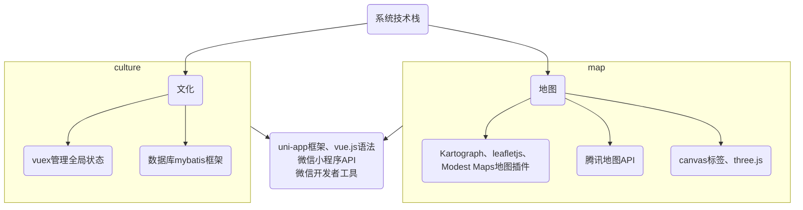

```mermaid
flowchart TB
	heading("系统技术栈")
	
	heading --> content1
	heading --> content2
	content1("地图")
	x1("Kartograph、leafletjs、Modest Maps地图插件")
	x2("腾讯地图API")
	x3("canvas标签、three.js")
	
	content2("文化")
	y1("vuex管理全局状态")
	y2("数据库mybatis框架")
	subgraph map
	content1 --> x1
	content1 --> x2
	content1 --> x3
	end
	
	subgraph culture
	content2 --> y1
	content2 --> y2
	end
	t("
	uni-app框架、vue.js语法
	微信小程序API
	微信开发者工具")
	map --> t
	culture --> t
   
```

