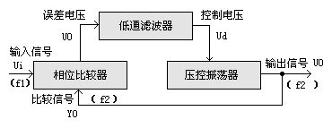
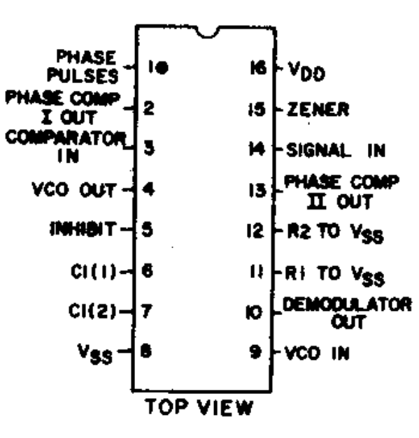
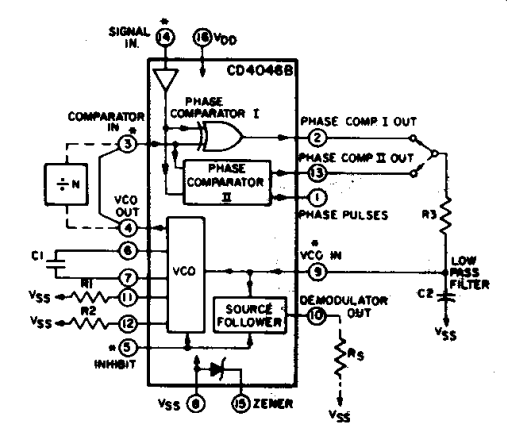
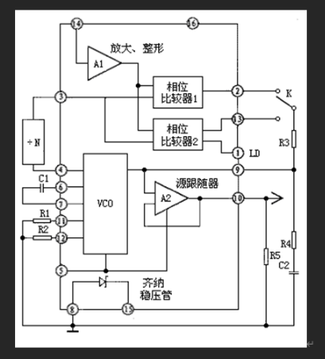
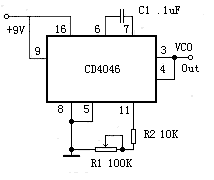

## 概念
锁相的意义是相位同步的自动控制，能够完成两个电信号相位同步的自动控制闭环系统叫做锁相环，简称PLL。

锁相环主要由相位比较器（PC）、压控振荡器（VCO）、低通滤波器三部分组成。

* 压控振荡器指输出频率与输入控制电压有对应关系的振荡电路(VCO)
* 从相位比较输出的正、负脉冲的宽度均等于两个输入脉冲上升沿之间的相位差。 

## 封装

- 1脚相位输出端，环路人锁时为高电平，环路失锁时为低电平。 
- 2脚相位比较器Ⅰ的输出端。 
- 3脚比较信号输入端。 
- 4脚压控振荡器输出端。 
- 5脚禁止端，高电平时禁止，低电平时允许压控振荡器工作。 
- 6、7脚外接振荡电容。 
- 8、16脚电源的负端和正端。 
- 9脚压控振荡器的控制端。 
- 10脚解调输出端，用于FM解调。 

* 11、12脚外接振荡电阻。
* 13脚相位比较器Ⅱ的输出端。 
* 14脚信号输入端。 

* 15脚内部独立的齐纳稳压管负极。 

## 工作原理

输入信号 Ui从14脚输入后，经放大器A1进行放大、整形后加到相位比较器Ⅰ、Ⅱ的输入端，图3开关K拨至2脚，则比较器Ⅰ将从3脚输入的比较信号Uo与输入信号Ui作相位比较，从相位比较器输出的误差电压UΨ则反映出两者的相位差。UΨ经R3、R4及C2滤波后得到一控制电压Ud加至压控振荡器VCO的输入端9脚，调整VCO的振荡频率f2，使f2迅速逼近信号频率f1。VCO的输出又经除法器再进入相位比较器Ⅰ，继续与Ui进行相位比较，最后使得f2＝f1，两者的相位差为一定值，实现了相位锁定。若开关K拨至13脚，则相位比较器Ⅱ工作，过程与上述相同，不再赘述。

## 应用

### 方波发生器

用CD4046的VCO组成的方波发生器，当其9脚输入端固定接电源时，电路即起基本方波振荡器的作用。振荡器的充、放电电容C1接在6脚与7脚之间，调节电阻R1阻值即可调整振荡器振荡频率，振荡方波信号从4脚输出。按图示数值，振荡频率变化范围在20Hz至2kHz。
