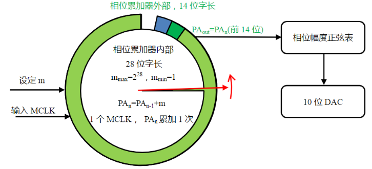

## 介绍

DDS的全程是Direct Digital Frequency Synthesis，翻译为“直接数字频率合成”，用于产生周期性波形。

一般的DDS芯片都是由相位累加器PA 、相位幅度转换 、后端DAC组成：

## DDS工作原理

以一个28位数的相位累加器为例，它可以计数0~228，或者说，它的相位表点数为2^28^=268435456点。使用者需要输入一个计数步长m，当然m一定要小于2^28^，此后外部时钟MCLK每出现一个脉冲，则PA完成一次累加。

红色秒针以m为步长，逆时针旋转，它完成一个周期360°的旋转，需要的时间与产生信号的频率为：
$$
T_{out}=\frac {2^{28}}{m}*T_{MCLK}\\
f_{out}=\frac {m}{2^{28}}*f_{MCLK}
$$

内部相位累加器具有28位，而外部相位累加器则不需要如此精细，一般仅需要14位即可。而累加器，做成28位，仅仅是多几个级联的计数器而已。

## DDS技术的弊端

在发出高质量正弦波中，DDS技术无法实现超低失真度，是其最大的弊端。

## 电流输出DDS

这里必须提到的是很多DDS或是DAC都是电流输出的，或者说性能要求较高的DAC芯片或是dds中集成的输出端dac都是电流输出的。

而幅度的控制，则必须改变相位-幅度码表中的数据才能进行。而在我们实际使用的芯片中，这个码表是已经在芯片的掩膜里就制造好了，不能进行修改。

## AD9959

