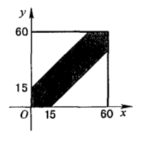
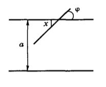
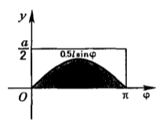
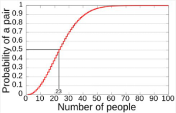
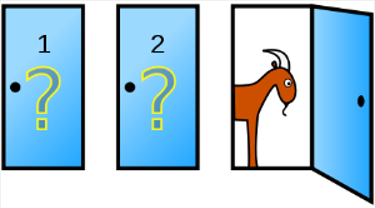
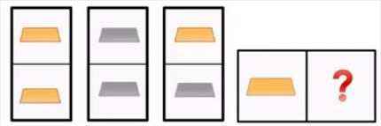
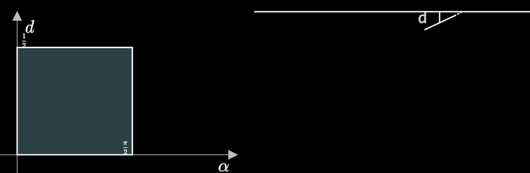

<h1>
    趣味概率梳理
    </h1>

[TOC]

> **摘要**
>
> 本论文主要从概率的历史、概率的经典问题、概率的悖论、概率的一题多解四个方面梳理了我对概率感兴趣之处.
>
> **关键词**
>
> 概率论、概率的悖论

## 概率的历史

### 起源

概率论这门学科可以说起源于赌博。尽管早在15世纪与16世纪意大利的一些数学家（如$Cardano,Pacioli,Tartaglia$等）已经对某些靠运气的游戏中的特定概率进行了计算，但概率论作为一门学科是起源于17世纪中期。
### 18世纪	
1654年，一个名叫$\it A.C.G. de\,Méré$的法国贵族对赌博以及赌博中的问题很感兴趣,但他对一些问题感到很困惑,为解决自己的困惑,他向著名数学家$\it B.Pascal(1629-1695)$求助。为解答$\it A.C.G. de\,Méré$提出的问题，$\it Pascal$与另外一位法国著名数学家$\it P.Fermat(1601-1655)$通信进行了讨论。1655年，荷兰科学家$C.Huygens(1629-1695)$首次访问巴黎，期间他学习了$\it Pascal$与$\it Fermat$关于概率论的工作。1657年，当他回到荷兰后，写了一本小册子，名叫$\it 《De\ Ratiociniis\ in\ Ludo\ Alease》$（《关于机会游戏的计算》），这是关于概率论的第一本书。在这个时期，“数学期望”这一基本概念以及关于概率的可加性、可乘性已经建立。  

概率论在 18 世纪得到了快速发展，这个期间的主要贡献者是$J. Bernolli(1654-1705)$ 与 $A. de\ Moivre (1667-1754)$  。  

$J. Bernoulli$ 是一位瑞士数学家， $Bernoulli$ 家族的第一位数学家. $Bernoulli$在概率论领域的代表作是$《Ars\ Conjectandi》 $(可译为《猜测的艺术》 )发表于1713 年，即他逝世后的第八年. 在此书中他严格地证明了概率论的第一个极限定理.    

$De Moivre$ 是一位法国数学家，但是大部分时间他住在英国. $De\ Moivre$ 开创了概率论的现代方法： 1718 年发表了$《The\ Doctrine\ of\ Chance$ . 在此书中统计独立性的定义首次出现. 该书在 1738 年与 1756 年出了扩展版，生日问题出现在 1738 年的版本中，赌徒破产问题出现在 1756 年的版本中.    

1730 年 $de\ Moivre$ 的另外一本专著$《Miscellanea\ Analytica\ Supplementum》$(可译为《解析方法》 ) 正式出版. 其中，关于对称 $Bernoulli$ 试验的中心极限定理首次提出并得到证明。

### 19世纪

19 世纪，概率论的早期理论得到了进一步的发展与推广，这个期间的主要贡献者是 $P. S. M. Laplace (1749-1827),$$S. D. Poisson (1781-1840), C. F.Gauss (1777-1855), P. L. Chebyshev (1821-1894), A. A. Markov (1856-1922)$
与 $A. M. Lyapunov (1857-1918)$. 这个时期的研究主要围绕极限定理展开.  

1812 年 $Laplace$ 的伟大专著$《Théorie\ Analytique\ des\ Probabilitiìés》$（可译为《概率论的解析理论》）诞生，其中，他阐述了他自己及前辈在概率论方面的结果. 特别地，他将 $De\ Moivre$ 的定理推广到 $Bernoulli$ 试验非对称情形.$Laplace$ 最重要的工作是将概率方法应用到观测误差，在很一般的条件下证明了观测误差的分布一定是渐近正态的.  

在当代概率论中，与 $Poisson$ 相关的有 $Poisson$ 分布、 $Poisson$ 过程. $Gauss$创立了误差理论，特别地，创立了最小二乘的基本方法. $Chebyshev, Markov$与 $Lyapunov$ 在研究独立但不同分布的随机变量和的极限定理方面发展了有效的方法.  

在 $Chebyshev$ 之前，概率论的主要兴趣在于对随机事件的概率进行计算.而 $Chebyshev$ 是第一个清晰认识并充分利用随机变量及其数学期望概念的人.$Chebyshev$ 思想的主要倡导者是他的忠诚的学生 $Markov$, 他将其老师的结果完整清晰地展现出来.  $Markov$ 自己对概率论的重大贡献之一是创立了概率论
的一个分支：研究相依随机变量的理论，称为“ $Markov$ 过程” .为证明概率论的中心极限定理， $Chebyshev$ 与 $Markov$ 利用的是矩方法，而 $Lyapunov$ 利用了特征函数方法. 极限定理的后续发展表明特征函数方法是一种强大的解析工具.  

### 20 世纪  

20 世纪可称为概率论发展的现代时期，本时期开始于概率论的公理化.在这个方向上的早期贡献者有$ S. N. Berstein (1880-1968), R. von\ Mises (1883-1953)$与 $E. Borel (1871-1956)$. 1933 年，俄罗斯著名数学家 $A. N. Kolmogorov$出版了他的伟大专著$《Foundations\ of\ the\ Theory\ of\ Probability》$ . 其中，他为概率论建立了目前广泛采纳的公理化体系.在 20 世纪，随机过程理论（马氏过程，平稳过程，鞅，随机过程的极限定理等）得到了快速发展. 另外，还有许多分支，比如（排名不分先后）随机微分方程、随机偏微分方程、倒向随机微分方程、随机微分几何、 $Malliavin $变分、白噪声分析、狄氏型理论、遍历理论、数理金融、大偏差理论、交互粒子系统、测度值过程、概率不等式、泛函不等式、渗流、最优传输、 SLE、随机矩阵、随机优化、随机控制、随机动力系统等众多概率论、随机分析及相关领域中的分支得到了快速发展. 作出重要贡献的科学家实在太多，不便一一列出.

## 概率的经典问题

### 1.约会问题

甲乙两位好朋友约定在晚上7时到8时之间在某电影院门口见面,并讲好先到者等候对方一刻钟,过时即可离去求这两人能会面的概率。

> 前苏联著名数学家格涅坚科的经典性著作《概率论教程》与1956年的《科学画报》上均提到过该题,后来经常被引用。

图1

这是一道几何概型问题在平面上建立直角坐标系,长度单位为分钟设$x$和$y$分别表示甲、乙两人到达约会地点的时间,所以两人能够会面的充要条件是$|x-y|≤15$,显然,$(x,y)$的所有可能结果是边长为60的正方形,而可能会面的时间则由图1中的阴影部分表示故所求概率等于阴影部分面积与正方形面积之比,也就是 
$$
p=\frac {60^2-45^2}{60^2}
$$

### 2. 投针问题

平面上画着一些平行线,相邻两线间的距离都是等于$a$,向此平面任投一长度为$l(l<a)$的针,试求此针与任一平行线相交的概率。

> 这就是历史上著名的蒲丰($Buffon$)投针问题由于答案与$π$有关,因此可利用$π={2l\over ap}$来计算$π$的数值。概率 $p$ 可以通过投针 $N$ 次，计算针与线相交的次数 $n$ ,以频率近似作为概率 $p$ ,这样就得 $π≈{2lN\over an}$ 如1901年意大利的拉泽里尼($Lazzerini$)使用长0.83的针在间隔为1的平行线中投3408次,相交次数为1808次,求得 $π$ 的实验值为3.1415929，这不但为圆周率的研究开辟了一条新路，并逐渐发展成为一种新方法—统计实验法。不过，不管拉泽里尼是否实际上投过针,他的实验还是受到了美国犹他州奥格登的国立韦伯大学的L·巴杰的质疑。

这是几何概型问题，以 $x$ 表示针的中点到最近的一条平行线的距离，$φ$ 表示针与平行线的交角，$x≤{a\over 2},0≤φ≤π$，可能结果的全体 $G$ 表示边长为${a\over 2}$及 $π$ 的长方形,为使针与平行线相交，必须有$x≤{l\over 2}sinφ$，满足关系式的区域 $g$ 在图3中用阴影表示。故所求概率 $p=\large {{1\over 2}\int_0^π sinφdφ\over{1\over 2}aπ}={{l(-cosφ)|_0^π}\over aπ}={2l\over aπ}$ .

图2

图3

### 3. 生日问题

某班级有n个人 $(2≤n<365)$ ,问至少有两人生日相同的概率有多大?

这属于古典概型中的分房问题,设$A$为$n$个人中至少有两个人的生日相同事件,则$\overline A$为$n$个人的生日全不相同的事件. 

$$
\because P({\overline A})={365!\over 365^n·(365 -n)!},\\ \therefore P(A)=1-{365!\over 365^n·(365-n)!}
$$

通过计算可知,如果一个班级有40人,至少有两人生日相同的可能性有89%;如果个班有45人,至少有两人生日相同的可能性达到94%;如果一个班级有50人,至少有两人生日相同的可能性有97%之多.

这个问题是概率论中的著名问题,由于它的迷惑性很强,不少人都为它打赌,因而引出了不少轶事.

### 4. 配对问题

某人一次写了$n$封信和相对的$n$个信封,他随意地将n张信纸塞入这$n$个信封中,问至少有一封信的信纸和信封是配对的概率是多少?没有一封信的信纸和信封是配对的概率是多少?

> 历史上有名的“配对问题”，于1708年为蒙特摩特( $Mont mort$ )所解决.当$n→∞$时,$p_1→1-{1\over e},p_0→{1\over e}$.

将$n$张信纸和$n$只信封编成$1,2…,n$的号码,信纸和信封配对的编成同一号.设$A$:表示第讠张信纸恰好塞人第$i$个信封事件,即第$i$封信的信纸和信封是配对的.至少有一封信的信纸和信封是配对的事件为$A_1∪A_2∪…∪A_n,设A_1,A_2,A_n$是随机事件,可以证明:
$$
P(A_1∪A_2\cdots ∪A_n)=\sum^n_{i=1}P(A_i)-\sum_{1≤i＜j≤n}P(A_iA_j)+\sum_{1≤i＜j≤n}P(A_iA_jA_k)-\cdots+(-1)^{n-1}P(A_1A_2\cdots A_n),\\
p_1=P(A_1∪A_2∪\cdots A_n),\\  
P(A_i)=C_n^1·{1\over n}=1,\\
\sum_{i=1}^nP(A_i)={(n-1)! \over n!},\\
P(A_iA_j)={(n-2)!\over n!},\\
\sum_{1≤i<j≤n}P(A_iA_j)=C^2_n·{(n-2)!\over n!}={1\over 2!};\\
P(A_iA_jA_k)={(n-3)!\over n!}\\
p_1=1-{1\over 2!}+{1\over 3!}-\cdots +{(-1)^{n-1}\over n!}\\=\sum_{k=1}^n{(-1)^{k-1}\over k!}
$$

没有一封信的信纸和信封是配对的概率:
$$
p_0=1-\sum_{k=1}^n{(-1)^{k-1}\over k!}=\sum^n_{k=0}{(-1)^k\over k!}
$$

### 5. 钓鱼问题

为了估计池塘中的鱼的尾数,可以使用以下方法:先从池塘中捕出一定数量的鱼,例如200尾,给每尾鱼作上记号,不影响存活,然后放回池塘.经过适当的时间,让其和池塘中其余的鱼充分混合,再从池塘中捕出一定数量的鱼,例如50尾,查看其中有记号的鱼,设有4尾,试根据上述数据,估计池塘内鱼的尾数.

解析设池塘中鱼的尾数为n,n是未知的,现在要估计n的值,将n的估计值记作n假定每尾鱼被捕捞的可能性是相等的,从池塘中任捕一尾,设事件A={带有记号的鱼}则由古典概型的知识可知
$$
P(A)={200\over n}
$$
第二次从池塘中捕捞出50尾,观察每尾鱼上是否有记号,共需观察50次,其中带有记号的鱼有4尾,即事件A发生的频数m=4,由概率的统计定义可知
$$
P(A)={4\over 50}
$$
有$(5),(6)$两式，得${200\over n}={4\over 50}$

解得$n≈2500$.

所以，估计池塘内约有鱼2500尾.

## 概率的悖论

### 1. 生日悖论

生日悖论，也叫生日问题，在上文中有提到，是指如果一个房间里有23个或23个以上的人，那么至少有两个人的生日相同的概率要大于50%（如下图）；而对于60或者更多的人，这种概率要大于99%。

这个数学事实与大多数人的直觉——23人中有2人生日相同的概率应该远远小于50%相抵触。在这个意义上，生日问题便可称为一个悖论。

### 2. 蒙提霍尔悖论

蒙提霍尔悖论亦称为蒙提霍尔问题、蒙特霍问题或蒙提霍尔悖论、三门问题，是一个源自博弈论的数学游戏问题，大致出自美国的电视游戏节目$Let's Make a Deal$（问题的名字来自该节目的主持人蒙提·霍尔），并因电影《决胜24点》为大多数非数学专业人士所知晓。

这个游戏的玩法是：参赛者会看见三扇关闭了的门，其中一扇的后面有一辆汽车，选中后面有车的那扇门就可以赢得该汽车，而另外两扇门后面则各藏有一只山羊。当参赛者选定了一扇门，但未去开启它的时候，节目主持人会开启剩下两扇门的其中一扇，露出其中一只山羊。主持人其后会问参赛者要不要换另一扇仍然关上的门。

问题是：换另一扇门会否增加参赛者赢得汽车的概率？答案是会换门的话，赢得汽车的机会率是 2/3，而不换只有1/3。

因为不管参赛者怎么选，主持人的行为总能做到，因此其并没有改变第一扇门后的概率分布。

### 3. 贝特朗箱子悖论

与三门问题，类似的一个问题叫贝特朗箱子悖论，注意区别于著名的“贝特朗悖论”。也有人把此叫做金盒问题，叙述如下：

现有三个箱子，每个箱子都有两个空档，中间用木板隔开。第一个箱子里面是两块金条，第二个箱子里面是两块银条，第三个箱子里面是一块金条和一块银条。随机抽取一个箱子，然后随机打开一个空档。如果里面是金条，那另外一个空档里是金条的概率是多少？

与大多数人的直觉相违背，所求概率并不是1/2。那么究竟是多少呢？如果将三个盒子表示为：（金1，金2）、（金3，银1）、（银2，银3），其中一个空档里是金条，有3种情况：金1、金2、金3，并且每种情况概率相同。这时，另一个空档里可能是金2、金1、银1，易知，另一个空档里是金条的概率为2/3。

### 4. 假阳性悖论

假设人群中有1%的人罹患某疾病，而其他人是健康的。我们随机选出任一个体，假设检验动作实施在未患病的人身上时，有1%的机率其结果为假阳性；实施在患病的人身上时，有1%的机率其结果为假阴性。

计算可知：如果患病，而被检出为阳性的概率为99%；而如果被测定为阳性者，实际上患病的概率仅为50%。也就是说有一半实际上是假阳性。

数学家 $John\ Allen\ Paulos$ 在他的《数学盲》一书中指出医生、律师以及其他受过很好教育的非统计学家经常会犯这样的错误。这种错误可以通过用实数而不是概率来描述数据的方法来避免。

## 概率的一题多解

以蒲丰投针问题为例，设想一组间隔为1的平行线，如果我们随机取一条长为1的线段，求线段与网络相交的概率。

1. 解法①

问题的主要特征就是**“连续性”**，那我们首先就应该把问题代数化，也就是用几个参数描述线段的状态.首要的两个参数是坐标，但不是整条线段的坐标，而是线段上某个锚点的坐标.这里选择将锚点定在了线段中点上，这样我们就充分简介地刻画了线段的位置...吗？

可以注意到锚点横坐标并不影响是否相交，那么我们就不再考虑横坐标。此时，我们就可以用锚点到最近的平行线的距离d来代替纵坐标.除了这以外，我们还要刻画线段的旋转，也就是定义一个角度$\alpha$,此处我们将其定义为最近的平行线与线段的夹角.

图中阴影部分为样本空间，下面来看相交的条件.

线段和(最近的)平行线相交$\iff$ $d≤sin\alpha$,$\therefore$概率为
$$
{\int_0^{\pi\over 2}{1\over 2}sin\alpha d\alpha \over {\pi\over 4}}={2\over \pi}
$$

2. 解法②

回到问题本身，由于原问题已经非常简单退无可退，于是我们进一步思考，哪些参数会影响不同曲线与平行线相交的概率？

运用微积分的思想，可以认为曲线是由无数极短线段拼成的，故交点个数的数学期望与短线段个数，或者说是曲线长度成正比。那么我们可以代入一些“奇怪”的曲线：**圆**.

圆的周长为π，始终与网格有2个交点，交点个数的数学期望为2，故长度为1的线段交点个数的期望为$2\over π$，也就是相交的概率为$2\over π$.

> **参考文献**
>
> [1]唐秀颖主编数学题解辞典代数[M].上海:上海辞书出版社,1985.11
>
> [2]谈祥柏主编趣味数学辞典[M].上海:上海辞书出版社,1994.43
>
> [3]\[美]T·帕帕斯著,张运南,张昶译数学趣闻集锦(上)[M].上海:上海教育出版社,1998.12.
>
> [4]不详。概率论的历史简介[EB/OL]。(不详) [不详].http://www.tup.com.cn/upload/books/yz/058550-01.pdf

