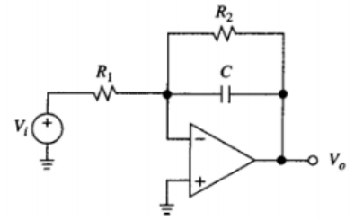
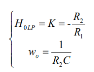
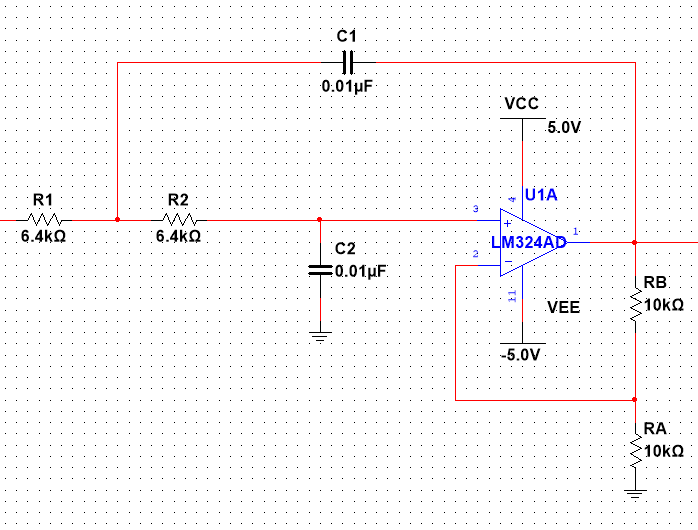
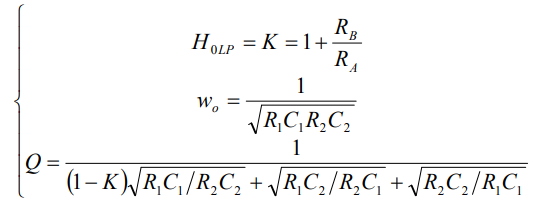
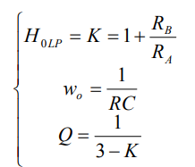

## 截止频率与所选电容的参考对照表

| $f_0$ | $10 - 100Hz$ |  $0.1-1kHz$  |   $1-10kHz$    | $10-100kHz$  |
| :---: | :----------: | :----------: | :------------: | :----------: |
|  $C$  |  $1-0.1μF$   | $0.1-0.01μF$ | $0.01-0.001μF$ | $1000-100pF$ |

## 低通滤波器

已知$ω_0$（- 3dB 截止频率）、$H_{0LP}$（直流增益）、Q（在- 3dB 截止频 率时的电压放大倍数与通带放大倍数数值之比）三个参数来设计电路。

### 一阶有源低通

### 二阶压控电压源低通滤波器

令 R1 = R2 = R 和C1 = C2 = C ，简化上述各式，则

