# 放大器的定义、分类和选择使用

## 放大器的全家谱

全部放大器被分为三种：晶体管放大器、运算放大器和功能放大器。

### 晶体管

* 双极型晶体管（BJT），且分为NPN、PNP型
* 单极性晶体管（也称场效应管，FET），且分为JFET（结型管）和MOSFET（金属氧化物管），它们都有N沟道、P沟道之分

从符号看，晶体管可以画成8种，双极型2种，单极型6种：

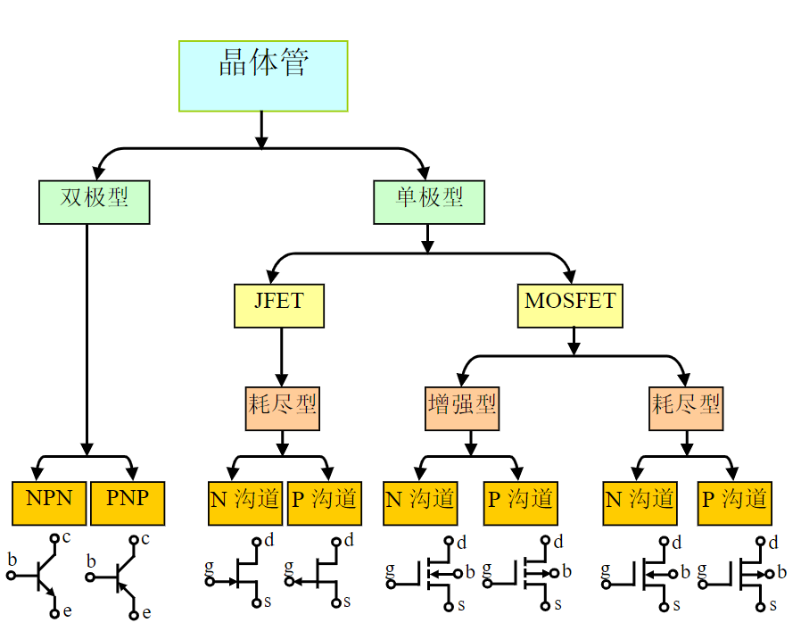

### 运算放大器

* 标准运放
* 全差分运放：

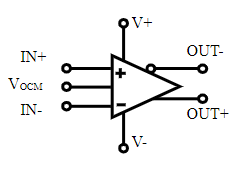
$$
U_{out+}-U_{out-}=A_{uo}(U_{IN+}-U_{IN-})  \\
(U_{out+}+U_{out-})/2=V_{ocm}
$$
这可以理解为，两个差分输出端子，将围绕着输入的VOCM波动。这个功能将常用于输出电平的移位。

### 功能放大器

## 运放的关键指标

### 输入失调电压（Offset Voltage,$V_{os}$）

**定义：在运放开环使用时，加载在两个输入端之间的直流电压使得放大器直流输出电压为0。也可定义为当运放接成跟随器且正输入端接地时，输出存在的非0电压。**

**优劣范围：1μV以下，属于极优秀的。100μV以下的属于较好的。最大的有几十mV。**

多数情况下，输入失调电压不分正负，生产厂家会以绝对值表示。

* 问题：当一个放大器被设计成AF倍闭环电压增益（同相输入放大增益，也称噪声增益）时，如果放大器的失调电压为VOS，则放大电路0输入时，输出存在一个等于AFVOS的直流电平，此输出被称为输出失调电压。闭环增益越大，则输出失调电压也越大。

* 对策：如果被测信号包含直流量且你关心这个直流量，就必须选择VOS远小于被测直流量的放大器，或者通过运放的调零措施消除这个影响。如果你仅关心被测信号中的交变成分，你可以在输入端和输出端增加交流耦合电路，将其消除。调零方法：有些运放有两个调零端，按照数据手册提供的方法接电位器调零即可。对没有调零端的运放，可采用外部的输出调零或者输入调零，有标准电路可以参考。

### 失调电压漂移（Offset Voltage Drift)

**定义：当温度变化、时间持续、供电电压等自变量变化时，输入失调电压会发生变化。输入失调电压随自变量变化的比值，称为失调电压漂移。**

因此，有三种漂移量存在：

1）输入失调电压变化相对于温度变化的比值。是指定温度范围内的平均值，以μV/°C为单位，用符号ΔVOS/ΔT或者$dV_{OS}/dT$表示。

2）相对于时间的比值，以μV/MO为单位，含义是每月变化多少微伏。没有明确的符号，通常用文字表示。本文暂用$dV_{OS}/dMO$表示。

3）相对于电源电压变化的比值，以μV/V为单位，含义是调好的放大器，当电源电压发生1V变化，会引起失调电压的变化。没有明确的符号，常用文字表示。此数值在很多放大器数据手册中没有体现。

**优劣范围：0.002μV/°C到几十μV/°C。**

* 问题：很严重。因为它不能被调零端调零，即便调零完成，它还会带来新的失调。在高精度、高稳定性要求的场合，选择漂移系数较小的放大器，比失调电压大小更为重要。
* 对策：第一，就是选择高稳定性，也就是上述漂移系数较小的运放。第二，有些运放具有自归零技术，它能不断地测量失调并在处理信号过程中把当前失调电压减掉。这就可以抑制温度变化、时间流逝、电源电压变化引起的新的失调。这很好。但是这种运放内部都有高频的切换动作，会产生该频率噪声，使用时应该注意。

### 输入偏置电流（Input bias current，$I_B$）

**定义：当输出维持在规定的电平时，两个输入端流进电流的平均值。**

**优劣范围：60fA~100μA。数量级相差巨大，这取决于运放输入端结构，FET输入的会很小。**

* 问题：第一，当用放大器接成跨阻放大测量外部微小电流时，过大的输入偏置电流会分掉被测电流，使测量失准。第二，当放大器输入端通过一个电阻接地时，这个电流将在电阻上产生不期望的输入电压。
* 对策：为避免输入偏置电流对放大电路的影响，最主要的措施是选择IB较小的放大器。有很多FET输入运放可以实现这个要求。但是需要注意，高速运放且IB较小的运放比较难选择，数量极少。ADI公司的ADA4817-1/-2，带宽1050MHz，IB约为2pA，单位增益稳定。

### 输入失调电流（Input offset current，$I_{OS}$）

**定义：当输出维持在规定的电平时，两个输入端流进电流的差值。**

**优劣范围：20fA~100μA。数量级相差巨大，这取决于运放输入端结构，FET输入的会很小。**

* 问题：失调电流的存在，说明两个输入端客观存在的电流有差异，后面将要所述的，用外部电阻实现匹配抵消偏置电流影响的措施，在此就失效了。

### 关于失调和偏置的总结

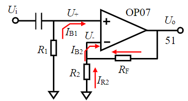

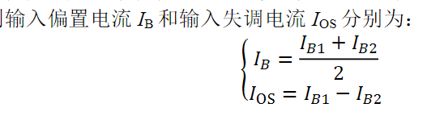

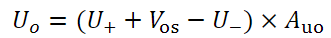

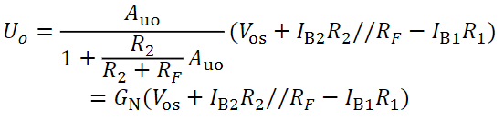

其中，GN被称为噪声增益，在噪声计算、输出失调计算中应用很广泛。

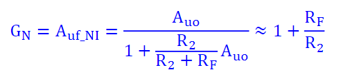

### 运放电路外部电阻的选择

* 高速运放电路，特别是电流反馈型运放，其外部电阻选择最好遵循数据手册建议，一般都比较小，1kΩ以下。实在找不到的情况下，以尽量减小电阻为宜。
* 外部电阻越大，则工作时消耗功耗越小，发热也越轻，对运放输出电流的要求也越低。这是在多种选择中选择大电阻的唯一理由。（流压转换电路中，面对微弱电流必须选择很大的电阻，不属此类）。
* 外部电阻越大，则运放偏置电流对输出失调的贡献越大。
* 外部电阻越大，则电阻本身产生的噪声越大。
* 外部电阻越大，附近的杂散电容越不可忽视，它通常会导致上限截止频率降低。
* 外部电阻越大，则电路板造成的漏电阻越不可忽视。
* 电阻选择，一般没有唯一的结论。

### 噪声指标

一个正常工作的放大电路，当输入端接地时，用示波器观察输出，你看到的可能不是平直的细线，而是在一定幅度之内的杂乱无章的波形。这就是噪声。

### 初识噪声

### 噪声的有效值和峰峰值关系

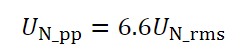

即噪声峰峰值为噪声有效值的6.6倍。

### 输入电压范围（Input Voltage Range）

**定义：保证运算放大器正常工作的最大输入电压范围。也称为共模输入电压范围。**

优劣评定：一般运放的输入电压范围比电源电压范围窄1V到几V，较好的运放输入电压范围和电源电压范围相同，甚至超出范围0.1V。**这会使得放大器设计具有更大的输入动态范围，提高电路的适应性。**

当运放最大输入电压范围与电源范围比较接近时，比如相差0.1V甚至相等、超过，都可以叫“输入轨至轨”，表示为Rail-to-rail input，或RRI。

注意，超出此范围并不代表运放会被烧毁，但**绝对参数**中出现的此值是坚决不能超过的。

之所以叫**共模输入电压范围**，是因为运放正常工作时，两个输入端之间的差压是很小的，某个输入端的电压与两个输入端电压的平均值（共模）是基本相同的。

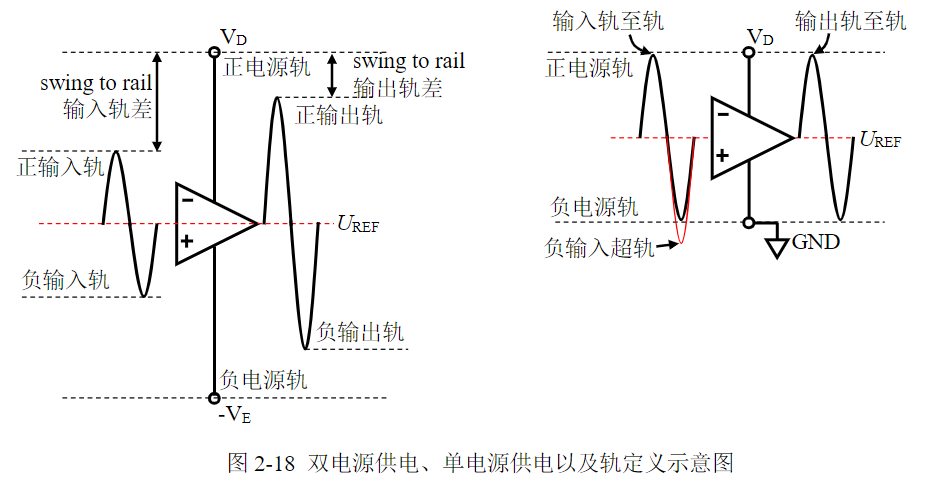

### 输出电压范围（$V_{OH}/V_{OL}$或者Swing from rail）

**定义：在给定电源电压和负载情况下，输出能够达到的最大电压范围。或者给出正向最大电压VOH以及负向最小电压VOL——相对于给定的电源电压和负载；或者给出与电源轨（rail）的差距。**

优劣范围：一般运放的输出电压范围要比电源电压范围略窄1V到几V。较好的运放输出电压范围可以与电源电压范围非常接近，比如几十mV的差异，这被称为**“输出至轨电压”**。这在低电压供电场合非常有用。当厂家觉得这个运放的输出范围已经接近于电源电压范围时，就自称**“输出轨至轨”**，表示为Rail-to-rail output，或RRO。

* 正至轨电压与负至轨电压的绝对值可能不一致，但一般情况下数量级相同
* 至轨电压与负载密切相关，负载越重（阻抗小）至轨电压越大；
* 至轨电压与信号频率相关，频率越高，至轨电压越大，甚至会突然大幅度下降；
* **至轨电压在20mV以内，属于非常优秀。**

>  RRIO（输入输出均轨至轨）

### 共模抑制比（Common-mode rejection ratio，CMRR）

**定义：差模电压增益与共模电压增益的比值，用dB表示。**

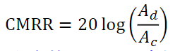

优劣范围：一般运放都有60dB以上的CMRR，高级的可达140dB以上。

理解：运算放大器在单端输入使用时，不存在这个概念。只有把运放接成类似于减法器形式，使得运放电路具备两个可变的输入端时，此指标才会发挥作用。

### 开环电压增益（Open-loop gain，$A_{VO}$）

定义：运放本身具备的输出电压与两个输入端差压的比值，用dB表示。

优劣范围：一般在60dB~160dB之间。越大的，说明其放大能力越强。

**在特殊应用中，比如高精密测量、低失真度测量中需要注意此指标。在某个频率处实际的开环电压增益，将决定放大器的实际放大倍数与设计放大倍数的误差，也将决定放大器对自身失真的抑制，还将影响输出电阻等。**

### 压摆率（Slew rate，SR）

**定义：闭环放大器输出电压变化的最快速率。用V/μs表示。**

**优劣范围：从2mV/μs到9000V/μs不等。**

理解：此值显示运放正常工作时，输出端所能提供的最大变化速率，当输出信号欲实现比这个速率还快的变化时，运放就不能提供了，导致输出波形变形——原本是正弦波就变成了三角波。

一个正弦波来说，其最大变化速率发生在过零点处，且与输出信号幅度、频率有关。

设输出正弦波幅度为$A_m$，频率为$f_{out}$，过零点变化速率为$D_V$，则

$$
𝐷_𝑉=2π𝐴_𝑚𝑓_{out}
$$

要想输出完美的正弦波，则正弦波过零点变化速率必须小于运放的压摆率。即

$$
SR>𝐷_𝑉=2𝜋𝐴_𝑚𝑓_{out}
$$

这个指标与后面讲述的满功率带宽有关。

### 单位增益带宽（Unity Gain-bandwidth，UGBW）—f1

**定义：运放开环增益/频率图中，开环增益下降到1时的频率。**

### 增益带宽积（Gain Bandwidth Product，GBP或者GBW）—f2

**定义：运放开环增益/频率图中，指定频率处，开环增益与该指定频率的乘积。**

### -3dB带宽—f3

**定义：运放闭环使用时，某个指定闭环增益（一般为1或者2、10等）下，增益变为低频增益的0.707倍时的频率。分为小信号（输出200mV以下）大信号（输出2V）两种**

### 满功率带宽(Full Power Bandwidth)—f0

### 满功率带宽(Full Power Bandwidth)—f0

**定义：将运放接成指定增益闭环电路（一般为1倍），连接指定负载，输入加载正弦波，输出为指标规定的最大输出幅度，此状态下，不断增大输入信号频率，直到输出出现因压摆率限制产生的失真（变形）为止，此频率即为满功率带宽。**

理解：比-3dB带宽更为苛刻的一个限制频率。它指出在此频率之内，不但输出幅度不会降低，且能实现满幅度的大信号带载输出。满功率带宽与器件压摆率密切相关：

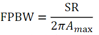

其中，𝐴𝑚ax为运放能够输出的最大值（即满功率值）

### 举例说明

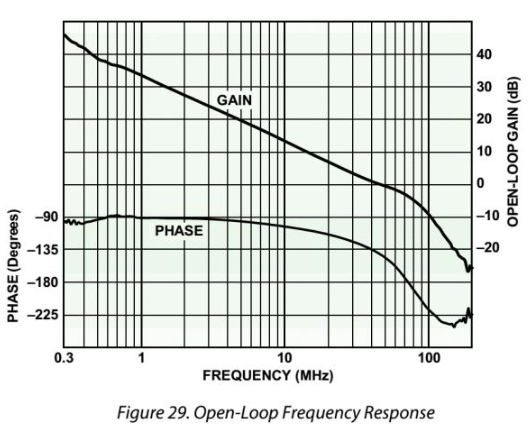

右侧纵轴是增益GAIN/dB，注意0dB发生在频率约为45MHz的地方，说明单位增益带宽为45MHz。

再看增益带宽积。

| 频率   | 增益读值/dB | 增益换算/倍 | 增益带宽积/MHz |
| ------ | ----------- | ----------- | -------------- |
| 0.3MHz | 45          | 177.83      | 53.35          |
| 10MHz  | 13.5        | 4.732       | 47.32          |
| 45MHz  | 0           | 1           | 45             |

### 建立时间（Settling Time）

**定义：运放接成指定增益（一般为1），从输入阶跃信号开始，到输出完全进入指定误差范围所需要的时间。所谓的指定误差范围，一般有1%，0.1%几种。**

**优劣范围：几个ns到几个ms。**

理解：建立时间由三部分组成，第一是运放的延迟，第二是压摆率带来的爬坡时间，第三是稳定时间。很显然，这个指标与SR密切相关，一般来说，SR越大的，建立时间更小。对运放组成的ADC驱动电路，建立时间是一个重要指标。

### 相位裕度（Phase margin，$𝝋_𝒎$）和增益裕度

**相位裕度定义：在运放开环增益和开环相移图中，当运放的开环增益下降到1时，开环相移值减去-180°得到的数值。**

**增益裕度定义：在运放开环增益和开环相移图中，当运放的开环相移下降到-180°时，增益dB值取负，或者是增益值的倒数。**

理解：相位裕度和增益裕度越大，说明放大器越容易稳定。

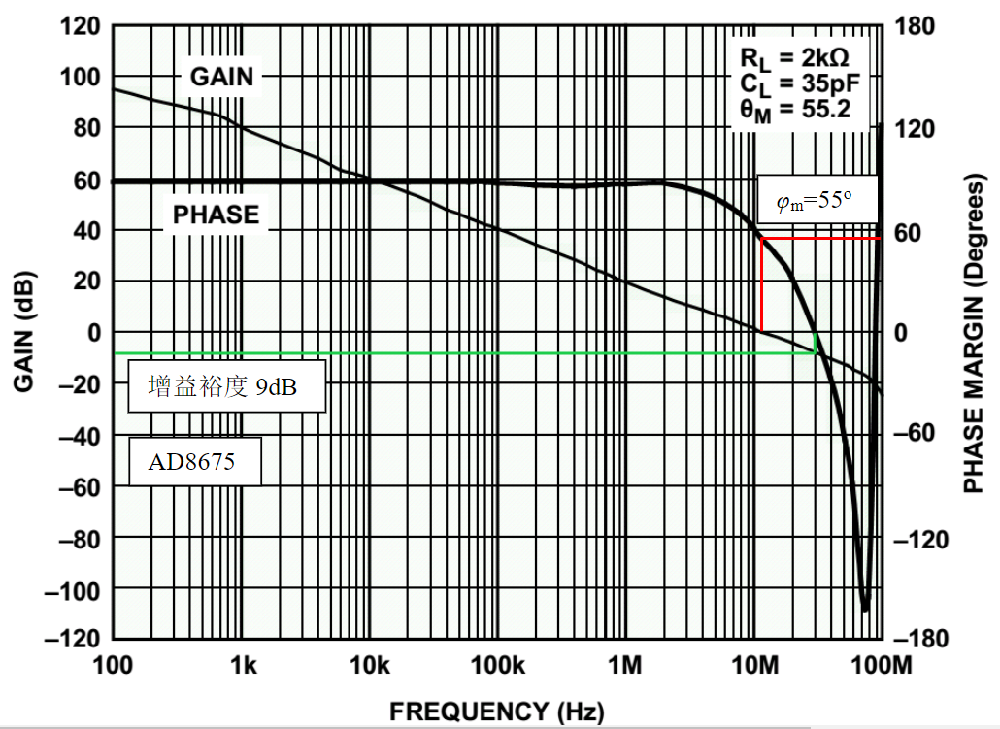

我们需要注意的是，所有运放，在任何频率下，都只存在滞后相移，即相移为负值。在极低频率处，相移接近于0且小于0，随着频率的上升，很快相移就进入到稳定的-90度，然后走向-180度甚至-270度。知道了这个规律，数据手册中无论怎么标注，你都能轻松应对了。

这样理解，相位裕度其实就是**当前相移和-180度的距离。**

### 电源电压抑制比（PSRR-Power Supply Rejection Ratio）

定义：双电源供电电路中，保持负电源电压不变，输入不变，而让正电源产生变化幅度为ΔVS，频率为f的波动。那么在输出端会产生变化幅度为ΔVout，频率为f的波动。这等效于电源稳定不变情况下，在入端施加了一个变化幅度为ΔVin，频率为f的波动。则

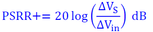

考虑到电路本身的噪声增益GN，则

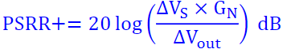

同样的方法，保持正电源电压不变，仅改变负电源电压，会得到PSRR-。

有些运放在描述PSRR时，不区分单独改变某个电源电压，而仅给出PSRR，这是指两个电源电压同时改变。注意，两个电源的改变方向是相反的——即保持正负电源的绝对值相等。理解：电源电压抑制比，其含义是运放对电源上纹波或者噪声的抵抗能力。

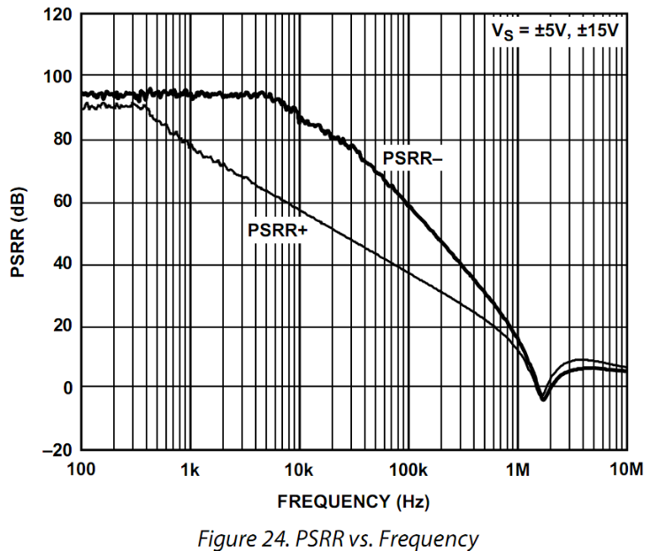

频率越高，运放对电源纹波或者噪声的抵抗能力越弱，这导致运放电路的输出端会出现电源上的不干净因素。**旁路电容的作用就是滤除电源上的噪声或者波动，特别在高频处，更需要滤除。**

### 全谐波失真加噪声THD+Noise

全谐波失真(Total Harmonic Distortion-THD)本身是衡量一个时域波形与标准正弦波的差异程度的量，其原始定义为：时域波形中包含基波分量有效值U1RMS，以及各次谐波分量U2RMS、U3RMS、U4RMS......等，则

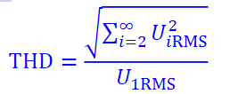

即全部谐波有效值（各次谐波有效值的平方和开根号）与基波有效值的比值。一般用%表示，也可以用dB表示，即上述计算值取对数乘以20。

在实际测试中，一般都采用数字采样、数字分析方法实施失真度测量。用一个失真度很小的信号源加载到被测放大电路的输入端，用失真度很小的AD转换器对输出信号实施高精度采集，然后用数学分析（傅里叶变换）的方法，计算获得输出波形中的基波有效值，以及各次谐波有效值，用上述标准公式计算即可。理论上谐波次数为无穷大次，但实际操作中一般取有限次谐波，比如2次到7次谐波——更高次的谐波对总的失真度贡献不大。

常用另一个指标THD+Noise来更加全面地表征放大器对输入信号的失真程度。

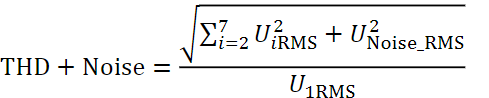

### 热阻（Thermal resistance，$θ_{JA}$）和温度范围

热阻标准定义：是导热体阻止热量散失程度的描述，以1W发热源在导热路径两端形成的温度差表示，单位为°C/W。有以下常用的两种：

* $θ_{JA}$，是指芯片热源结(Junction)与芯片周围环境(Ambient)（一般为空气）的热阻。
* $θ_{JC}$，是指芯片热源结(Junction)与芯片管壳(Case)的热阻。

理解：对芯片来说，导热路径的两端分别为自身发热体与环境空气。热阻θJA越大，说明散热越困难，其温差也就越大。比如一个热阻θJA=150°C/W的芯片，说明其如果存在1W的热功率释放（为电源提供给芯片的功率-芯片输出的功率），则会在芯片内核和环境空气中形成一个150°C的温差。.

当确定热功率释放为P，则

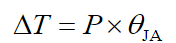

其中ΔT是芯片工作时，自身结温与环境温度的温差。如果此时环境温度为TA，则芯片结温TJ为：

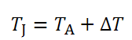

很显然，同样功耗情况下，具有不同热阻的芯片，热阻越大的，结温会越高。当结温超过了最高容许结温（一般就是芯片中声明的存储温度，比如150°C），芯片就可能发热损坏。

应用热阻指标可以帮助设计者估算芯片可否安全工作。如下图查到ADA4000-1关于热阻的描述，可知SOIC8封装热阻为112.38°C/W，结温不得超过150°C。假设设计者使用SOIC8封装，则在-10~50°C环境下（一般气温范围），为保证结温不超过150°C，ΔT需小于100°C。因此，设计电路时，需要注意ADA4000-1的发热功耗不得超过

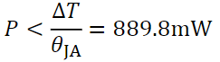

而发热功耗与输出功率相关，一般情况下，输出功率越大，会带来芯片本身发热功耗的增加。当然，对ADA4000-1来说，产生如此大的发热功耗是不可能的，对于高频运放则很正常。可以看出，选择热阻更小的14脚封装的SOIC(也就是SO-14)，具有88.2°C/W的热阻，则可以有效改善。

理论上说，你看看芯片的大小（就能估计出热阻），摸摸芯片的温度，通过色环读出负载电阻的大小，就可以粗略估计出输出电压幅度，看似很神奇，其实也很简单。

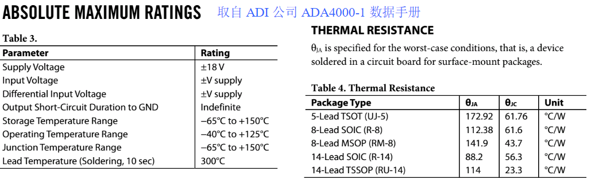

# 放大器的共性问题

## 放大器的封装

## 供电和电源去耦

电源对地之间增加的电容，分为两类，一类是库电容，另一类是旁路电容。

### 库电容

所谓的库电容，其实是一个百μF数量级的电解电容。它的作用是，当负载出现突然的大电流需求，而电源一时不能提供如此大的电流输出，就会造成输出产生电压跌落。为避免这种现象出现，库电容在此时会释放它内部的电荷，形成补充电流输出，以减小电源的输出压力。这种库电容一般设计在电源进入电路板的入口处，且距离用电运放距离不能太远—一般建议不要超过10cm。你看着办吧。

### 旁路电容

旁路电容一般是10uF～0.1uF～0.01uF的电容组，设计在芯片的电源管脚根部，在局部形成一个低通滤波器，用于“旁路”（bypass）电源出现的高频电压噪声，其实就是让高频噪声在此短接到地。

> 这样，使用两个不同容值的电容器并联，会扩大其低阻抗频率区域，使得旁路作用在更宽的频域内有效。
>
> 那么，如果要覆盖较为宽广的噪声频段，仅用一个电容是难以实现的。用一个较大的电容C1负责较低频段，用一个较小电容C2负责较高频段，是实践中最为常见的有效方法。这两个电容的容值一般选为50倍到1000倍较好。
>
> 这种双电容旁路常用于模拟电路芯片如运放等的电源旁路，常用的组合有10μF/0.1μF，4.7μF/0.01μF，10μF/0.01μF等。

# 信号处理电路

## ADC驱动电路

### 单电源标准运放ADC驱动电路

#### 移位型：直接耦合同相放大

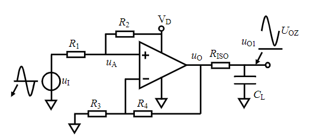

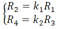

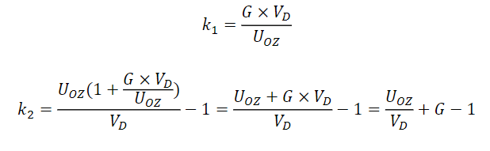

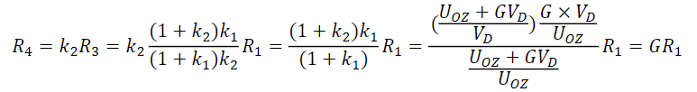

#### 移位型：直接耦合同相衰减

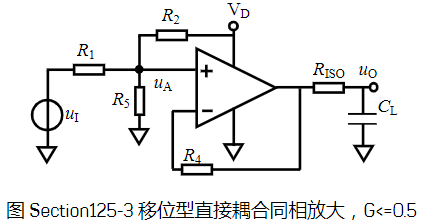

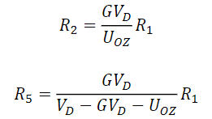

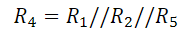

