```mermaid
flowchart TB
	subgraph p1["初始模块"]
	direction TB
        x1("画出抽样信号的时域图像fs")
        x2("画出待测信号的时域图像f1")
        x3("画出待测信号与抽样信号的乘积f2")
        x1 --> x2 --> x3
	end
	
	subgraph p2["对比模块"]
	direction TB
        y1("画出抽样信号的频域图像Fs")
        y2("画出待测信号的频域图像F1")
        y3("画出待测信号与抽样信号的卷积F2")
        y4("到此为止已经得到了6个图像，放在一起对比")
        y1 --> y2 --> y3 --> y4
	end
	
	subgraph p3["傅里叶变换模块"]
	direction LR
        z1("抽样信号的
        时域图像fs的
        频率不断减小，周期扩大
        表现为图像拉宽")
        z2("抽样信号的
        频域图像Fs
        与原点的距离缩小
        表现为图像缩窄")
        z3("乘积信号f2
        的图像拉宽")
        z4("卷积信号F2的图像
        缩窄、幅值缩小")
        z1 ---|同时发生| z2 ---|同时发生| z3 ---|同时发生| z4 
	end
	p1 --> p2 --> p3
```

## 数字波形生成

### 1.概述

* 设计的任务：给出数字序列A、B的值和逻辑函数F的表达式(与、或、非、异或同或等),生成A、B和F的波形图。注:A、B序列长度最大值不小于16。
* 需要的知识点：vuepress的二次开发、逻辑运算基础知识、vue.js基本语法、echarts插件的使用等。
* 具体完成的设计内容：己完成题目所有需求：输入通道A、B，输出通道F0~F4的波形绘制；要求的5种逻辑运算。其中波形绘制模块规模较大，使用了echarts插件，代码行数在130行左右；逻辑运算模块耗时较多，主要花在调试，代码行数在50左右。
* 创新点：设计方案和演示效果集成在个人网站中，界面优雅简洁；波形图和用户有一定的交互，如鼠标移入可查看当前点的坐标、多通道选择显示与否、图表横坐标量程自适应、可下载当前显示的波形图、可切换波形图/柱状图、可显示数据视图。

### 2.总体设计

* 软件结构设计。对用户可见：输入框，波形界面，我们要做的就是获取用户的输入 -> 将这串输入进行逻辑运算 -> 将运算结果以某种方式呈现到波形界面。其中用户的输入是两串字符串（通道A和通道B），遍历字符串时配合逻辑运算符“|、&、~”等可以得到输出波形的字符串，再确定好横坐标（字符串的索引值，用户端看起来是时间），纵坐标（只有两个值：0和1）就可以调用echarts插件绘制波形。

  ```mermaid
  flowchart TB
    subgraph wave["波形生成模块"]
    direction LR
      x("调用echarts插件，
      根据逻辑运算模块返回的运算结果，
      生成波形")  --> dots1(...) --> y("some operation")
    end
    subgraph cal[逻辑运算模块]
    direction LR
      z("some operation")  --> dots2(...) --> g("some operation")
    end
    wave --->|调用运算方法| cal --->|返回运算结果| wave
    x1("用户输入") --> cal
  ```

  

* 数据结构设计。采用的全局变量：用户的输入A、B，输出与函数F0、或函数F1、非函数F2、异或函数F3、同或函数F4；其中A、B为字符串类型，期间会转成数组类型；F0~F1为数组类型；A、B用于保存用户的输入，F0 ~ F1用于保存逻辑运算结果。

### 3.详细设计及实现

* 主要模块的流程图。

  ```mermaid
  flowchart TB
    subgraph wave[逻辑运算模块]
    direction LR
    	X1("分别将A，B转换成数组,
    	方便运算")
      X2("遍历A数组或B数组，
      按位做逻辑运算")
      X3("将运算结果存储到对应的函数数组中")
      X1 --> X2 --> X3
    end
    x2("通道A的输入") ---> wave
    x3("通道B的输入") ---> wave
    wave ---> x4("A，B的与函数") 
    wave ---> x5("A，B的或函数") 
    wave ---> x6("A，B的异或函数")
    wave ---> x7("A，B的同或函数")
  ```

  

  ```mermaid
  flowchart TB
    subgraph wave[波形生成模块]
    direction LR
    	X1("根据逻辑运算模块返回的运算结果,
    	生成echarts的相关配置项和数据")
      X2("由配置项和数据生成echarts图表，
      生成波形")  
      X1 --> X2
    end
    x1("当前时刻time") ---> wave
    x2("通道A的输入") ---> wave
    x3("通道B的输入") ---> wave
    x4("A，B的与函数") ---> wave
    x5("A，B的或函数") ---> wave
    x6("A，B的异或函数") ---> wave
    x7("A，B的同或函数") ---> wave
    wave ---> y1("控制在用户界面上渲染这些波形")
  ```

  

  

  项目结果运行分析：

  

  点击链接，查看项目运行地址：

  可以看到用户界面初始渲染了样例输入的波形

  现在A输入0001000100010001，在B输入0101010101010101，结果显示:

  

  点击上方按钮，把其他波形隐藏，只观测异或波形：

  

  

  

* 设计过程中出现的错误。

  1. 根据echarts的[官方文档](https://echarts.apache.org/zh/index.html),有三种方式引入echarts：

     * ```text
       npm install echarts --save
       ```

     * CDN引入

     * 下载js文件到本地

     但可能是vuepress不同于一般vue项目，我在引入过程中发现前两种方式失效，据说需要动态引入，但是我不太会，所以我选择了第三种方式。
  
  2. Error from chokidar (D:): Error: EBUSY: resource busy or locked, lstat 'D:xxx'
  
     npm run dev（即运行项目）之后报错，这里我是因为在某个.md文件中引入了自定义组件，因为这个框架dev时会自动把components目录下的组件自动全局注册，无需我们引入，把该行import去掉就行了。
  

### 4.结论

本次实验达到了设计题目的要求，功能完善，亦有特点：设计方案和演示效果集成在个人网站中，界面优雅简洁；波形图和用户有一定的交互，如鼠标移入可查看当前点的坐标、多通道选择显示与否、图表横坐标量程自适应、可下载当前显示的波形图、可切换波形图/柱状图、可显示数据视图。

不足之处：用户只能选择已有的函数输出，不能自定义输出函数。

### 5.结束语

本次实验过程中基本没有遇到什么困难。

通过本次实验，我对vuepress的二次开发使用以及echarts的引入和使用有了一定的掌握。

### 6.程序清单

```js
/*逻辑运算模块的主要函数1*/
trans(channel) {
      /*依次将用户输入的A、B按位做逻辑运算填入数组
      /*`this.${channel}`会解析为'this.A'！！不是this.A，有点难受*/
      if (channel === 'A') {
        for (let i in this.A) {
          this.time.push(`t${i}`)
          let item0 = this.A[i] & this.B[i] //与
          this.F0.push(this.compareWithZero(item0))

          let item1 = this.A[i] | this.B[i] //或
          this.F1.push(this.compareWithZero(item1))

          let item2 = ~this.A[i]  //非
          this.F2.push(this.compareWithZero(item2))
          console.log(item2);
          console.log(this.F2);


          let item3 = this.A[i] ^ this.B[i] //异或
          this.F3.push(this.compareWithZero(item3))

          let item4 = ~(this.A[i] ^ this.B[i]) //同或
          this.F4.push(this.compareWithZero(item4))

        }
      } else
        for (let i in this.B) {
          this.time.push(`t${i}`)
          let item0 = this.A[i] & this.B[i] //与
          this.F0.push(this.compareWithZero(item0))

          let item1 = this.A[i] | this.B[i] //或
          this.F1.push(this.compareWithZero(item1))

          let item2 = ~this.A[i]  //非
          this.F2.push(this.compareWithZero(item2))

          let item3 = this.A[i] ^ this.B[i] //异或
          this.F3.push(this.compareWithZero(item3))

          let item4 = ~(this.A[i] ^ this.B[i]) //同或
          this.F4.push(this.compareWithZero(item4))

        }
    },
/*逻辑运算模块的主要函数2*/
compareWithZero(item) {
	if(item === -2) return 0
	else if(item === -1) return 1
    else return item > 0 ? 1 : 0
},
        
```


  ```js
  /*波形生成的主要函数*/
  drawLine(time, A, B, F0, F1, F2, F3, F4) {
        let myChart = echarts.init(document.getElementById('my-chart-box'));
        window.onresize = function () {
          myChart.resize();
        };
        let option = {
          tooltip: {
            show: true,
            trigger: 'axis'
          },
          legend: {
            data: ['A', 'B', 'F0:与','F1:或','F2:非','F3:异或','F4:同或']
          },
          grid: {
            left: '3%',
            right: '4%',
            bottom: '3%',
            containLabel: true
          },
          toolbox: {
            show:true,
            feature: {
              dataView: { readOnly: false },
              magicType: { type: ['line', 'bar'] },
              saveAsImage: {}
            }
          },
          xAxis: {
            type: 'category',
            data: time
          },
          yAxis: {
            type: 'value',
          },
          series: [
            {
              name: 'A',
              type: 'line',
              step: 'end',
              data: A,
              label: {
                show: true,
                position: 'bottom',
                textStyle: {
                  fontSize: 20
                }
              }
            },
            {
              name: 'B',
              type: 'line',
              step: 'end',
              data: B,
              label: {
                show: true,
                position: 'bottom',
                textStyle: {
                  fontSize: 20
                }
              }
            },
            {
              name: 'F0:与',
              type: 'line',
              step: 'end',
              data: F0,
              label: {
                show: true,
                position: 'bottom',
                textStyle: {
                  fontSize: 20
                }
              }
            },
            {
              name: 'F1:或',
              type: 'line',
              step: 'end',
              data: F1,
              label: {
                show: true,
                position: 'bottom',
                textStyle: {
                  fontSize: 20
                }
              }
            },
            {
              name: 'F2:非',
              type: 'line',
              step: 'end',
              data: F2,
              label: {
                show: true,
                position: 'bottom',
                textStyle: {
                  fontSize: 20
                }
              }
            },
            {
              name: 'F3:异或',
              type: 'line',
              step: 'end',
              data: F3,
              label: {
                show: true,
                position: 'bottom',
                textStyle: {
                  fontSize: 20
                }
              }
            },
            {
              name: 'F4:同或',
              type: 'line',
              step: 'end',
              data: F4,
              label: {
                show: true,
                position: 'bottom',
                textStyle: {
                  fontSize: 20
                }
              }
            },
          ]
        };
        // 使用刚指定的配置项和数据显示图表。
        myChart.setOption(option);
      },
  ```


## 电子钢琴

### 1.概述

* 设计的任务:已知各音阶标称频率值： （HZ）:

  

  完成一个程序，实现如下功能
(1)程序每间隔 0.5 秒扬声器发出不同频率的声音，每次升高 100HZ，直到频率达到2000hz。
(2)谱曲功能：首先给出基准节拍，并定义每个音节频率，输入一串字符串，可输出一段音乐。例如 0.5A1/1A2/0.5B3/1C4/5D1

* 需要的知识点：vuepress的二次开发、\<audio>标签的使用、vue.js基本语法、钢琴相邻音阶频率的差值、模板字符串语法、js动态操作dom等。

* 具体完成的设计内容:已完成所有要求，主要分成三个模块：点击琴键模块、输入字符串模块、点击100~2000Hz按钮模块。

* 创新点：设计方案和演示效果集成在个人博客中，界面优雅简洁；琴键可视化，用户可以点击鼠标“弹琴”；健壮性较好，有错误提示，如输入字符串不合法等。


### 2.总体设计

* 软件结构设计：对用户可见：输入框、几个操控按钮、38个琴键，我们要做的就是根据用户点击的按钮、输入的字符串 -> 将字符串转成程序可识别的标识 -> 播放相关音频文件。

  ```mermaid
  flowchart TB
  classDef manage fill:#ffffde;
  modu1:::manage
  modu2:::manage
  modu3:::manage
    subgraph modu1["100~2000Hz依次播放模块"]
    direction TB
      y1("直接顺序播放音频文件")
    end
    
    subgraph modu2[谱曲模块]
    direction TB
      g1("通过映射表将字符串映射为音频文件")  --> g2("得到一串音频文件的索引值") --> g3("按索引值顺序播放可演奏曲子")
    end
    subgraph modu3[琴键模拟模块]
    direction TB
      z1("琴键1")  --> z2("音频文件1")
      z3("琴键2")  --> z4("音频文件2")
      z5("琴键3")  --> z6("音频文件3")
      z7("琴键4")  --> z8("音频文件4")
      dots3("...")
      
    end
    
    
    x1("用户") --> sel1("点击琴键")
    x1("用户") --> sel2("输入字符串")
    x1("用户") --> sel3("点击100~2000Hz按钮")
    sel1 --> modu3 --> z9("点击某一琴键就会播放相应的音频文件")
    sel2 --> modu2
    sel3 --> modu1
    
  ```

  

* 数据结构设计：采用的全局变量：keyNum(整型)、userInput(字符串型)、songStr(数组型)、playIndex（数组型）、以及38个音频文件。

  ```mermaid
  flowchart TB
  	subgraph A1["变量说明"]
  	keyNum --> x1("用于记录琴键数、音频文件数")
  	userInput --> x2("存放用户输入的字符串")
  	songStr --> x3("字符串转换成数组谱曲")
  	playIndex --> x4("音频文件播放的索引数组")
  	end
  ```

  

### 3.详细设计及实现

1. 先找到钢琴音频文件,我是在网上找到在线钢琴模拟器,自己录制声音然后剪辑，一共50个，实际使用了39个。

   [在线钢琴模拟器](https://www.xiwnn.com/piano/)

   录音软件用的是“金舟电脑录音软件”——显然听都没听说过👍。虽然普通用户最久只能录制几分钟，但是我们就使用一下，完全ok，过后也可以马上卸载
   音频剪辑软件我用的是adobe旗下的audition（需破解）

   

   

   全选然后重命名可以批量重命名这些文件 看着很多，其实一共**1.2MB** 实际我只选用了前38个音频文件。

   说实话，钢琴的音频文件还真不好找，不然我也不会用这种笨方法了。

   针对任务（1），我是用一个循环+延时，其中每个按键绑定的延时需要递增，否则就会出现所有按键几乎同时被点击，非常难受😢。 接着js控制按键依次被自动点击。

   针对任务（2），我是用一个输入框来存放用户输入的字符串变量，将该字符串转成数组，遍历数组依次判断本次循环中的数组元素应该对应哪个音频文件，遍历完后可以得到字符串与音频文件的对应关系，（期间你需要定义一个数组类型变量来记录播放顺序）然后遍历这个播放顺序的数组，依次让按钮自动被点击。

   npm run dev(项目运行)结果：
   
   
   
   点击链接，查看项目运行地址
   
   
   
   用户界面可见四个按钮和一个输入框，以及38个琴键。点击琴键会听到相应的音频。

* 设计过程中出现的错误。

  播放100~2000Hz音频时几乎所有音频同时播放。解决方法是循环时每个音频文件都延时播放，且延时递增。


### 4.结论

本次实验已达到设计题目的要求，功能完善，特点是设计方案和演示效果集成在个人博客中，界面优雅简洁；琴键可视化，用户可以点击鼠标“弹琴”；健壮性较好，有错误提示，如输入字符串不合法等。

不足之处是由于音频标签audio本身的特性，音频短时间内不能被多次点击播放，导致相邻播放音频间延时要足够，否则当相邻播放音频为同一音源时只触发一次播放，不能完全模拟钢琴的效果。

### 5.结束语

本次实验过程中基本没有遇到什么困难。

通过本次实验，我对vuepress的二次开发使用、前端引用外部音频文件、audio标签的使用有了更深的掌握。

### 6.程序清单

```js
/*100~2000Hz（大概）依次播放*/
    f1() {
      document.querySelectorAll('.audio-box audio').forEach((e, index) => {
        if (index % 2 === 0) {
          setTimeout(() => {
            e.play();
          }, index * 250)
        }
      })
    },
/*根据谱曲数组，播放相应音频*/
    compose() {
      if (this.playIndex.length > 0) {
        let time = 1;
        for (let i in this.playIndex) {
          console.log('循环');
          console.log('此次序数为:'+this.playIndex[i]);
          let temp = this.playIndex[i].toString()
          setTimeout(() => {
            document.querySelector('#piano' + temp).play()
            time ++
            //延时递增
          }, i * 1000)
        }
      }
      else {
        document.querySelector('#piano20').play()
        alert('请输入自定义曲子,然后点击确定')
      }
    },

/*将用户输入的字符串转化成谱曲函数可以识别的数组*/
inputCompo() {
      this.songStr = []
      this.playIndex = []
      console.log(this.userInput);//userInput为类似'A1,B2,C3'的字符串
      this.userInput.split("/").forEach(e => {
        this.songStr.push(e) //
      });

      console.log('songStr:');
      console.log(this.songStr);//此处songStr应为数组类型

      for (let i in this.songStr) {
        let index = this.songStr[i].slice(1) //用于计算audio实际序数
        let ch = this.songStr[i].slice(0, 1) //ch用以判断在第几行

        if(index > 13) {
          alert('谱曲字符串不合法')
          return
        }

        if (ch === 'A') {
          // console.log('第一行');
          this.playIndex.push(index)

        } else if (ch === 'B') {
          this.playIndex.push(parseInt(index) + 13)
        } else if (ch === 'C') {
          this.playIndex.push(parseInt(index) + 26)
        } else
          alert('谱曲字符串不合法')
      }
      console.log('audio实际序数:\n');
      console.log(this.playIndex);
    },
```

## 采样定理

### 1.概述

* 设计的任务：请用动画描述采样定理，分为两种情况 f s≥2f max 和 f s<2f max。

* 需要的知识点：vuepress的二次开发、了解什么是采样定理、信号的时域和频域波形、傅里叶变化、动画制作软件AE的使用，重点是变速、路径动画、修剪路径等

* 具体完成的设计内容：已完成所有要求，主要分成三个模块：初始模块、对比模块、傅里叶变换模块。

* 创新点：集成到个人网站中，可查看在线链接。

### 2.总体设计

使用动画制作工具实现，无软件结构和数据结构。没有引用其他文件，一切从零开始。


### 3.详细设计及实现

* 主要模块的流程图。



* 由于该题较为简单，所以设计过程中基本没有出现什么错误。

### 4.结论

本次实验已达到设计题目的要求，功能完善，特点是设计方案和演示效果集成在个人博客中，界面优雅简洁。

不足之处是没有程序般严密的计算。

### 5.结束语

本次实验过程中基本没有遇到什么困难。

通过本次实验，我重拾了After Effect这款软件，对它有了更熟练的操作；对抽样定理有了更深的理解。


## 兑奖算法

### 1.概述

* 设计的任务：
  1. 问题描述：设兑奖方式为：从 1 到 22 选出 5 个不重复的数字{a0,a1,a2,a3,a4}，而主办方开出5 个号码P0、P1、P2、P3、P4，外加一个特别号 P5，得奖方式如下： 
  
     大奖：5 个号码和特别号码完全相同 一等奖：5 个号码完全相同，即{a0,a1,a2,a3,a4}={ P0，P1，P2，P3，P4}。
  
     二等奖：{a0,a1,a2,a3,a4}中有 4 个号码出现在{ P0，P1，P2，P3，P4}，另一个号码等于P5。
  
     三得奖：{a0,a1,a2,a3,a4}中有 4 个号码出现在{ P0，P1，P2，P3，P4}，另一个号码不等于P5。
  
     四等奖：{a0,a1,a2,a3,a4}中有 3 个号码出现在{ P0，P1，P2，P3，P4}。
  
     五等奖：{a0,a1,a2,a3,a4}中有 2 个号码出现在{ P0，P1，P2，P3，P4}。问题是：根据投注情况，求出中奖的注。
  
  2. 基本要求 
  
     （1） 设计投注的数据结构。
  
     （2） 设计投注方式：键盘输入或从文件输入等。 
  
     （3） 设计求解中奖注的算法。 
  
     （4） 输出中奖注。 
  
     （5） 输入随机注，判断是否中奖，中几等奖。
  
* 需要的知识点：vue.js基本语法、vue中watch的基本用法、vuepress的二次开发、第三方插件Lucky Canvas的引入和使用、简单的按键消抖等。

* 具体完成的设计内容：已完成所有内容，主要分为三个模块：抽奖模块、开奖模块、兑奖模块。

* 创新点：设计方案和演示效果集成在个人博客中，界面优雅简洁；不止是给出获奖等级，模拟了抽奖转盘，用户对抽奖流程可见；用户可“作弊”。

### 2.总体设计

* 软件结构设计：对用户可见：开奖按钮、兑奖按钮、抽奖按钮，抽奖的转盘，外加一个“作弊”的输入框，各模块说明如下：用户点击抽奖 -> 转盘转动，模拟随机抽奖效果 -> 给出抽到的数字或别的什么标识；用户点击开奖 -> 给出后台随机生成的5个号码及1个特殊号码；用户点击兑奖 -> 对比开奖号码和抽奖号码，判断用户获奖等级并告知用户；用户在输入框输入想要的号码 -> 后台直接将这串号码当成用户抽到的号码。


* 数据结构设计：采用的全局变量：msg（字符串型）、userNumber（数组型）、btnClickNum（整型）、adminNumbers（数组型）、specialNumber（整型）、grade（获奖等级）、userInput（字符串型）

  ```mermaid
  flowchart LR
  	x1("msg") --> y1("用于存储提示信息")
  	x2("userNumber") --> y2("用于存储用户抽到的号码数")
  	x3("btnClickNum") --> y3("用于计数法按键消抖")
  	x4("adminNumbers") --> y4("用于存储主办方的开奖号码")
  	x5("specialNumber") --> y5("用于存储用户抽到的号码数")
  	x6("grade") --> y6("用于存储用户抽到的号码数")
  	x7("userInput") --> y7("用于存储用户的输入")
  	
  ```

  

### 3.详细设计及实现

* 主要模块的流程图:

```mermaid
  flowchart TB		
  	subgraph p1["抽奖模块"]
  	direction TB
  		subgraph p0["这是一个黑箱"]
          direction TB
              a1("A0,A1,...,A21")
          end
          x1("a0,a1,a2,a3,a4")     
          p0 -->|随机不重复抛出5个,\n经过排序整理|x1
  	end
  	
  	subgraph p2["开奖模块"]
  	direction TB
         subgraph p4["这是一个黑箱"]
          direction TB
              a2("A0,A1,...,A21")
          end
          y1("P0,P1,P2,P3,P4")     
          p4 -->|随机不重复抛出5个,\n经过排序整理|y1
          p4 -->|随机抛出一个特殊号码P0| y2("P5")
  	end
  	
  	subgraph p3["兑奖模块"]
  	direction LR
          z1("some operation") --> z2("...") --> z3("some operation")
  	end
  	p1 --> t1("a0,a1,a2,a3,a4") --> p3
  	p2 --> t2("(P0,P1,P2,P3,P4)+P5") --> p3 --> res("告知用户获奖等级")
```

找到LuckyCanvas插件的github地址


项目运行结果：


点击链接查看项目运行地址：


点击开奖：


点击单抽或五连抽，会有类似大转盘的抽奖动画：


抽完五个数后，会显示用户手中的号码数：


点击兑奖，会给出用户的获奖等级：


再次点击开奖，会有提示信息：


再次点击抽奖，也会有提示信息：


可以在“作弊”输入框输入想要的号码：


* 由于该题较为简单，所以设计过程中基本没有出现什么错误。


### 4.结论

本次实验已达到设计题目的要求，功能完善，特点是设计方案和演示效果集成在个人博客中，界面优雅简洁；不止是给出获奖等级，模拟了抽奖转盘，用户对抽奖流程可见；用户可“作弊”。

不足之处由于插件LuckyCanvas本身的局限，不能同时抽到多个数，设计中所谓的五连抽其实是连续单抽五次。

### 5.结束语

本次实验过程中基本没有遇到什么困难。

通过本次实验，我对vuepress的二次开发使用有了更深的掌握，对Lucky Canvas有了初步的认识与使用。

### 6.程序清单

```js
// 点击抽奖按钮会触发star回调
    startCallback () {
      // 调用抽奖组件的play方法开始游戏
      this.$refs.myLucky.play()
      // 模拟调用接口异步抽奖
      setTimeout(() => {
        // 假设后端返回的中奖索引是0
        let haveSameNum = true
        let prizeIndex//奖品的索引
        let i = 0
        while (1) {
          prizeIndex = Math.floor(Math.random() * 21 + 1) //得到1~22之间的一个随机数，不保证不重复
          // console.log(prizeIndex);
          haveSameNum = this.checkHaveSame(this.userNumbers,prizeIndex)
          if(haveSameNum === false) {
            this.userNumbers.push(prizeIndex)
            break
          }
        }
        // 调用stop停止旋转并传递中奖索引
        this.$refs.myLucky.stop(prizeIndex)
      }, 1000)
    },
    // 抽奖结束会触发end回调
    endCallback (prize) {
      this.msg = '你抽到了数字：' + prize.fonts[0].text
      this.showMsg()
    },
    /*单抽*/
    singleClick() {
      this.btnClickNum ++
      if(this.btnClickNum === 1) {
        if(this.userNumbers.length >= 5) {
          //用户号码数有5个，即此时是选择重开与否
          this.confirmRes = confirm('你已经抽到了5个数，确定重开吗')
          if(this.confirmRes) {
            //若用户选择了重开
            this.userNumbers = []//用户号码数'清零'
            //用户号码数提示框隐藏
            this.startCallback()
            this.confirmRes = false //恢复默认值
          }
        }
        else if(this.userNumbers.length >= 0) {
          //初始情况，直接单抽
          this.startCallback()
        }
        setTimeout(() => {
          this.btnClickNum = 0
        },2000)
      }
    },
    /*五连抽*/
    seriesDraw() {
      this.btnClickNum ++
      if (this.btnClickNum === 1) {
        setTimeout(() => {
          this.btnClickNum = 0
        },2000)
        if(this.userNumbers.length >= 5) {
          //当用户号码数有5个
          this.confirmRes = confirm('你已经抽到了5个数，确定重开吗')
          if (this.confirmRes) {
            //若用户选择重开
            this.userNumbers = []//用户号码数'清零'
            //用户号码数提示框隐藏
            $('.userNum').animate({
              opacity: '0'
            })
            for (let i = 0; i <= 4; i++) {
              setTimeout(() => {
                this.startCallback()
              }, i * 3000)
            }
            this.confirmRes = false//恢复默认值
          }
        }
        else if(this.userNumbers.length >= 1) {
          //已经单抽过了
          this.msg = '你已经单抽了，不能五连抽'
          this.showMsg()
        }
        else if (this.userNumbers.length >= 0) {
          //初始情况,可直接进行五连抽
          for (let i = 0; i <= 4; i++) {
            setTimeout(() => {
              this.startCallback()
            }, i * 3000)
          }
        }
      }
    },
    /*主办方开奖*/
    getAdminNumbers() {
      this.btnClickNum ++
      if(this.btnClickNum === 1) {
        //防止按键短时间内被点击使函数执行多次
        setTimeout(() => {this.btnClickNum = 0},2000)
        if(this.adminNumbers.length >= 5) {
          this.confirmRes = confirm('你已开奖，确定重新开奖？')
          if(this.confirmRes) {
            this.confirmRes = false //恢复默认值
            let num = Math.floor(Math.random() * 21 + 1)
            this.adminNumbers = []
            this.adminNumbers.push(num)
            let haveSameNum
            while (this.adminNumbers.length < 5) {
              let adminIndex = Math.floor(Math.random() * 21 + 1)
              haveSameNum = this.checkHaveSame(this.adminNumbers,adminIndex)
              if(haveSameNum === false) {
                this.adminNumbers.push(adminIndex)
              }
            }
            this.specialNumber = Math.floor(Math.random() * 21 + 1)//特殊号码数
          }
        }
        else if(this.adminNumbers.length === 0) {
          //初始情况，直接开奖
          let num = Math.floor(Math.random() * 21 + 1)
          this.adminNumbers = []
          this.adminNumbers.push(num)
          let haveSameNum
          while (this.adminNumbers.length < 5) {
            let adminIndex = Math.floor(Math.random() * 21 + 1)
            haveSameNum = this.checkHaveSame(this.adminNumbers,adminIndex)
            if(haveSameNum === false) {
              this.adminNumbers.push(adminIndex)
            }
          }
          this.specialNumber = Math.floor(Math.random() * 21 + 1)//特殊号码数
        }
      }
    },
    /*兑奖*/
    getMyPrize() {
      if(this.userNumbers.length >=5 && this.adminNumbers.length >=5 ) {
        let judgeSum = this.compareArray(this.userNumbers, this.adminNumbers)
        let judgeSpecial = false
        for(let i in this.userNumbers) {
          if(this.userNumbers[i] === this.specialNumber) {
            judgeSpecial = true
            break
          }
        }
        if(judgeSum < 2) this.grade = 0
        else if(judgeSum === 2) this.grade = 1//五等奖
        else if(judgeSum === 3) this.grade = 2//四等奖
        else if(judgeSum === 4) {
          if(!judgeSpecial)
            this.grade = 3 //三等奖
          else this.grade = 4 //二等奖
        }
        else if(judgeSum === 5) {
          if(!judgeSpecial) this.grade = 5//一等奖
          else this.grade = 6//特等奖
        }
        alert('获奖等级：' + this.switchGradeToStr(this.grade))
      }
    },

```

## 中国象棋

### 1.概述

* 设计的任务：自己设计一款类似围棋的棋类对战软件，不能用五子棋等已有规则。

  要求：

  （1）可人人对战 

  （2）规则判断（提子、判断打劫） 

  （3）人机对战 

  （4）可点目（数子）判断胜负 

  （5）网络对战（选作）

  注：课上老师指出也可以设计围棋、象棋等。

* 需要的知识点：vue.js基本语法、vue中watch的基本用法、vuepress的二次开发、中国象棋的走法、FEN串等、element UI的引入和使用。

* 具体完成的设计内容：已完成（1）（2）（3）（4）要求。其中玩家对战模块和人机对战模块规模最大，代码行数分别在400、900左右。

* 创新点：简单的评分系统和评语系统；人机对战中给电脑方设计了三项被动技能：兵线刷新、替父从军和草木皆兵；设置了三种难度：简单、困难和地狱。

### 2.总体设计

* 软件结构设计：对用户可见：一个棋盘和棋子（包括空白处也算作空白棋子），重开按钮，人机对战按钮，难度选择按钮。各模块说明如下：获取用户前后两次鼠标点击的位置（即一个棋子的起点和终点） -> 判断走法是否合法 -> 合法则控制棋子坐标变化，重新渲染棋盘；人机对战轮到电脑方执棋时，电脑先计算求出所有红方可能走的棋子，选出对红方最有利的走法 -> 电脑得知了红方下一步最有可能怎么走 -> 电脑计算求出所有它可以走的棋子，找出能阻断破坏上述对红方最有利的走法、或对自己黑方最有利的走法，比如红方将军，轮到电脑执棋时，电脑会检索到红方将军这一步走法，然后尝试阻断这一将军；而在没有将军时，电脑也会尝试去吃掉红方价值最大的棋子。

  ```mermaid
  flowchart TB
  	classDef manage file:#ffffde;
  	p1:::manage
  	p2:::manage
  	subgraph p1["玩家对战模块"]
  	direction TB		
  		x3("走法是否合法")
  	end
  	x1("鼠标第一次点击的位置")
  	x2("鼠标第二次点击的位置")
  	x1 --> p1
  	x2 --> p1 --> x4("改变棋子坐标
  	重新渲染棋盘
  	实现走棋")
  	
  	
  	subgraph p2["人机对战模块"]
  	direction TB
  		y2("通过搜索算法计算出电脑应该走哪一步棋")
  	end
  	y1("玩家的走棋") --> p2 --> y3("改变棋子坐标
  	重新渲染棋盘
  	实现走棋")
  ```

  

* 数据结构设计：采用的全局变量有dispalyChess(数组型)、playerSide（布尔型）、IN_BOARD_（数组型）、sqSelected（整型）、currentChess（字符型）、isHaveK_w（布尔型）、isHaveK_b（布尔型）、difficulty（字符串型）、probability（浮点型）、sqSrc（整型）、sqDest（整型）、IN_FORT\_（数组型）、LEGAL_SPAN（数组型）、KNIGHT_PIN\_（数组型）、wScore（整型）、bScore（整型）、markMsgArr（数组型），以及棋子图片、棋子背景图共18张图片。

  ```mermaid
  flowchart LR
  x1("dispalyChess") -->y1("用于存储当前棋盘信息")
  x2("playerSide") -->y2("用于存储当前走棋方信息")
  x3("IN_BOARD_") -->y3("辅助数组，用于判断某一
  棋子的一维坐标是否在棋盘内")
  x4("sqSelected") -->y4("当前鼠标是否选中一棋子")
  x5("currentChess") -->y5("当前选中的棋子，的首字母,")
  x6("isHaveK_w") -->y6("用于记录当前棋盘是否还有红方帅")
  x7("isHaveK_w") -->y7("用于记录当前棋盘是否还有黑方将")
  x8("difficulty") -->y8("记录用户选择的难度")
  x9("probability") -->y9("控制被动技能“替父从军”触发的概率")
  x10("sqSrc") -->y10("记录某一方选择棋子的起点")
  x11("sqDest") -->y11("记录某一方选择棋子的终点")
  x12("LEGAL_SPAN") -->y12("用于判断sqDest-sqSrc等于-16、-1、1、16")
  x13("KNIGHT_PIN_") -->y13("辅助数组，用于判断马脚处是否有棋子")
  x14("wScore") -->y14("记录红方得分")
  x15("bScore") -->y15("记录黑方得分")
  x16("markMsgArr") -->y16("存储所有评语信息")
  ```

  

### 3.详细设计及实现

* 算法介绍：

  #### 1.设计图形界面

     中国象棋有10行9列，很自然地想到可以用10×9矩阵表示棋盘。事实上，我们使用16×16矩阵来表示一个扩充了的虚拟棋盘。

     

     如上图所示，灰色部分为真实棋盘，置于虚拟棋盘之中。这么做是因为可以快速判断棋子是否走出边界，以及便于之后的一些运算。

     容易想到使用二维数组表示16×16矩阵，这样棋盘上的一个位置需要两个变量表示。如果使用长度为256的一维数组表示，一个位置只需一个变量，这就可以减少计算量。因此用一维数组表示16×16矩阵。

     一维矩阵和二维矩阵之间的转换已经有现成算法，如下：

     ```js
     RANK_Y(sq) {// 根据一维矩阵，获取二维矩阵行数 行数从0开始
           return sq >> 4;
     },
     FILE_X(sq) {// 根据一维矩阵，获取二维矩阵列数 列数从0开始
           return sq & 15;
     },
     ```

     判断某位置是否在棋盘内：

  ```js
  IN_BOARD(sq) {
        return this.IN_BOARD_[sq] != 0;
  }
  ```

  #### 2.棋子表示

  使用整数表示棋子

  |      |  将  |  士  |  象  |  马  |  车  |  炮  |  卒  |
  | :--: | :--: | :--: | :--: | :--: | :--: | :--: | :--: |
  | 红方 |  8   |  9   |  10  |  11  |  12  |  13  |  14  |
  | 黑方 |  16  |  17  |  18  |  19  |  20  |  21  |  22  |

  这样可以快速判断某棋子属于红方还是黑方，如下表所示：

  | 红方棋子 | 红方棋子  | 黑方棋子 | 黑方棋子  |
  | :------: | :-------: | :------: | :-------: |
  |  十进制  |  二进制   |  十进制  |  二进制   |
  |    8     | 0000 1000 |    16    | 0001 0000 |
  |    9     | 0000 1001 |    17    | 0001 0001 |
  |    10    | 0000 1010 |    18    | 0001 0010 |
  |    11    | 0000 1011 |    19    | 0001 0011 |
  |    12    | 0000 1100 |    20    | 0001 0100 |
  |    13    | 0000 1101 |    21    | 0001 0101 |
  |    14    | 0000 1110 |    22    | 0001 0110 |

  可以看出：

  红方棋子 & 8 = 1

  黑方棋子 & 16 = 1

  #### 3.字符串表示局面

  我们可以用一行字符串表示一个局面，这就是FEN格式串，一种使用ASCII码字符描述国际象棋局面的标准，当然也可应用于中国象棋。中国象棋的初始局面可表示为：

  rnbakabnr/9/1c5c1/p1p1p1p1p/9/9/P1P1P1P1P/1C5C1/9/RNBAKABNR w - - 0 1

  | 红方 | 字母 | 黑方 | 字母 | 对应单词 |
  | :--: | :--: | :--: | :--: | :------: |
  |  帅  |  K   |  将  |  k   |   king   |
  |  仕  |  A   |  士  |  a   | advisor  |
  |  相  |  B   |  象  |  b   |  bishop  |
  |  马  |  N   |  马  |  n   |  knight  |
  |  车  |  R   |  车  |  r   |   rook   |
  |  炮  |  C   |  炮  |  c   |  cannon  |
  |  兵  |  P   |  卒  |  p   |   pawn   |

  中国象棋共有十行，每行都用一个字符串表示，行间使用正斜杠分割。

  例如：

  - rnbakabnr表示

    

  - 9表示：第二行都是空格。
  
  - w表示轮到哪一方走，w即白方，b即黑方（没有用r表示红方，是为了与国际象棋对应，毕竟国际象棋是黑白两色。）
  
  - "- -"，在中国象棋中没有意义，始终用“-”表示。
  
  - 末尾的“0”表示双方没有吃子的走棋步数(半回合数)，通常该值达到120就要判和(六十回合自然限着)，一旦形成局面的上一步是吃子，这里就标记“0”。
  
  - 末尾的“1”表示当前的回合数。
  
    使用FEN串初始化棋局，这就涉及到了将FEN串转化为一维棋局数组。暂时不考虑哪方走子，只解析红色部分，伪代码如下：
  
    ```js
    // 将FEN串转为一维数组
    行变量 y = 3
    列变量 x = 3
    var c = FEN串第一个字符;
    while (c != " ") {
      if (c == "/") {   // 换行
        x = 3;
        y ++;
        if (y > 12) {
          break;
        }
      } else if (c >= "1" && c <= "9") {  // 出现空位
        列向量x增加c
      } else if (c >= "A" && c <= "Z") {  // 红方棋子
        将字符表示的棋子转换为整数，并放入数组x + (y << 4)的位置
      } else if (c >= "a" && c <= "z") {
        将字符表示的棋子转换为整数，并放入数组x + (y << 4)的位置
      }
       
      c = FEN串的下一个字符;
    }
    ```
  
    #### 4.棋盘界面设计
  
    假设有一张棋盘如下：
  
    
  
    由于棋盘有90个交叉点，我们把棋盘划分为的90个小正方形区域，交叉点是小正方形的中心。每个区域都会定义一个img标签。
  
    这些img标签有两个作用：
  
    - 显示棋子图片
  
      如果某个区域存在棋子，就会显示相应的棋子图片；否则，显示一张透明图片
  
    - 响应点击事件
  
    每个img标签都会绑定onmousedown事件。点击不同的img标签时，会传递不同的参数给响应函数，这样就知道点击的具体是哪个区域了。
    
    #### 5.棋盘相关的html、css
    
    在网上找到一副象棋的图片，在photoshop中抠图、导出为png格式；全部导出后全选右键重命名（这样可以批量重命名），利用模板字符串+v-for语法可以在html中快捷方便地列出所有象棋，如:
    
    ```html
    <div class="imgBox myImgBox" v-for="(item,index) in 90">
            
    </div>
    ```
    
    棋盘的css设计，这里我取了个巧，只要设置每个象棋的位置（包括暂时没有棋子的地方）的背景图为如下：
    
    
    
    这样就能组合成一张宫格很多的图，且棋子都在格子的顶点处。然后在楚河汉界处设置`background: none`即可
    
    #### 6.棋子的走法表示
    
    一个走法包括起点和终点，分别用sqSrc和pcDst表示一维棋局数组中的起点和终点。很容易想到，使用数组[sqSrc, pcDst]表示一个走法。（我不考虑节省内存）
    
    > **提示**
    >
    > 如果想节省内存，由于sqSrc和pcDst都是不超过255的整数（因为一维棋盘数组的大小是256），可以将sqSrc和pcDst压缩到一个整数中，算法如下：
    >
    > ```js
    > // 获取走法的起点
    > function SRC(mv) {
    >   return mv & 255;
    > }
    > // 获取走法的终点
    > function DST(mv) {
    >   return mv >> 8;
    > }
    > ```
    
    * **将**
    
      将的走法有四个方向，如下图所示：
    
      
    
      在一维数组中，1、2、3、4几个方向的起点和终点分别满足以下等式：
    
      ```js
      pcDst = sqSrc - 16
      
      pcDst = sqSrc - 1
      
      pcDst = sqSrc + 1
      
      pcDst = sqSrc + 16
      ```
    
      且必须在九宫格内
    
    * **士**
    
      士的走法也是四个方向，如下所示:
    
      
    
      士的4个方向分别满足以下等式：
    
      ```js
      pcDst = sqSrc - 17
      
      pcDst = sqSrc - 15
      
      pcDst = sqSrc + 15
      
      pcDst = sqSrc + 17
      ```
    
      且终点sqSrc位于九宫内
    
    * **象**
    
      象的四个走法如下图所示，黑三角是相应的象眼位置
    
      
    
      象的4个方向分别满足以下等式：
    
      ```js
      pcDst = sqSrc - 34
      
      pcDst = sqSrc - 30
      
      pcDst = sqSrc + 30
      
      pcDst = sqSrc + 34
      ```
    
      1）象不能过河
    
      在程序中，棋局被表示为大小为256的一维数组，一半棋盘位于0到127，另一半位于128到255。
    
      128的二进制是1000 0000，右起第八位是1。128到255这些数的二进制，右起第8位都是1；0到127这些数的二进制，右起第8位都是0。因此，如果象没过河，也就是pcDst和sqSrc位于相同的一半棋盘，那么
    
      2）象眼无棋子
    
      象眼位于sqSrc和sqDst的中点，判断(sqSrc + sqDst)/2 的位置是否有棋子即可。
    
    * **马**
    
      马的8个走法如下图所示，黑三角是相应的马脚位置
    
      
    
      马的8个方向满足以下等式：
    
      ```js
      pcDst = sqSrc - 33
      pcDst = sqSrc - 31
      pcDst = sqSrc - 18
      pcDst = sqSrc + 14
      pcDst = sqSrc - 14
      pcDst = sqSrc + 18
      pcDst = sqSrc + 31
      pcDst = sqSrc + 33
      ```
    
      对应的马脚分别位于：
    
      ```js
      sqSrc - 16
      sqSrc - 16
      sqSrc - 1
      sqSrc - 1
      sqSrc + 1
      sqSrc + 1
      sqSrc + 16
      sqSrc + 16
      ```
    
      马的走法需要满足下面两个条件：
    
      （1）、pcDst - sqSrc等于-33、-31、-18、14、-14、18、31、33其中的一个
    
      （2）、对应马脚的位置没有棋子
    
      我们使用一个新的辅助数组，来判断马的走法是否合法。
    
      ```js
      var KNIGHT_PIN_ = [
                                    0,  0,  0,  0,  0,  0,  0,  0,  0,
        0,  0,  0,  0,  0,  0,  0,  0,  0,  0,  0,  0,  0,  0,  0,  0,
        0,  0,  0,  0,  0,  0,  0,  0,  0,  0,  0,  0,  0,  0,  0,  0,
        0,  0,  0,  0,  0,  0,  0,  0,  0,  0,  0,  0,  0,  0,  0,  0,
        0,  0,  0,  0,  0,  0,  0,  0,  0,  0,  0,  0,  0,  0,  0,  0,
        0,  0,  0,  0,  0,  0,  0,  0,  0,  0,  0,  0,  0,  0,  0,  0,
        0,  0,  0,  0,  0,  0,  0,  0,  0,  0,  0,  0,  0,  0,  0,  0,
        0,  0,  0,  0,  0,  0,  0,  0,  0,  0,  0,  0,  0,  0,  0,  0,
        0,  0,  0,  0,  0,  0,  0,  0,  0,  0,  0,  0,  0,  0,  0,  0,
        0,  0,  0,  0,  0,  0,  0,  0,  0,  0,  0,  0,  0,  0,  0,  0,
        0,  0,  0,  0,  0,  0,  0,  0,  0,  0,  0,  0,  0,  0,  0,  0,
        0,  0,  0,  0,  0,  0,  0,  0,  0,  0,  0,  0,  0,  0,  0,  0,
        0,  0,  0,  0,  0,  0,  0,  0,  0,  0,  0,  0,  0,  0,  0,  0,
        0,  0,  0,  0,  0,  0,  0,  0,  0,  0,  0,  0,  0,  0,  0,  0,
        0,  0,  0,  0,  0,  0,-16,  0,-16,  0,  0,  0,  0,  0,  0,  0,
        0,  0,  0,  0,  0, -1,  0,  0,  0,  1,  0,  0,  0,  0,  0,  0,
        0,  0,  0,  0,  0,  0,  0,  0,  0,  0,  0,  0,  0,  0,  0,  0,
        0,  0,  0,  0,  0, -1,  0,  0,  0,  1,  0,  0,  0,  0,  0,  0,
        0,  0,  0,  0,  0,  0, 16,  0, 16,  0,  0,  0,  0,  0,  0,  0,
        0,  0,  0,  0,  0,  0,  0,  0,  0,  0,  0,  0,  0,  0,  0,  0,
        0,  0,  0,  0,  0,  0,  0,  0,  0,  0,  0,  0,  0,  0,  0,  0,
        0,  0,  0,  0,  0,  0,  0,  0,  0,  0,  0,  0,  0,  0,  0,  0,
        0,  0,  0,  0,  0,  0,  0,  0,  0,  0,  0,  0,  0,  0,  0,  0,
        0,  0,  0,  0,  0,  0,  0,  0,  0,  0,  0,  0,  0,  0,  0,  0,
        0,  0,  0,  0,  0,  0,  0,  0,  0,  0,  0,  0,  0,  0,  0,  0,
        0,  0,  0,  0,  0,  0,  0,  0,  0,  0,  0,  0,  0,  0,  0,  0,
        0,  0,  0,  0,  0,  0,  0,  0,  0,  0,  0,  0,  0,  0,  0,  0,
        0,  0,  0,  0,  0,  0,  0,  0,  0,  0,  0,  0,  0,  0,  0,  0,
        0,  0,  0,  0,  0,  0,  0,  0,  0,  0,  0,  0,  0,  0,  0,  0,
        0,  0,  0,  0,  0,  0,  0,  0,  0,  0,  0,  0,  0,  0,  0,  0,
        0,  0,  0,  0,  0,  0,  0,  0,  0,  0,  0,  0,  0,  0,  0,  0,
        0,  0,  0,  0,  0,  0,  0,  0,  0,  0,  0,  0,  0,  0,  0,  0,
        0,  0,  0,  0,  0,  0,  0,
      ];
      ```
    
      该数组在（-33 + 256）、（-31 + 256）、（-18 + 256）、（14 + 256）、（-14 + 256）、（18 + 256）、（31 + 256）、（33 + 256）这8个位置分别存放了-1、-1、-16、-16、1、1、16、16，其他位置都是0。
    
      设置变量sqPin满足：
    
      ```js
      sqPin = sqSrc + KNIGHT_PIN_[sqDst - sqSrc + 256]
      ```
    
      如果马的走法满足条件（1），那么spPin就是马脚的位置；否则sqPin = sqSrc。
    
      因此马的走法合法，只需要满足sqPin != sqSrc并且sqPin位置无棋子。
    
    * **车、炮**
    
      车的走法如下图所示：
    
      
    
      沿着四条直线走，每个方向可一直向前走，直到：
    
      （1）、走出棋盘
    
      （2）、碰到本方棋子
    
      （3）、吃掉对方棋子
    
      例如方向1，每走一步都是在起点基础上-1；方向2是在起点基础上-16；方向3是在起点基础上+1；方向4是在起点基础上+16。
    
      炮与车的行棋规则类似，也可以沿一个方向一直向前走，不过遇到棋子时，要越过去（也就是翻山）。翻山后，炮只能吃对方棋子，不能落到空位置。
    
    * **卒(兵)**
    
      红兵的走法如下图所示：
    
      
    
      （1）、判断是否过河
    
      以红方为例，红方是向上走。如果红方过河，则会走到棋盘0到127的位置，此时所处位置的二进制表示，右起第8位是0。（因为128的二进制是1000 0000，这与之前讲过的SAME_HALF函数类似）
    
      判断函数如下：
    
      ```js
      // sp是棋子位置，sd是走棋方（红方0，黑方1）。如果该位置已过河，则返回true；否则返回false。
      function AWAY_HALF(sq, sd) {
        return (sq & 0x80) == (sd << 7);
       
      }
      ```
    
      如果兵已经过河，是可以左右走的，满足下面条件的走法一定合法：
    
      AWAY_HALF(sq, sd) && (sqDst == sqSrc - 1 || sqDst == sqSrc + 1)
    
      （2）、判断兵（卒）是否是向前走了一步
    
      红兵向前走一步是sqSrc - 16，黑卒向前走一步是sqSrc + 16。可用如下函数得到兵（卒）向前一步的位置：
    
      ```js
      // sp是棋子位置，sd是走棋方（红方0，黑方1）。返回兵（卒）向前走一步的位置。
      function SQUARE_FORWARD(sq, sd) {
        return sq - 16 + (sd << 5);
      }
      ```
    
      因此，只要sqDst = = SQUARE_FORWARD(sq, sd)，说明兵（卒）是向前走了一步，走法合法。
    
      #### 7.电脑自动走棋
    
      电脑生成的走棋与上一部分叙述的棋子走法写的代码有点类似。
    
      - **将**
        
    
        使用一个辅助数组表示这四个方向：
    
        ```
        let KING_DELTA = [-16, -1, 1, 16];
        ```
    
        已知帅在一维棋局数组中的起点位置sqSrc。生成帅的走法，就是获取帅全部的合法终点sqDes。使用一个数组存储所有可能的走法，伪代码如下：
    
        ```javascript
        for (var i = 0; i < 4; i ++) {       // 将的4个方向
          let sqDst = sqSrc + KING_DELTA[i];    // 得到一个可能的终点位置
          if (该位置不位于九宫中) {
            // 该走法不合法，执行下一轮循环
            continue;
          }
          var pcDst = 终点位置的棋子;  　　　　// 如果终点位置没有棋子，那么pcDst=0
          if (pcDst不是本方棋子) {
            走法合法，保存到步骤数组中
          }
        }
        ```
    
      - **仕**
        
    
        同样使用辅助数组表示仕的4个方向：
    
        ```
        let ADVISOR_DELTA = [-17, -15, 15, 17];
        ```
    
        生成仕的走法，伪代码如下：
    
        ```js
        for (var i = 0; i < 4; i ++) {　　　　　　// 仕的4个方向
          var sqDst = sqSrc + ADVISOR_DELTA[i]; // 得到一个可能的终点位置
          if (该位置不位于九宫中) {
            // 该走法不合法，执行下一轮循环
            continue;
          }
          var pcDst = 终点棋子;　　　　　　　　　　// 如果终点位置没有棋子，那么pcDst=0
          if (pcDst不是本方棋子) {
            走法合法，保存到步骤数组中
          }
        }
        ```
    
      - **象**
        
    
        我们并不用设置一个类似[-34, -30, 30, 37]的数组保存象的方向。因为仕的方向，跟象眼的方向一致。仕方向的二倍，就是象的方向。
    
        ```js
        for (var i = 0; i < 4; i ++) {       // 象的4个方向
          var sqDst = sqSrc + ADVISOR_DELTA[i]; // 获得象眼的位置
          if (象眼不在棋盘上，或者象眼位置已过河，或者象眼存在棋子) {
                // 位置不合法，执行下一轮循环
            continue;
          }
          sqDst += ADVISOR_DELTA[i];    　　　　// 得到一个可能的终点位置
          var pcDst = 终点位置的棋子   　　　　// 如果终点位置没有棋子，那么pcDst=0
          if (pcDst不是本方棋子) {
            走法合法，保存到步骤数组中
          }
        }
        ```
    
      - **马**
    
        
    
        用辅助数组表示马的方向：
    
        KNIGHT_DELTA = [[-33, -31], [-18, 14], [-14, 18], [31, 33]];
    
        对应马腿的4个方向，与帅的4个方向是一样的。
    
        生成马的走法，伪代码如下：
    
        ```js
        for (var i = 0; i < 4; i ++) {　　　　　　// 马腿的4个方向
          var sqDst = sqSrc + KING_DELTA[i];　　// 得到一个马腿的位置
          if (马腿位置存在棋子) {
            continue;
          }
          for (var j = 0; j < 2; j ++) { // 1个马腿对应2个马的方向
            sqDst = sqSrc + KNIGHT_DELTA[i][j]; // 得到一个马的可能的终点位置
            if (该位置不在棋盘上) {
              continue;
            }
            var pcDst = 终点位置的棋子;        // 如果终点位置没有棋子，那么pcDst=0
            if (pcDst不是本方棋子) {
              走法合法，保存到步骤数组中
            }
          }
        }
        ```
    
      - **车**
    
        
    
        车的方向与帅的方向相同，只不过车可以连续走下去。
    
        生成车的走法，伪代码如下：
    
        ```js
        for (var i = 0; i < 4; i ++) {
          var delta = KING_DELTA[i];    // 得到一个方向
          var sqDst = sqSrc + delta;    // 从起点sqSrc开始，沿着方向delta走一步
          while (sqDst在棋盘上) {
            var pcDst = sqDst位置的棋子;
            if (pcDst == 0) {       // sqDst位置上根本就没有棋子
              走法合法，保存到步骤数组中
            } else {
              if (pcDst是对方的棋子) {
                走法合法，保存到步骤数组中
              }
              // 已经遇到了对方棋子，终止循环
              break;
            }
            sqDst += delta;     // 沿着方向delta向前走一步
          }
        }
        ```
    
      - **炮**
    
        
    
        炮的走法与车类似，但炮遇到一个棋子后，可以越过去，也就是翻山，并吃掉一个对方棋子。
    
        生成炮的走法，伪代码如下：
    
        ```js
        for (var i = 0; i < 4; i ++) {
          var delta = KING_DELTA[i];    // 得到一个方向
          var sqDst = sqSrc + delta;    // 从起点sqSrc开始，沿着方向delta走一步
          while (sqDst在棋盘上) {
            var pcDst = sqDst位置的棋子;
            if (pcDst == 0) {       // sqDst位置上根本就没有棋子
              走法合法，保存到步骤数组中
            } else {            // 终点存在棋子，炮需要翻山
              break;
            }
            sqDst += delta;     // 沿着方向delta向前走一步
          }
          sqDst += delta;       // 沿着方向delta向前走一步
          while (IN_BOARD(sqDst)) { // 如果sqDst仍位于棋盘，那么此时炮已经翻山了
            var pcDst = sqDst位置的棋子;
            if (pcDst > 0) {     // 炮翻山后遇到了一个棋子
              if (pcDst是对方棋子) {
                走法合法，保存到步骤数组中
              }
              // 炮翻山后，不管遇到的是对方棋子，还是己方棋子，都要结束对当前方向的搜索
              break;
            }
            sqDst += delta;
          }
        }
        ```
    
      - **兵**
    
        
    
        红兵和黑卒向前走的方向是不一样的，分别是-16和16。我们已经介绍了下面的函数：
    
        ```js
        // sp是棋子位置，sd是走棋方（红方0，黑方1）。返回兵（卒）向前走一步的位置。
        function SQUARE_FORWARD(sq, sd) {
          return sq - 16 + (sd << 5);
        }
        ```
    
        该函数可以获得兵（卒）前进一步的位置。
    
        生成兵的走法，伪代码如下：
    
        ```js
        var sqDst = SQUARE_FORWARD(sqSrc, this.sdPlayer);   // 得到兵（卒）前进一步的位置
        if (sqDst在棋盘上) {
          var pcDst = sqDst位置的棋子;
          if (pcDst不是本方棋子) {
            走法合法，保存到步骤数组中
          }
        }
        if (这个兵（卒）已过河) {
          for (var delta = -1; delta <= 1; delta += 2) {
            // delta只能取-1和1两个值，这正是兵（卒）的左右两个方向
            sqDst = sqSrc + delta;
            if (sqDst在棋盘上) {
              var pcDst = sqDst位置的棋子;
              if (pcDst不是本方棋子) {
                走法合法，保存到步骤数组中
              }
            }
          }
        }
        ```
    
      #### 8.搜索算法
    
      * **局面评估**
      
        局面评估，就是判断局面对红方（或黑方）的优势，并把优势量化。棋子价值可用以下不等式表达：
      
        帅 > 车 > 马、炮 > 仕、相 > 兵
      
        棋子价值可以简单量化为：
      
        |  兵  |  仕  |  相  |  炮  |  马  |  车  |  帅  |
        | :--: | :--: | :--: | :--: | :--: | :--: | :--: |
        |  10  |  20  |  20  |  40  |  45  |  90  | 1000 |
      
        
      
        > **提示** 
        >
        > 但是棋子价值是跟位置有关系的，比如兵在过河前价值很小，过河后价值大涨。在我的程序中，就不考虑这个了。
      
      * **搜索算法**
      
        思路：轮到电脑方执棋时:
      
        1. 电脑先计算求出所有红方可能走的棋子，选出对红方最有利的走法。
        2. 然后电脑得知了红方下一步最有可能怎么走。
        3. 电脑计算求出所有它可以走的棋子，找出能阻断破坏上述对红方最有利的走法、或对自己黑方最有利的走法。
        4. 比如红方将军，轮到电脑执棋时，电脑会检索到红方将军这一步走法，然后尝试阻断这一将军；而在没有将军时，电脑也会尝试去吃掉红方价值最大的棋子。
      
        
  
* 主要模块的流程图：

  搜索算法的流程图如下：

  ```mermaid
  flowchart TD
      A["开始"]
      B(["先定义一个变量maxVal，
      然后遍历红方棋子
      (每次遍历的元素：红棋item1)"])
      C(["使用machine_getExactStep(item1)
      函数得到item1的最佳走法[sqSrc,sqDst]"])
      C1(["使用machine_evaluate(arr)函数
      求出当前棋盘的价值，其中参数arr为当前
      棋盘数组；结果保存在val1"])
  	D{val1 > maxVal?}
      E(["记录当前最大评估值: maxVal=val1;
      记录此时的起点: sqSrc_w = sqSrc"])
      F{"是否遍历完红棋？"}
      G[("此时电脑已计算出红方
      最有可能走的棋子，即sqSrc_w")]
      
      J(["初始化一个变量minVal = maxVal,
      遍历黑棋（item2）"])
      K(["遍历黑棋item2的所有走法(item3)"])
      L(["电脑内部模拟黑棋使
      用了走法item3([sqSrc,sqDst])"])
      M(["重新使用machine_getExactStep(item3)
      函数得到红棋sqSrc_w的最佳走法[sqSrc_w,sqDst]"])
      N(["电脑内部模拟该红棋按最佳走法落子"])
      O(["调用machine_evaluate(arr)
      函数计算此时内部模拟棋盘的价值，
      其中参数arr为模拟棋盘数组;结果保存在val2中"])
      P{val2 < minVal?}
      Q(["记录当前最小评估值: maxVal=val1;
      记录此时的起点: sqSrc_b = sqSrc
      记录此时的终点sqDst_b = sqDst"])
      R{"是否遍历完该黑棋的走法？"}
      S{"是否遍历完所有黑棋？"}
      T[("此时电脑计算
      出对它最有利的走法[sqSrc_b,sqDst_b]")]
      
      A --> B --> C --> C1 --> D
      D ---->|no| B
      D -->|yes| E --> F
  	F -->|no| B
  	F -->|yes|G
  	G --> J --> K --> L --> M --> N --> O --> P
  	P -->|no|L 
  	P -->|yes| Q --> R
  	R -->|no|K
  	R -->|yes|S
  	S -->|no|J
  	S -->|yes|T
  ```

  项目运行结果：

  

  点击链接，查看项目运行地址：

  

  默认为玩家对战模式，尝试走棋，若走棋合法则该棋移动，走棋方切换；若不合法则不移动也不切换。

  

  鼠标悬浮在人机对战按钮上，会提示被动技能相关信息：

  

  点击人机对战后：

  

  

  电脑走棋时会给用户提示电脑移动了哪步棋：

  

  触发替父从军：

  

  

  

  触发兵线刷新：

  

  

  

  触发草木皆兵：

  

  

  

  一方胜利后会有评分结算：

  

* 设计过程中出现的错误。

vuepress引入element UI报错：```Cannot find module 'core-js/library/xxx' when import element-ui```

element UI是饿了么前端团队开发的一套UI组件库，较为成熟，根据其[官方文档](https://vuepress.vuejs.org/zh/guide/basic-config.html#应用级别的配置)，在`docs/.vuepress`下新建`enhanceApp.js`，在该文件中这样写:

```js
import ElementUI from "element-ui";
import 'element-ui/lib/theme-chalk/index.css'
export default ({
                  Vue, // the version of Vue being used in the VuePress app
                  // options, // the options for the root Vue instance
                  // router, // the router instance for the app
                  // siteData // site metadata
                }) => {
  Vue.use(ElementUI);
}
```

参考[文章](https://blog.csdn.net/qq_32855007/article/details/108726430)解决，这大概是版本号的问题，需执行`yarn add async-validator@1.11.5`或`npm install async-validator@1.11.5`,重新运行就可以了。虽然但是，这些组件没有适配移动端，以下给出几个组件的适配代码：

在`docs/.vuepress/styles/index.styl`中：

```css
/*弹窗*/
@media screen and (max-width: 500px) {
  .el-message {
    min-width: 300px !important;
  }
}
@media screen and (max-width: 500px) {
  .el-message-box{
    width: 300px !important;
  }
}
```

### 4.结论

本次实验已达到设计题目的要求，功能完善，特点是设计方案和演示效果集成在个人博客中，界面优雅简洁；简单的评分系统和评语系统；人机对战中给电脑方设计了三项被动技能：兵线刷新、替父从军和草木皆兵；设置了三种难度：简单、困难和地狱。

不足之处是人机对战中电脑的棋力很弱（≤小学生）。

### 5.结束语

本次实验遇到最大的困难是电脑走棋的搜索算法，由于棋子很多，而且存储棋盘的数组的长度高达256，算法的时间复杂度甚至在 $O（n^4）$ 左右，一旦出现bug将很难定位该bug出现在哪步，有时修改到深夜一两点钟仍无果。解决方法是debug时先不遍历整个棋盘，而是棋盘的前10个（左右）的棋子，将流程图与伪代码放在旁边，时刻提示自己算法步骤。

到目前为止前端开发也做了好几个小项目了，基本没碰到什么高深的算法，本次实验让我再次体会到算法的珠玑奥妙，让我不得不感慨算法的门槛之高。

### 6.程序清单

```js
/*玩家对战模块*/
/*每个img绑定一个点击事件*/
    document.querySelectorAll('div.imgBox img').forEach((e, index) => {
      e.addEventListener('mousedown', (e, index) => {
        let fileName = e.target.src.slice(32, 33)
        // console.log(fileName);
        let alertStr = this.ImgNameToChessName(fileName)

        let imgIndex = parseInt(e.target.id.slice(3)) + 1
        // console.log(imgIndex);
        // console.log(this.displayChessTemp);
        let chessInfo = {//棋子的一些信息
          displayChess: this.displayChessTemp,
          fileName: fileName,
          imgIndex: imgIndex,
          sqSelected: this.imgIndexToSq(imgIndex)
        }

        this.chess1Click(chessInfo)

        /*用户每次点击棋子应该将该棋子储存到当前棋子currentChess*/
        // this.currentChess = fileName
        // if(this.sqSelected) {
        //   if(this.currentChess != 'U') {
        //     console.log('上次点击的是空白处');
        //   }
        // }
      })
    })
/*棋子走法相关辅助函数*/
/*传入一维坐标，如果在棋盘内，返回true*/
    IN_BOARD(sq) {
      return this.IN_BOARD_[sq] !== 0;
    },
    /*判断是否在九宫格内,若是，返回true*/
    IN_FORT(sq) {
      return this.IN_FORT_[sq] !== 0;
    },
    /*将二维矩阵坐标转换为一维矩阵坐标 (x,y)含(0,0)*/
    COORD_XY(x, y) {// 将二维矩阵坐标转换为一维矩阵坐标 (x,y)含(0,0)
      return x + (y << 4);
    },
    /*根据一维矩阵，获取二维矩阵行数 行数从0开始*/
    RANK_Y(sq) {// 根据一维矩阵，获取二维矩阵行数 行数从0开始
      return sq >> 4;
    },
    /*根据一维矩阵，获取二维矩阵列数*/
    FILE_X(sq) {// 根据一维矩阵，获取二维矩阵列数
      return sq & 15;
    },
    /*初始化棋盘，得到棋盘一开始的布局*/
        initBoard() {
      this.displayChessTemp = []//清空一下棋盘
      this.FENArray = this.FEN.split('') //将FEN字符串转为数组

      this.FENtoBoard(this.FENArray)//将FEN串(array型)转化为一维数组形式，并且字符元素映射为整型,保存在this.displayChessTemp
      for (let i = 0; i < 256; i++) {//将棋盘外元素设置为null
        if (!this.IN_BOARD(i)) {
          this.displayChessTemp[i] = null
        }
      }
      let start = this.COORD_XY(3, 3) //51,循环开始处
      let end = this.COORD_XY(11, 12) //203，循环结束处
      // let imgDomArr = document.querySelectorAll('div.imgBox img')
      /*tag用作记录文件名关键信息；
      **row是当前循环索引值i对应的二维坐标的行数,col是列数；
      **imgIndex用于记录i对应第几个图片*/
      let tag = '', row = 0, imgIndex = 0, col = 0;
      for (let i = start; i <= end; i++) {
        if (this.IN_BOARD(i)) {
          switch (this.displayChessTemp[i]) {
            case 8:
              tag = 'K';
              break;
            case 9:
              tag = 'A';
              break;
            case 10:
              tag = 'B';
              break;
            case 11:
              tag = 'N';
              break;
            case 12:
              tag = 'R';
              break;
            case 13:
              tag = 'C';
              break;
            case 14:
              tag = 'P';
              break;

            case 16:
              tag = 'k_';
              break;
            case 17:
              tag = 'a_';
              break;
            case 18:
              tag = 'b_';
              break;
            case 19:
              tag = 'n_';
              break;
            case 20:
              tag = 'r_';
              break;
            case 21:
              tag = 'c_';
              break;
            case 22:
              tag = 'p_';
              break;
            case 1:
              tag = 'UNexist';
              break;
            case 0:
              tag = 'UNexist'
              break;
            default:
              tag = 'UNexist'
          }
          row = this.RANK_Y(i)
          col = this.FILE_X(i)
          imgIndex = i - 7 * row - 30
          let imgSrcStr = `/img/chess/${tag}.png`;
          this.imgDomArr[imgIndex].src = imgSrcStr
          /*清空变量*/
          tag = '';
          row = 0;
          imgIndex = 0
        } else continue
      }

    },
/*人机对战模块*/     
    /*电脑走棋
    * dom:电脑操控模拟鼠标点击处的dom对象(实际上是调用了chess1Click函数，没有点击)
    * 1代表起点，2代表终点
    * 实现效果为棋子移动
    * */
    machineMove(dom1,dom2){
      let fileName1 = dom1.attr('src').slice(11, 12)
      let imgIndex1 = parseInt(dom1.attr('id').slice(3)) + 1
      let chessInfo1 = {//棋子的一些信息
        displayChess: this.displayChessTemp,
        fileName: fileName1,
        imgIndex: imgIndex1,
        sqSelected: this.imgIndexToSq(imgIndex1)
      }
      this.chess1Click(chessInfo1)//相当于鼠标点击了pos0车的位置

      setTimeout(() => {
        let fileName2 = dom2.attr('src').slice(11, 12)
        let imgIndex2 = parseInt(dom2.attr('id').slice(3)) + 1
        let chessInfo2 = {//棋子的一些信息
          displayChess: this.displayChessTemp,
          fileName: fileName2,
          imgIndex: imgIndex2,
          sqSelected: this.imgIndexToSq(imgIndex2)
        }
        this.chess1Click(chessInfo2)
      },500)

    },
    /*根据输入的棋子dom对象，返回该棋子所有可能的下一步走法（array型，但数组元素为dom对象）*/
    machine_getSteps(dom, arr) {
      // console.log(arr);
      if(arr !== undefined) {
        let step = []
        let fileName = dom.attr('src').slice(11, 12)
        let sqSrc = this.imgIndexToSq(parseInt(dom.attr('id').slice(3)) + 1)//获取一维坐标
        switch (fileName) {
          case 'k': {
            let KING_DELTA= [-16, -1, 1, 16];
            for (let i in KING_DELTA) {// 将的4个方向
              let sqDst = sqSrc + KING_DELTA[i]; // 得到一个可能的终点位置
              if(!this.IN_BOARD(sqDst)) {//终点处不在棋盘内
                continue
              }
              if(arr[sqDst] < 16 && this.IN_FORT(sqDst)) {
                //终点处没有棋子没有本方（黑方）棋子，且终点在九宫格内
                let row = this.RANK_Y(sqDst)
                let imgIndex = sqDst - 7*row -29 - 1
                let domTemp =  $('#pos' + imgIndex)
                step.push(domTemp)
              }
            }
            break
          }
          case 'a': {
            let ADVISOR_DELTA = [-15, -17, 17, 15];
            for(let i in ADVISOR_DELTA) {
              let sqDst = sqSrc + ADVISOR_DELTA[i]; // 得到一个可能的终点位置
              if(!this.IN_BOARD(sqDst) ) {//终点处不在棋盘内，或不在九宫格内
                continue
              }
              if(arr[sqDst] < 16 && this.IN_FORT(sqDst)) {
                //终点处没有棋子没有本方（黑方）棋子,且终点在九宫格内
                let row = this.RANK_Y(sqDst)
                let imgIndex = sqDst - 7*row -29 - 1
                let domTemp =  $('#pos' + imgIndex)
                step.push(domTemp)
              }
            }
            break
          }
          case 'b': {
            let BISHOP_DELTA = [-34, -30, 30, 34];
            for(let i in BISHOP_DELTA) {
              let sqDst = sqSrc + BISHOP_DELTA[i]; // 得到一个可能的终点位置
              if(!this.IN_BOARD(sqDst) || !this.SAME_HALF(sqSrc,sqDst)
                  || arr[(sqSrc+sqDst)/2] > 1) {
                //终点处不在棋盘内,或过河,或象眼无棋子
                continue
              }
              if(arr[sqDst] < 16) {
                //终点处没有棋子没有本方（黑方）棋子
                let row = this.RANK_Y(sqDst)
                let imgIndex = sqDst - 7*row -29 - 1
                let domTemp =  $('#pos' + imgIndex)
                step.push(domTemp)
              }
            }
            break
          }
          case 'n': {
            let KING_DELTA= [-16, -1, 1, 16];
            let KNIGHT_DELTA = [[-33, -31], [-18, 14], [-14, 18], [31, 33]];
            for(let i in KNIGHT_DELTA) {// 马腿的4个方向
              let sqDst = sqSrc + KING_DELTA[i]; // 得到一个马腿的位置
              if(arr[sqDst] > 1) {
                //马脚处有棋子
                continue
              }
              for (let j = 0; j < 2; j ++) { // 1个马腿对应2个马的方向
                sqDst = sqSrc + KNIGHT_DELTA[i][j]; // 得到一个马的可能的终点位置
                if (!this.IN_BOARD(sqDst)) {
                  continue;
                }
                if(arr[sqDst] < 16) {
                  //终点处没有棋子没有本方（黑方）棋子
                  let row = this.RANK_Y(sqDst)
                  let imgIndex = sqDst - 7*row -29 - 1
                  let domTemp =  $('#pos' + imgIndex)
                  step.push(domTemp)
                }
              }
            }
            break
          }
          case 'r': {
            let KING_DELTA= [-16, -1, 1, 16];
            for (let i = 0; i < 4; i ++) {
              let delta = KING_DELTA[i];    // 得到一个方向
              let sqDst = sqSrc + delta;    // 从起点sqSrc开始，沿着方向delta走一步
              while (this.IN_BOARD(sqDst)) {
                //在棋盘上
                if(arr[sqDst] < 16) {
                  //终点处没有棋子没有本方（黑方）棋子,或有红方棋子
                  let row = this.RANK_Y(sqDst)
                  let imgIndex = sqDst - 7*row -29 - 1
                  let domTemp =  $('#pos' + imgIndex)
                  step.push(domTemp)
                  if(arr[sqDst] >= 8) {
                    //终点处有对方（红方）棋子
                    break
                  }
                }
                else break
                sqDst += delta;     // 沿着方向delta向前走一步
              }
            }
            break
          }
          case 'c': {
            let KING_DELTA= [-16, -1, 1, 16];
            for (let i = 0; i < 4; i ++) {
              let delta = KING_DELTA[i];    // 得到一个方向
              let sqDst = sqSrc + delta;    // 从起点sqSrc开始，沿着方向delta走一步
              while (this.IN_BOARD(sqDst)) {
                if(arr[sqDst] === 1) {
                  //终点处没有棋子
                  let row = this.RANK_Y(sqDst)
                  let imgIndex = sqDst - 7*row -29 - 1
                  let domTemp =  $('#pos' + imgIndex)
                  step.push(domTemp)
                }
                else {            // 终点存在棋子，炮需要翻山
                  break;
                }
                sqDst += delta;     // 沿着方向delta向前走一步
              }
              sqDst += delta;       // 沿着方向delta向前走一步
              while (this.IN_BOARD(sqDst)) { // 如果sqDst仍位于棋盘，那么此时炮已经翻山了
                if(arr[sqDst] >= 8 && arr[sqDst] < 16) {
                  //终点处是红方棋子
                  let row = this.RANK_Y(sqDst)
                  let imgIndex = sqDst - 7*row - 29 - 1
                  let domTemp = $('#pos' + imgIndex)
                  step.push(domTemp)
                  break
                }
                sqDst += delta;
              }
            }
            break
          }
          case 'p': {
            let PAWN_delta = [16,1,-1] //兵一开始只能向下走,过河后可向左/右走
            let sqDst = sqSrc + PAWN_delta[0]
            if(arr[sqDst] < 16) {//终点处不是黑方棋子
              let row = this.RANK_Y(sqDst)
              let imgIndex = sqDst - 7*row -29 - 1
              let domTemp =  $('#pos' + imgIndex)
              step.push(domTemp)
            }
            //若兵过河了(此处的131是经过计算得到的过河临界值，且终点在棋盘内
            if(sqSrc >= this.domToSq($('#pos45'))) {
              for (let i = 0; i < 2; i++) {
                sqDst = sqSrc + PAWN_delta[i+1]
                if(!this.IN_BOARD(sqDst)) break
                if(arr[sqDst] < 16) {
                  let row = this.RANK_Y(sqDst)
                  let imgIndex = sqDst - 7*row -29 - 1
                  let domTemp =  $('#pos' + imgIndex)
                  step.push(domTemp)
                }
              }
            }
            break
          }

          case 'K': {
            let KING_DELTA= [-16, -1, 1, 16];
            for (let i in KING_DELTA) {// 将的4个方向
              let sqDst = sqSrc + KING_DELTA[i]; // 得到一个可能的终点位置
              if(!this.IN_BOARD(sqDst)) {//终点处不在棋盘内
                continue
              }
              if(!(arr[sqDst] & 8) && this.IN_FORT(sqDst)) {
                //终点处没有棋子没有本方（红方）棋子，且终点在九宫格内
                let row = this.RANK_Y(sqDst)
                let imgIndex = sqDst - 7*row -29 - 1
                let domTemp =  $('#pos' + imgIndex)
                step.push(domTemp)
              }
            }
            break
          }
          case 'A': {
            let ADVISOR_DELTA = [-15, -17, 17, 15];
            for(let i in ADVISOR_DELTA) {
              let sqDst = sqSrc + ADVISOR_DELTA[i]; // 得到一个可能的终点位置
              if(!this.IN_BOARD(sqDst) ) {//终点处不在棋盘内，或不在九宫格内
                continue
              }
              if(!(arr[sqDst] & 8) && this.IN_FORT(sqDst)) {
                //终点处没有棋子没有本方（红方）棋子,且终点在九宫格内
                let row = this.RANK_Y(sqDst)
                let imgIndex = sqDst - 7*row -29 - 1
                let domTemp =  $('#pos' + imgIndex)
                step.push(domTemp)
              }
            }
            break
          }
          case 'B': {
            let BISHOP_DELTA = [-34, -30, 30, 34];
            for(let i in BISHOP_DELTA) {
              let sqDst = sqSrc + BISHOP_DELTA[i]; // 得到一个可能的终点位置
              if(!this.IN_BOARD(sqDst) || !this.SAME_HALF(sqSrc,sqDst)
                  || arr[(sqSrc+sqDst)/2] > 1) {
                //终点处不在棋盘内,或过河,或象眼无棋子
                continue
              }
              if(!(arr[sqDst] & 8)) {
                //终点处没有棋子没有本方（红方）棋子
                let row = this.RANK_Y(sqDst)
                let imgIndex = sqDst - 7*row -29 - 1
                let domTemp =  $('#pos' + imgIndex)
                step.push(domTemp)
              }
            }
            break
          }
          case 'N': {
            let KING_DELTA= [-16, -1, 1, 16];
            let KNIGHT_DELTA = [[-33, -31], [-18, 14], [-14, 18], [31, 33]];
            for(let i in KNIGHT_DELTA) {// 马腿的4个方向
              let sqDst = sqSrc + KING_DELTA[i]; // 得到一个马腿的位置
              if(arr[sqDst] > 1) {
                //马脚处有棋子
                continue
              }
              for (let j = 0; j < 2; j ++) { // 1个马腿对应2个马的方向
                sqDst = sqSrc + KNIGHT_DELTA[i][j]; // 得到一个马的可能的终点位置
                if (!this.IN_BOARD(sqDst)) {
                  continue;
                }
                if(!(arr[sqDst] & 8)) {
                  //终点处没有棋子没有本方（红方）棋子
                  let row = this.RANK_Y(sqDst)
                  let imgIndex = sqDst - 7*row -29 - 1
                  let domTemp =  $('#pos' + imgIndex)
                  step.push(domTemp)
                }
              }
            }
            break
          }
          case 'R': {
            let KING_DELTA= [-16, -1, 1, 16];
            for (let i = 0; i < 4; i ++) {
              let delta = KING_DELTA[i];    // 得到一个方向
              let sqDst = sqSrc + delta;    // 从起点sqSrc开始，沿着方向delta走一步
              while (this.IN_BOARD(sqDst)) {
                //在棋盘上
                if(!(arr[sqDst] & 8)) {
                  //终点处没有棋子没有本方（红方）棋子,或有红方棋子
                  let row = this.RANK_Y(sqDst)
                  let imgIndex = sqDst - 7*row -29 - 1
                  let domTemp =  $('#pos' + imgIndex)
                  step.push(domTemp)
                  if(arr[sqDst] & 16) {
                    //终点处有对方（黑方）棋子
                    break
                  }
                }
                else break
                sqDst += delta;     // 沿着方向delta向前走一步
              }
            }
            break
          }
          case 'C': {
            let KING_DELTA= [-16, -1, 1, 16];
            for (let i = 0; i < 4; i ++) {
              let delta = KING_DELTA[i];    // 得到一个方向
              let sqDst = sqSrc + delta;    // 从起点sqSrc开始，沿着方向delta走一步
              while (this.IN_BOARD(sqDst)) {
                if(arr[sqDst] === 1) {
                  //终点处没有棋子
                  let row = this.RANK_Y(sqDst)
                  let imgIndex = sqDst - 7*row -29 - 1
                  let domTemp =  $('#pos' + imgIndex)
                  step.push(domTemp)
                }
                else {            // 终点存在棋子，炮需要翻山
                  break;
                }
                sqDst += delta;     // 沿着方向delta向前走一步
              }
              sqDst += delta;       // 沿着方向delta向前走一步
              while (this.IN_BOARD(sqDst)) { // 如果sqDst仍位于棋盘，那么此时炮已经翻山了
                if(arr[sqDst] & 16) {
                  //终点处是黑方棋子
                  let row = this.RANK_Y(sqDst)
                  let imgIndex = sqDst - 7*row - 29 - 1
                  let domTemp = $('#pos' + imgIndex)
                  step.push(domTemp)
                  break
                }
                sqDst += delta;
              }
            }
            break
          }
          case 'P': {
            let PAWN_delta = [-16,1,-1] //兵一开始只能向上走,过河后可向左/右走
            let sqDst = sqSrc + PAWN_delta[0]
            if(!(arr[sqDst] & 8)) {//终点处不是红方棋子,则走法合法
              let row = this.RANK_Y(sqDst)
              let imgIndex = sqDst - 7*row -29 - 1
              let domTemp =  $('#pos' + imgIndex)
              step.push(domTemp)
            }
            //若兵过河了(此处的131是经过计算得到的过河临界值，且终点在棋盘内
            if(sqSrc < 131 && this.IN_BOARD(sqDst)) {
              for (let i = 0; i < 2; i++) {
                sqDst = sqSrc + PAWN_delta[i+1]
                if(!this.IN_BOARD(sqDst)) break
                if(!(arr[sqDst] & 8)) {
                  let row = this.RANK_Y(sqDst)
                  let imgIndex = sqDst - 7*row -29 - 1
                  let domTemp =  $('#pos' + imgIndex)
                  step.push(domTemp)
                }
              }
            }
            break
          }
          default: this.$alert('出错了！')
        }
        return step
      }
      else this.$alert('出错了！')
    },
    /*根据局面评估值，返回下一步要走的棋子*/
    machine_getPcToBeMoved() {
      let blackAllPc = [], whiteAllPc = []
      let displayChess_evaluate = this.displayChessTemp.map(item => {return item})
      //该循环得到所有可以选择走的棋子，的一维坐标
      for(let sqSrc in this.displayChessTemp) {
        if(displayChess_evaluate[sqSrc] & 16) {
          blackAllPc.push(sqSrc)
        }
        else if(displayChess_evaluate[sqSrc] & 8) whiteAllPc.push(sqSrc)
      }
      let ramI_w = Math.floor(Math.random() * blackAllPc.length)
      let val2 = 0, maxVal = this.machine_evaluate(displayChess_evaluate),
          maxVal2_sqSrc_w = blackAllPc[ramI_w], DstDom
      /*该循环可得到红方棋子下一步的起点选择哪个*/
      for(let k in whiteAllPc) {
        let sqSrc_w = whiteAllPc[k]//某个红方棋子的起点一维坐标
        // console.log(sqSrc2);
        /*针对该红棋红方得到最有利于它的走法*/

        DstDom = this.machine_getExactStep(this.sqToDom(sqSrc_w),displayChess_evaluate)
        if(DstDom === undefined) continue //如果遍历到的某个红方棋子一种走法都没有，就跳过
        // console.log(DstDom);
        /*该红方棋子最佳走法的终点一维坐标*/
        let sqDst_w = this.domToSq(DstDom)
        /*假设该红棋移动*/
        let tempNum = this.machine_supposeToMove(displayChess_evaluate,sqSrc_w,sqDst_w)

        val2 = this.machine_evaluate(displayChess_evaluate)//试求评估值2
        /*恢复中转棋盘*/
        this.machine_recoverFicBoard(displayChess_evaluate,sqSrc_w,sqDst_w,tempNum)
        /*站在红方的角度，我肯定力求val2最大*/
        if(val2 >= maxVal) {
          maxVal = val2 //更新最大评估值
          maxVal2_sqSrc_w = sqSrc_w//更新评估值最大时选择的棋子
        }
        else {
          // minMaxVal2_sqSrc = blackAllPc[i]
          // console.log('error');
        }
        // break
      }
      let xDstDom = this.machine_getExactStep(this.sqToDom(maxVal2_sqSrc_w),this.displayChessTemp)
      if(xDstDom === undefined) {
        let xArr = this.machine_getSteps(this.sqToDom(maxVal2_sqSrc_w),this.displayChessTemp)
        xDstDom = xArr[Math.floor(Math.random() * xArr.length)]
      }
      if(this.sqToDom(maxVal2_sqSrc_w).attr('id') === undefined) {
        maxVal2_sqSrc_w = whiteAllPc[ramI_w]
      }
      // console.log('红方最好的起点:' + this.sqToDom(maxVal2_sqSrc_w).attr('id'));
      // console.log('红方最好的终点:' + xDstDom.attr('id'));
      // console.log('假设该红方棋子落子后的评估值：' + maxVal);

      // console.log(displayChess_evaluate);
      let sqDst_b,sqSrc_b//黑方最终决定的起点、终点
      let val1 = 0,minVal = maxVal
      // let minMaxVal2_sqSrc = blackAllPc[0]//使maxVal2最小时的棋子的起点一维坐标(黑方执棋)
      for(let i in blackAllPc) {
        //遍历所有黑棋
        // console.log(i);
        // if(i == 9) break //先遍历前10颗棋子
        let sqSrc = blackAllPc[i]//某个黑方棋子的起点一维坐标
        // console.log('一黑方棋子的起点:' + this.sqToDom(sqSrc).attr('id'));
        // console.log('一黑方棋子的终点：');
        /*走法数组，元素为对象类型*/
        let stepArray = this.machine_getSteps(this.sqToDom(sqSrc),this.displayChessTemp)
            .map(e => {return e})
        if(stepArray.length === 0) {
          continue
        }
        for(let j in stepArray) {//遍历某黑棋的所有走法
          /*该黑方棋子其中一个走法的终点，的一维坐标*/
          if(stepArray[j].attr('alt') === undefined) continue //谨防有疏漏..
          let sqDst = this.domToSq(stepArray[j])

          // console.log(this.sqToDom(sqDst));
          //
          // console.log(displayChess_evaluate);
          // console.log('可以到达一一一一');
          /*黑棋的虚拟移动*/
          let tempNum_b = this.machine_supposeToMove(displayChess_evaluate,sqSrc,sqDst)

          // console.log(displayChess_evaluate);
          /*重新求一下之前确定的红方棋子的终点*/
          let xxxDstDom = this.machine_getExactStep(this.sqToDom(maxVal2_sqSrc_w),displayChess_evaluate)
          if(xxxDstDom === undefined) continue//如果改走法没有了，跳过
          let sqDst_w = this.domToSq(xxxDstDom)

          // console.log('重新求了红棋的终点：' + this.sqToDom(sqDst_w).attr('id'));
          // console.log('可以到达二二二二');
          let tempNum_w = this.machine_supposeToMove(displayChess_evaluate,maxVal2_sqSrc_w,sqDst_w)
          val1 = this.machine_evaluate(displayChess_evaluate)//黑、红方都假设走完后，求评估值1
          // console.log('假设黑棋落子后的评估值：' + val1);

          this.machine_recoverFicBoard(displayChess_evaluate,maxVal2_sqSrc_w,sqDst_w,tempNum_w)
          this.machine_recoverFicBoard(displayChess_evaluate,sqSrc,sqDst,tempNum_b)
          /*站在黑方的角度，我肯定力求val1最小,maxVal2最小*/
          if(val1 <= minVal) {
            minVal = val1
            sqDst_b = sqDst
            sqSrc_b = sqSrc
            // console.log('最小评估值' + minVal);
          }
          // else console.log('err');

          // /*黑方走棋破坏的*/
          if(this.sqToDom(sqSrc).attr('id') === 'pos2') {
            // console.log('------------');
            // console.log(displayChess_evaluate);
          }
        }

        // break
      }
      // console.log('黑棋最终的起点:');
      // console.log(this.sqToDom(sqSrc_b));
      // console.log('黑棋最终的终点:');
      // console.log(this.sqToDom(sqDst_b));
      // return randomSrcDom

      return [this.sqToDom(sqSrc_b),this.sqToDom(sqDst_b)]
      /*以下为没有搜索算法，直接随机*/
      // let randomIndex
      // let randomSrcDom//起点,终点
      // while(1) {
      //   randomIndex = Math.floor(Math.random() * blackAllPc.length)//随机数在数组中的索引值
      //   // let randomSq = blackAllPc[randomIndex]
      //   randomSrcDom = this.sqToDom(blackAllPc[randomIndex])
      //   if(this.machine_getSteps(randomSrcDom).length > 0)
      //     //当选中的棋子至少有一种走法时，才退出循环，否则一直循环直到找到一棋子其走法有至少一种
      //     break
      // }

    },
    /*根据输入的起点dom对象，返回使评估值最小的终点的dom对象*/
    machine_getExactStep(srcDom,arr) {
      // console.log(arr);
      let allWays, displayChess_evaluate
      if(arr !== undefined) {
        allWays = this.machine_getSteps(srcDom,arr)
        displayChess_evaluate = arr.map((item) => {
          //用于评估分数的中转棋盘(不能直接对数组赋值，应对元素赋值)
          return item
        })
      }
      // else {
      //   allWays = this.machine_getSteps(srcDom) //该棋子的所有走法,数组元素是dom对象
      //   /*棋盘中转站*/
      //   displayChess_evaluate = this.displayChessTemp.map((item) => {
      //     //用于评估分数的中转棋盘(不能直接对数组赋值，应对元素赋值)
      //     return item
      //   })
      // }
      if(!this.playerSide) {
        // console.log('黑方执棋，此时求的是红棋的最佳终点');
        //如果是黑方执棋
        let maxVal = this.machine_evaluate(arr)
        let randomDstIndex = Math.floor(Math.random() * allWays.length)
        let dstDom = allWays[randomDstIndex]//初始就赋一个随机值
        // console.log(srcDom);
        for(let i in allWays) {
          let srcNum = displayChess_evaluate[this.domToSq(srcDom)]//起点棋子代表的Num值
          let sqDst = this.domToSq(allWays[i])//终点棋子的一维坐标
          let tempNum = displayChess_evaluate[sqDst]//保存一下落棋前终点处的棋子Num
          /*假设终点落下该棋，即终点处的Num值改变*/
          displayChess_evaluate[sqDst] = srcNum
          let currentVal = this.machine_evaluate(displayChess_evaluate)
          // console.log('评估值：'+ currentVal);
          if(this.machine_evaluate(displayChess_evaluate) > maxVal) {//如果评估值比原来大
            maxVal = this.machine_evaluate(displayChess_evaluate)//更新最大值
            dstDom = this.sqToDom(sqDst)//更新终点
          }
          // else console.log('此次循环没有大的');
          displayChess_evaluate[this.domToSq(srcDom)] = srcNum//恢复中转棋盘
          displayChess_evaluate[sqDst] = tempNum//恢复中转棋盘
        }
        return dstDom
      }
      else {
        let minVal = this.machine_evaluate(arr)
        let randomDstIndex = Math.floor(Math.random() * allWays.length)
        let dstDom = allWays[randomDstIndex]//初始就赋一个随机值
        // console.log(srcDom);
        for(let i in allWays) {
          let srcNum = displayChess_evaluate[this.domToSq(srcDom)]//起点棋子代表的Num值
          let sqDst = this.domToSq(allWays[i])//终点棋子的一维坐标
          let tempNum = displayChess_evaluate[sqDst]//保存一下落棋前终点处的棋子Num
          /*假设终点落下该棋，即终点处的Num值改变*/
          displayChess_evaluate[sqDst] = srcNum
          let currentVal = this.machine_evaluate(displayChess_evaluate)
          if(this.machine_evaluate(displayChess_evaluate) < minVal) {//如果评估值比原来小
            // console.log('------------');
            minVal = this.machine_evaluate(displayChess_evaluate)//更新最小值
            dstDom = this.sqToDom(sqDst)//更新终点
          }
          displayChess_evaluate[this.domToSq(srcDom)] = srcNum//恢复中转棋盘
          displayChess_evaluate[sqDst] = tempNum//恢复中转棋盘
        }
        return dstDom
      }
      // console.log(dstDom);
      // console.log(allWays);
      // console.log('当前评估值:' + this.machine_evaluate(this.displayChessTemp));
    },
    /*根据输入的整个棋盘数组，返回红方分数-黑方分数的值，记作《评估值》*/
    machine_evaluate(array) {
      let wVal = this.machine_getVal(array,true), bVal = this.machine_getVal(array,false)
      return wVal - bVal
    },
    /*根据输入的整个棋盘数组以及红/黑方标识，返回红/黑方的价值*/
    machine_getVal(array,isWhite) {
      let val = 0
      for(let i in array) {
        if(isWhite) {//若是红方
          switch (array[i]) {
            case 8: val += 1000;break
            case 9: val += 20;break
            case 10: val += 20;break
            case 11: val += 45;break
            case 12: val += 90;break
            case 13: val += 40;break
            case 14: val += 10;break
            default: val += 0
          }
        }
        else {
          switch (array[i]) {
            case 16: val += 1000;break
            case 17: val += 20;break
            case 18: val += 20;break
            case 19: val += 45;break
            case 20: val += 90;break
            case 21: val += 40;break
            case 22: val += 10;break
            default: val += 0
          }
        }
      }
      return val
    },
    /*根据输入的中转棋盘数组、起点、终点，完成在该数组上的虚拟移动，返回中转值*/
    machine_supposeToMove(arr,sqSrc,sqDst) {
      if(arr === undefined || sqSrc === undefined || sqDst === undefined)
        return 'ERROR'
      let temp = arr[sqDst]
      arr[sqDst] = arr[sqSrc]
      arr[sqSrc] = 1
      return temp
    },
    /*根据输入的中转棋盘数组、棋子的起点和终点、中转值，完成中转棋盘的恢复*/
    machine_recoverFicBoard(arr,sqSrc,sqDst,temp) {
      if(arr === undefined || sqSrc === undefined || sqDst === undefined || temp === undefined)
        return 'ERROR'

      arr[sqSrc] = arr[sqDst]
      arr[sqDst] = temp
    },
    /*该函数会使局面重新绘制，返回1,2,3,0
    * 1：表示触发了兵线刷新
    * 2：替父从军
    * 3：草木皆兵*/
    machine_passiveSkills() {
      /*兵线刷新*/
      return new Promise((resolve,reject) => {
        if(this.difficulty === 'd3') this.rounds ++

        /*兵线刷新*/
        let advisorSum = 0, isEaten = false
        let currentVal = this.machine_evaluate(this.displayChessTemp), isSkill3 = false
        // console.log(this.machine_getVal(this.displayChessTemp, false));
        for(let i in this.displayChessTemp) {
          if(this.displayChessTemp[i] === 22) {
            advisorSum ++
            continue
          }
          /*替父从军*/
          if(this.displayChessTemp[i] & 8 && this.displayChess_Old[i] & 16) {
            //若某处上一步为黑方棋子，下一步为红方棋子，说明黑方棋子被吃掉
            if(Math.floor(Math.random() + this.probability)) { //附加条件：大概30%几率触发替父从军
              isEaten = true
              this.displayChessTemp[i] = this.displayChess_Old[i]
            }
          }
          /*草木皆兵180*/
          if(currentVal > 180
              || this.machine_getVal(this.displayChessTemp,false) < 1220) {
            //黑方总价值＜1220，大约损失了两车一炮
            isSkill3 = true
          }
        }
        if(advisorSum < 3) {
          for(let i = 0,j = 0;i <5;i++,j+=2) {
            let domSq = this.domToSq($(`#pos${27 + j}`))
            // console.log($(`#pos${27 + j}`));
            this.displayChessTemp[domSq] = 22
          }
          document.querySelector('#skill1').play()
          setTimeout(() => {
            this.drawWithSq()
            // let chessInfo = null
            this.chess1Click(null)
            resolve(1)
          },3000)
        }
        /*替父从军*/
        else if(isEaten) {
          document.querySelector('#skill2').play()
          setTimeout(() => {
            this.drawWithSq()
            // let chessInfo = null
            this.chess1Click(null)
            resolve(2)
          },2500)
        }
        /*草木皆兵*/
        else if(isSkill3 || this.rounds >= 5) {
          this.flag = !this.flag
          for(let i in this.displayChessTemp) {
            if(this.displayChessTemp[i] === 1) {
              this.displayChessTemp[i] = 22
            }
          }
          document.querySelector('#skill3').play()
          setTimeout(() => {
            this.drawWithSq()
            // let chessInfo = null
            this.chess1Click(null)
            resolve(3)
          },3000)
        }
        else resolve(0)

      })
    },
```

