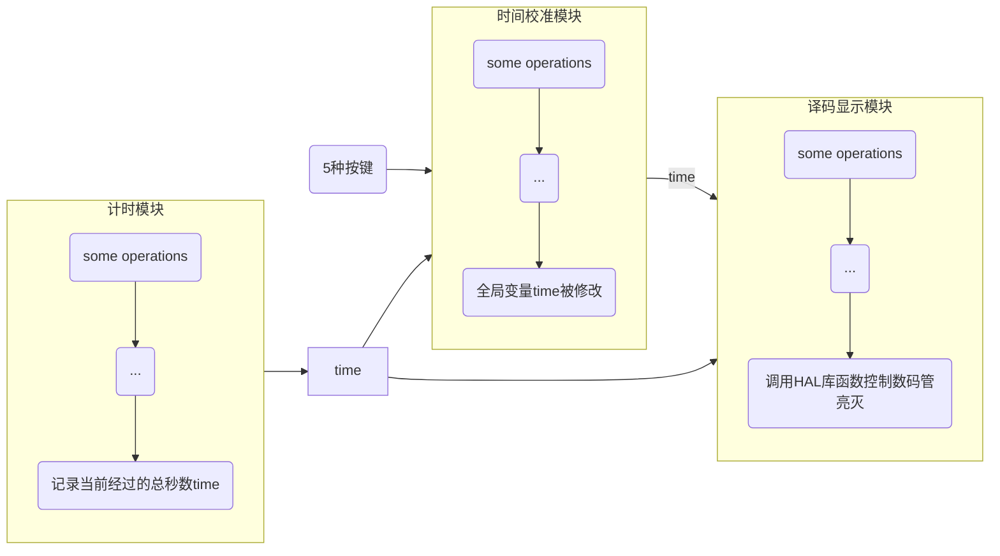
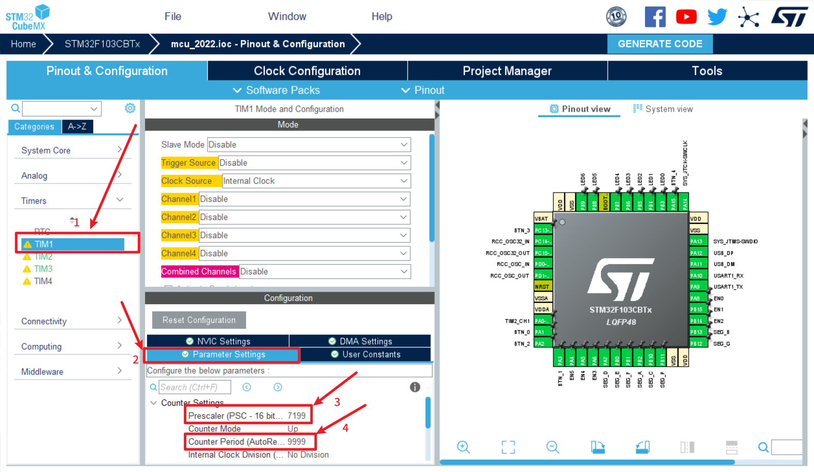
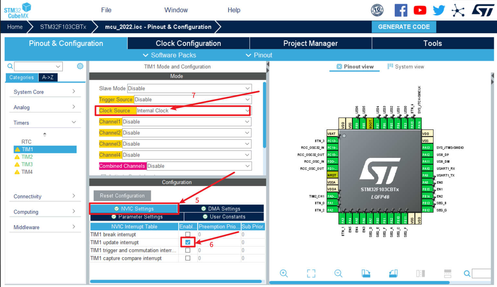
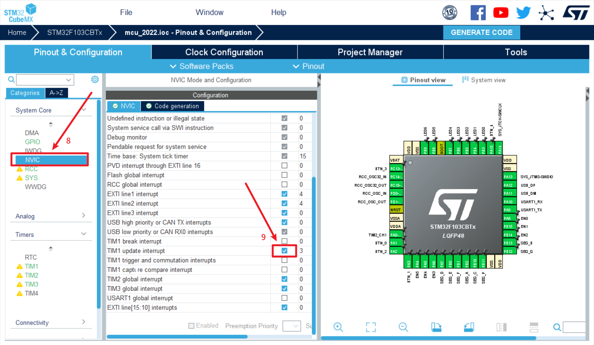
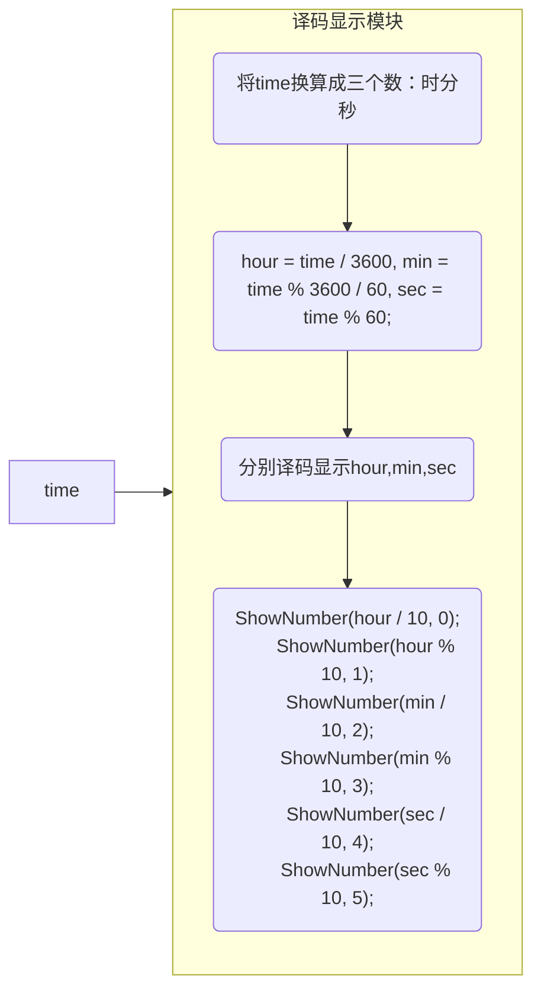

# 基于STM32F103单片机的时钟设计与实现

> **摘要**
>
> 在如今这个高科技发展社会，数字电子时钟已成经为人们日常生活中必不可少的必要物品，广泛应用于个人家庭及车站，电影院，办公室等重要的公共场所，给人民的生活、学习、工作带来很大的方便，由于单片机具有体积小、功能强可靠性高、价格低廉等系列优点，用单片机制作数字时钟，更方便于人民，服务于社会，符合社会科学发展观的需要，且开发较为容易，所以受到人们的重视和关注，以其极高的性能价格比，适应了社会的发展需要。通过对它的学习、应用，我设计了一个简单的电子时钟，能够准确显示时间，调整时间，锻炼了软件设计能力。
>
> **关键词**：stm32、电子时钟


## 前言

### 背景

随着社会发展的越来越快，单片机自20世纪70年代问世以来，由于其体积比较小，重量轻等多种有利优势，所以深受人们的热爱，由于开发较容易，灵活性好，也同时被很多设计者拿来应用到各种设备领域中;电子时钟是其中一个典型的例子，由于人们的生活节奏越来越快，时间观念在不断的增强，生活里很多时候离不开时钟，可以说时钟是现代人生活中是不可缺少的东西，现如今，时钟的款样和功能也越来越多，人们对钟表的精确度也越来越高。

### 定义

电子时钟称数显钟，是一种用数字电路技术实现时，分，秒计时的装置，与机械时钟相比，直观性为其只要显著特点，且非机械驱动，具有更长的使用寿命。

### 需求分析

传统的数字电子时钟采用了很多的分立元器件，不仅占用了很大的空间而且利用率比也很低，随着系统设计复杂度的不断提高，用传统时钟系统设计方法已经很难满足设计的需求，而单片机自20世纪末21世纪初问世以来，由于单片机具有体积小、功能强可靠性高、价格低廉等一系列优点，所以不仅已成为工业测控领域普遍采用的智能化控制工具，而且还已渗入到人们工作和和生活的各个角落，有力地推动了各个行业的技术改造。

电子时钟是采用数字电路实现对“时”、“分”、“秒”数字显示的计时装置，主要是利用电子技术将时钟数字化，电子化，让时钟更精确，精准。数字集成电路技术的发展采用了先进的石英技术，使数字钟具有走时准确、性能稳定、携带方便、体积小，界面美观、功能强、可靠性高。

### 总结

用单片机制作数字时钟，更方便于人民，服务于社会，符合社会科学发展观的需要，且开发较为容易，所以受到人们的重视和关注，以其极高的性能价格比，适应了社会的发展需要。随着单片机性价比的不断提高，新一代产品的应用也越来越广泛了，大的方面可以在工业工程方面做控制系统，小的方面可以用于家电控制，电子玩具等。  

接下来阐述**如何设计与实现基于STM32F103单片机的时钟**


## 详细设计

### 功能分析

1. 通过数码管显示数字，包括时分秒，具有时间校准的功能

2. 整点报时可以通过声音或光两种情况报警。

3. 时间校准由开发板上的按键统一完成。

### 工作原理

一个最基本的数字时钟系统主要由计时模块、译码显示模块，此外的时间校准模块属于附加功能。系统总体模块图如下：



#### 计时模块

计时模块应包含一个秒信号发生器，它直接决定整个系统的精度，可通过配置单片机内部的定时器并在相应的中断服务函数中给秒变量赋值实现。

> **注意**
>
> 不能使用HAL库中的延时函数来给秒变量自增，因为不能保证相邻两次执行延时函数的时间间隔是1s。


此模块的计时变量有两种实现方案：

1. 定义一个数组类型、长度为6的变量，前两位表示时、中间两位表示分、最后两位表示秒。秒信号控制最后一位自增，逢10进1，最后两位逢60进1，以此类推。然后遍历该数组去显示译码。
2. 定义一个无符号长整型（uint32_t）变量，来记录当前的总秒数，在显示译码时再换算成时分秒。注意因为24h=24*3600s=86400s,而uint16_t表示的最大的数为2^16=65536<86400，所以定义成uint32_t类型，避免数据溢出。

优缺点对比：

* 第一种方案的优点是数据类型占用存储空间小，缺点是在处理进位时有较多的逻辑判断，不是很直观。

* 第二种方案的优点是逻辑简单清晰，只需按如下方法计算即可得到时，分，秒：

  ```c
  uint16_t hour = f_time / 3600, min = f_time % 3600 / 60, sec = f_time % 60;
  ```

  

​	缺点也显而易见：占用存储空间较大。

对于设计者来说，在软硬件条件允许时，简单的逻辑显然更受欢迎。而对于该系统，即使定义一个uint32_t类型，也不会造成什么负担。所以我选择了方案二。

在CubeMX中，按如下步骤进行定时器1的相关配置：



其中**PSC**处是配置分频系数，**Counter Period**处是配置定时器的计数上限值，当达到该上限值时执行中断服务函数。




配置为定时器更新时触发中断。别忘了配置时钟源为内部时钟。

使能定时器相应的中断：




最后在程序中执行函数```HAL_TIM_Base_Start_IT(&htim1);```即可启动定时器1。定时器的中断服务函数如下：

```c
void HAL_TIM_PeriodElapsedCallback(TIM_HandleTypeDef *htim)
{
  if(htim->Instance == TIM1) {// 定时器1触发的中断
    time ++;//time是一个全局变量，记录总秒数
    if(time >= 24 * 3600) time = 0;
  }
  else if(htim->Instance == TIM3) {// 定时器3触发的中断,用于调整时间时的闪烁
    if(isHide == 0) isHide = 1;
    else isHide = 0;
  }
}
```

该函数传入的参数htim可用于判断是哪个定时器产生的中断。

正如前文所述，此处几乎没有逻辑判断，不用考虑进位问题。

#### 译码显示模块

该模块只需接收一个参数time，即可译码显示。



其中调用ShowNumber(num,pos)函数会实现：一个特定位置上（参数pos决定）的数码管显示一个十进制数（参数num决定）。同一时间只会亮起一个数码管，后一次调用的效果会覆盖前一次，所以需要动态扫描这6个数码管，在视觉上实现“**同时亮**”。

具体的代码如下：

```c
void showTime(uint32_t f_time) 
{
	uint16_t hour = f_time / 3600, min = f_time % 3600 / 60, sec = f_time % 60;
	for(int i = 0;i < 6;i++)
	{
		switch (i)
		{
			case 0: ShowNumber(hour / 10, i); break;
			case 1: ShowNumber(hour % 10, i); break;
			case 2: ShowNumber(min / 10, i); break;
			case 3: ShowNumber(min % 10, i); break;
			case 4: ShowNumber(sec / 10, i); break;
			case 5: ShowNumber(sec % 10, i); break;
			default:
				break;
		}
		HAL_Delay(3);
	}
}
```

#### 时间校准模块

实验板上具有上下左右中五个按键，可这样设计：

* **中**表示切换时间显示/调整模式，比如第一次按进入时间调整模式，再按一次正常显示时间。
* **左右**表示选择调整的位置，比如初始选择的是秒的个数位，按两次次**左**可选择分的个数位。且选中的位置以0.5s切换显示/隐藏。
* **上**表示增大当前值，**下**表示减小当前值，具体增大/减小的值还要视当前位置而定。

当按下中间的按键进入时间校准模式时，数码管上的显示应该静止，而背后的计数值time不静止，所以显然需要另一个中间变量TimeTemp控制译码显示。

至于控制选择的位置以0.5s切换显示/隐藏，可以启用定时器3，每隔0.5s产生一次中断，产生中断时，执行如下代码：

```c
isHide = !isHide;
```

再用变量isHide控制选择位置处的显示译码：

```c
void DisplaySegWithHide(uint32_t num)
{
  if(isHide) ShowNumber(10, PosSelceted);//10不能被译码，导致该位置处的数码管不显示
  else ShowNumber(num, PosSelceted);
}
```

其中的PosSelected表示选择的位置，初始为5（即秒的个数位）。按下左右键时可增加或减小，如：

```c
//该按钮实现调整位置向右移
if(isManaging) {
    if(PosSelceted == 5) PosSelceted = 5;
    else PosSelceted ++;
}
```

增大、减小当前值还需判断当前选择位置，如选择了秒的个数位，增大即```time ++;```如选择了分的个数位，增大即```time += 60;```具体如下：

```c
switch (PosSelceted) {
    case 0: if(isManaging && CheckArithNum(36000, 0)) TimeTemp += 36000; break;
    case 1: if(isManaging && CheckArithNum(3600, 0)) TimeTemp += 3600; break;
    case 2: if(isManaging && CheckArithNum(600, 0)) TimeTemp += 600; break;
    case 3: if(isManaging && CheckArithNum(60, 0)) TimeTemp += 60; break;
    case 4: if(isManaging && CheckArithNum(10, 0)) TimeTemp += 10; break;
    case 5: if(isManaging && CheckArithNum(1, 0)) TimeTemp += 1; break;
    default:
        TimeTemp += 3;
        PosSelceted = 1; 
        break;
}
time = TimeTemp; 
```

可以看到，正如前文所述，由于定义的time是长整型，在增加或减小当前值时，亦不用考虑进位、借位，这就使逻辑变得很简单、清晰，大大简化了设计者相应的思路和算法。


## 效果演示


<video id="video" controls="" preload="true" poster="">
  <source id="mp4" src="https://gorilla.cdnja.co/v/jg/JGnvG.mp4?token=7zFZJevG3oJr-xB5D8QWIw&expires=1655305934" type="video/mp4">
</video>


# 完整代码附录

前文只给除了部分、关键的代码，下面给出**main.c、seg7.c**文件的代码。其他文件均为CubeMX自动生成。

## main.c：

```c
/* USER CODE BEGIN Header */
/**
  ******************************************************************************
  * @file           : main.c
  * @brief          : Main program body
  ******************************************************************************
  * @attention
  *
  * Copyright (c) 2022 STMicroelectronics.
  * All rights reserved.
  *
  * This software is licensed under terms that can be found in the LICENSE file
  * in the root directory of this software component.
  * If no LICENSE file comes with this software, it is provided AS-IS.
  *
  ******************************************************************************
  */
/* USER CODE END Header */
/* Includes ------------------------------------------------------------------*/
#include "main.h"
#include "tim.h"
#include "usart.h"
#include "usb_device.h"
#include "gpio.h"

/* Private includes ----------------------------------------------------------*/
/* USER CODE BEGIN Includes */
// #include "seg7.h"
  uint32_t time = 72000;
  uint32_t TimeTemp = 0;
  uint16_t isManaging = 0;//表示正在调整的flag�????1表示调整模式�????0表示不是调整模式
  uint16_t isHide = 0;//表示某个数码管显示或隐藏
  uint16_t PosSelceted = 4;//调整选择的位�????
/* USER CODE END Includes */

/* Private typedef -----------------------------------------------------------*/
/* USER CODE BEGIN PTD */

/* USER CODE END PTD */

/* Private define ------------------------------------------------------------*/
/* USER CODE BEGIN PD */
/* USER CODE END PD */

/* Private macro -------------------------------------------------------------*/
/* USER CODE BEGIN PM */

/* USER CODE END PM */

/* Private variables ---------------------------------------------------------*/

/* USER CODE BEGIN PV */

/* USER CODE END PV */

/* Private function prototypes -----------------------------------------------*/
void SystemClock_Config(void);
static void MX_NVIC_Init(void);
/* USER CODE BEGIN PFP */

/* USER CODE END PFP */

/* Private user code ---------------------------------------------------------*/
/* USER CODE BEGIN 0 */

/* 
Num: 参与运算的数
Arithmetic: 0表示加法，1表示减法
返回值: 0表示不合法,1表示合法
 */
uint16_t CheckArithNum(uint32_t Num, uint16_t Arithmetic) 
{
  if(Arithmetic == 0) {
    if((TimeTemp + Num) > 24 * 3600) return 0;
  }
  else if(Arithmetic == 1) {
    if(TimeTemp < Num) return 0;
  }
  return 1;
}

void HAL_GPIO_EXTI_Callback(uint16_t GPIO_Pin)
{
  switch (GPIO_Pin)
  {
    case BTN_0_Pin: {
      TimeTemp = time;
      if(isManaging == 0) 
      {
        isManaging = 1;
        HAL_TIM_Base_Start_IT(&htim3);
      }
      else 
      {
        isManaging = 0;
        HAL_TIM_Base_Stop_IT(&htim3);
      }
      break;
    }
    case BTN_1_Pin: {
      if(isManaging) {//该按钮实现调整位置向左移�???? 
        if(PosSelceted == 0) PosSelceted = 0;
        else PosSelceted --;
      }
      break;
    }
      
    case BTN_3_Pin: {
      //该按钮实现调整位置向右移
      if(isManaging) {
        if(PosSelceted == 5) PosSelceted = 5;
        else PosSelceted ++;
      }
      break;
    }

    case BTN_2_Pin: {//该按钮实现加时
      switch (PosSelceted) {
        case 0: if(isManaging && CheckArithNum(36000, 0)) TimeTemp += 36000; break;
        case 1: if(isManaging && CheckArithNum(3600, 0)) TimeTemp += 3600; break;
        case 2: if(isManaging && CheckArithNum(600, 0)) TimeTemp += 600; break;
        case 3: if(isManaging && CheckArithNum(60, 0)) TimeTemp += 60; break;
        case 4: if(isManaging && CheckArithNum(10, 0)) TimeTemp += 10; break;
        case 5: if(isManaging && CheckArithNum(1, 0)) TimeTemp += 1; break;
        default:
          TimeTemp += 3;
          PosSelceted = 1; 
          break;
      }
      time = TimeTemp; break;
    }
    case BTN_4_Pin: {//该按钮实现减时
      switch (PosSelceted) {
        case 0: if(isManaging && CheckArithNum(36000, 1)) TimeTemp -= 36000; break;
        case 1: if(isManaging && CheckArithNum(3600, 1)) TimeTemp -= 3600; break;
        case 2: if(isManaging && CheckArithNum(600, 1)) TimeTemp -= 600; break;
        case 3: if(isManaging && CheckArithNum(60, 1)) TimeTemp -= 60; break;
        case 4: if(isManaging && CheckArithNum(10, 1)) TimeTemp -= 10; break;
        case 5: if(isManaging && CheckArithNum(1, 1)) TimeTemp -= 1; break;
        default:
          break;
      }
      time = TimeTemp; break;
    }
    default:
      break;
  }

}

void HAL_TIM_PeriodElapsedCallback(TIM_HandleTypeDef *htim)
{
  if(htim->Instance == TIM1) {// 定时器1触发的中断
    time ++;
    if(time >= 24 * 3600) time = 0;
  }
  else if(htim->Instance == TIM3) {// 定时器3触发的中断
    if(isHide == 0) isHide = 1;
    else isHide = 0;
  }
}

void DisplaySegWithHide(uint32_t num)
{
  if(isHide) ShowNumber(10, PosSelceted);//10表示一个乱码数
  else ShowNumber(num, PosSelceted);
}

void DrinklePos(uint32_t f_time, unsigned char pos)
{
	uint16_t hour = f_time / 3600, min = f_time % 3600 / 60, sec = f_time % 60;
	for(int i = 0;i < 6;i ++) {
    switch (i) {
      case 0: 
        if(i == pos) DisplaySegWithHide(hour / 10);
        else ShowNumber(hour / 10 , i);
        break;
      case 1: 
        if(i == pos) DisplaySegWithHide(hour % 10);
        else ShowNumber(hour % 10 , i);
        break;
      case 2: 
        if(i == pos) DisplaySegWithHide(min / 10);
        else ShowNumber(min / 10, i);
        break;
      case 3: 
        if(i == pos) DisplaySegWithHide(min % 10);
        else ShowNumber(min % 10, i);
        break;
      case 4: 
        if(i == pos) DisplaySegWithHide(sec / 10);
        else ShowNumber(sec / 10, i);
        break;
      case 5: 
        if(i == pos) DisplaySegWithHide(sec % 10);
        else ShowNumber(sec % 10, i);
        break;
      default:
        break;
		}
		HAL_Delay(3);
  }
}

/* USER CODE END 0 */

/**
  * @brief  The application entry point.
  * @retval int
  */
int main(void)
{
  /* USER CODE BEGIN 1 */

  /* USER CODE END 1 */

  /* MCU Configuration--------------------------------------------------------*/

  /* Reset of all peripherals, Initializes the Flash interface and the Systick. */
  HAL_Init();

  /* USER CODE BEGIN Init */

  /* USER CODE END Init */

  /* Configure the system clock */
  SystemClock_Config();

  /* USER CODE BEGIN SysInit */

  /* USER CODE END SysInit */

  /* Initialize all configured peripherals */
  MX_GPIO_Init();
  MX_TIM2_Init();
  MX_USART1_UART_Init();
  MX_USB_DEVICE_Init();
  MX_TIM1_Init();
  MX_TIM3_Init();

  /* Initialize interrupts */
  MX_NVIC_Init();
  /* USER CODE BEGIN 2 */
  HAL_TIM_Base_Start_IT(&htim1);//启动定时�????+启动定时器中�????
  /* USER CODE END 2 */

  /* Infinite loop */
  /* USER CODE BEGIN WHILE */
  // int num = 0;
  while (1)
  {
    if(isManaging) {
      DrinklePos(TimeTemp, PosSelceted);
      // showTime(TimeTemp);
    }
    else showTime(time);
    for(uint16_t i = 0;i < 2; i++) {
      if(i) ShowDot(1);
      else ShowDot(3);
      HAL_Delay(2);
    }
    // HAL_Delay(3);
    /* USER CODE END WHILE */

    /* USER CODE BEGIN 3 */
  }
  /* USER CODE END 3 */
}

/**
  * @brief System Clock Configuration
  * @retval None
  */
void SystemClock_Config(void)
{
  RCC_OscInitTypeDef RCC_OscInitStruct = {0};
  RCC_ClkInitTypeDef RCC_ClkInitStruct = {0};
  RCC_PeriphCLKInitTypeDef PeriphClkInit = {0};

  /** Initializes the RCC Oscillators according to the specified parameters
  * in the RCC_OscInitTypeDef structure.
  */
  RCC_OscInitStruct.OscillatorType = RCC_OSCILLATORTYPE_HSE;
  RCC_OscInitStruct.HSEState = RCC_HSE_ON;
  RCC_OscInitStruct.HSEPredivValue = RCC_HSE_PREDIV_DIV1;
  RCC_OscInitStruct.HSIState = RCC_HSI_ON;
  RCC_OscInitStruct.PLL.PLLState = RCC_PLL_ON;
  RCC_OscInitStruct.PLL.PLLSource = RCC_PLLSOURCE_HSE;
  RCC_OscInitStruct.PLL.PLLMUL = RCC_PLL_MUL9;
  if (HAL_RCC_OscConfig(&RCC_OscInitStruct) != HAL_OK)
  {
    Error_Handler();
  }

  /** Initializes the CPU, AHB and APB buses clocks
  */
  RCC_ClkInitStruct.ClockType = RCC_CLOCKTYPE_HCLK|RCC_CLOCKTYPE_SYSCLK
                              |RCC_CLOCKTYPE_PCLK1|RCC_CLOCKTYPE_PCLK2;
  RCC_ClkInitStruct.SYSCLKSource = RCC_SYSCLKSOURCE_PLLCLK;
  RCC_ClkInitStruct.AHBCLKDivider = RCC_SYSCLK_DIV1;
  RCC_ClkInitStruct.APB1CLKDivider = RCC_HCLK_DIV2;
  RCC_ClkInitStruct.APB2CLKDivider = RCC_HCLK_DIV1;

  if (HAL_RCC_ClockConfig(&RCC_ClkInitStruct, FLASH_LATENCY_2) != HAL_OK)
  {
    Error_Handler();
  }
  PeriphClkInit.PeriphClockSelection = RCC_PERIPHCLK_USB;
  PeriphClkInit.UsbClockSelection = RCC_USBCLKSOURCE_PLL_DIV1_5;
  if (HAL_RCCEx_PeriphCLKConfig(&PeriphClkInit) != HAL_OK)
  {
    Error_Handler();
  }
}

/**
  * @brief NVIC Configuration.
  * @retval None
  */
static void MX_NVIC_Init(void)
{
  /* EXTI1_IRQn interrupt configuration */
  HAL_NVIC_SetPriority(EXTI1_IRQn, 4, 0);
  HAL_NVIC_EnableIRQ(EXTI1_IRQn);
  /* EXTI2_IRQn interrupt configuration */
  HAL_NVIC_SetPriority(EXTI2_IRQn, 4, 0);
  HAL_NVIC_EnableIRQ(EXTI2_IRQn);
  /* EXTI3_IRQn interrupt configuration */
  HAL_NVIC_SetPriority(EXTI3_IRQn, 0, 0);
  HAL_NVIC_EnableIRQ(EXTI3_IRQn);
  /* USB_HP_CAN1_TX_IRQn interrupt configuration */
  HAL_NVIC_SetPriority(USB_HP_CAN1_TX_IRQn, 0, 0);
  HAL_NVIC_EnableIRQ(USB_HP_CAN1_TX_IRQn);
  /* USB_LP_CAN1_RX0_IRQn interrupt configuration */
  HAL_NVIC_SetPriority(USB_LP_CAN1_RX0_IRQn, 0, 0);
  HAL_NVIC_EnableIRQ(USB_LP_CAN1_RX0_IRQn);
  /* TIM1_UP_IRQn interrupt configuration */
  HAL_NVIC_SetPriority(TIM1_UP_IRQn, 3, 0);
  HAL_NVIC_EnableIRQ(TIM1_UP_IRQn);
  /* TIM2_IRQn interrupt configuration */
  HAL_NVIC_SetPriority(TIM2_IRQn, 0, 0);
  HAL_NVIC_EnableIRQ(TIM2_IRQn);
  /* TIM3_IRQn interrupt configuration */
  HAL_NVIC_SetPriority(TIM3_IRQn, 0, 0);
  HAL_NVIC_EnableIRQ(TIM3_IRQn);
  /* EXTI15_10_IRQn interrupt configuration */
  HAL_NVIC_SetPriority(EXTI15_10_IRQn, 0, 0);
  HAL_NVIC_EnableIRQ(EXTI15_10_IRQn);
}

/* USER CODE BEGIN 4 */

/* USER CODE END 4 */

/**
  * @brief  This function is executed in case of error occurrence.
  * @retval None
  */
void Error_Handler(void)
{
  /* USER CODE BEGIN Error_Handler_Debug */
  /* User can add his own implementation to report the HAL error return state */
  __disable_irq();
  while (1)
  {
  }
  /* USER CODE END Error_Handler_Debug */
}

#ifdef  USE_FULL_ASSERT
/**
  * @brief  Reports the name of the source file and the source line number
  *         where the assert_param error has occurred.
  * @param  file: pointer to the source file name
  * @param  line: assert_param error line source number
  * @retval None
  */
void assert_failed(uint8_t *file, uint32_t line)
{
  /* USER CODE BEGIN 6 */
  /* User can add his own implementation to report the file name and line number,
     ex: printf("Wrong parameters value: file %s on line %d\r\n", file, line) */
  /* USER CODE END 6 */
}
#endif /* USE_FULL_ASSERT */

```

## seg7.c:

```c
#include <stdio.h>
#include "main.h"

void ShowNumber( unsigned char num , unsigned char pos )
{
	switch( num )
	{
		case 0 :
			HAL_GPIO_WritePin( SEG_A_GPIO_Port, SEG_A_Pin, GPIO_PIN_RESET);
			HAL_GPIO_WritePin( SEG_B_GPIO_Port, SEG_B_Pin, GPIO_PIN_RESET);
			HAL_GPIO_WritePin( SEG_C_GPIO_Port, SEG_C_Pin, GPIO_PIN_RESET);
			HAL_GPIO_WritePin( SEG_D_GPIO_Port, SEG_D_Pin, GPIO_PIN_RESET);
			HAL_GPIO_WritePin( SEG_E_GPIO_Port, SEG_E_Pin, GPIO_PIN_RESET);
			HAL_GPIO_WritePin( SEG_F_GPIO_Port, SEG_F_Pin, GPIO_PIN_RESET);
			HAL_GPIO_WritePin( SEG_G_GPIO_Port, SEG_G_Pin, GPIO_PIN_SET);
			break ;
		case 1 :
			HAL_GPIO_WritePin( SEG_A_GPIO_Port, SEG_A_Pin, GPIO_PIN_SET);
			HAL_GPIO_WritePin( SEG_B_GPIO_Port, SEG_B_Pin, GPIO_PIN_RESET);
			HAL_GPIO_WritePin( SEG_C_GPIO_Port, SEG_C_Pin, GPIO_PIN_RESET);
			HAL_GPIO_WritePin( SEG_D_GPIO_Port, SEG_D_Pin, GPIO_PIN_SET);
			HAL_GPIO_WritePin( SEG_E_GPIO_Port, SEG_E_Pin, GPIO_PIN_SET);
			HAL_GPIO_WritePin( SEG_F_GPIO_Port, SEG_F_Pin, GPIO_PIN_SET);
			HAL_GPIO_WritePin( SEG_G_GPIO_Port, SEG_G_Pin, GPIO_PIN_SET);
			break ;
		case 2 :
			HAL_GPIO_WritePin( SEG_A_GPIO_Port, SEG_A_Pin, GPIO_PIN_RESET);
			HAL_GPIO_WritePin( SEG_B_GPIO_Port, SEG_B_Pin, GPIO_PIN_RESET);
			HAL_GPIO_WritePin( SEG_C_GPIO_Port, SEG_C_Pin, GPIO_PIN_SET);
			HAL_GPIO_WritePin( SEG_D_GPIO_Port, SEG_D_Pin, GPIO_PIN_RESET);
			HAL_GPIO_WritePin( SEG_E_GPIO_Port, SEG_E_Pin, GPIO_PIN_RESET);
			HAL_GPIO_WritePin( SEG_F_GPIO_Port, SEG_F_Pin, GPIO_PIN_SET);
			HAL_GPIO_WritePin( SEG_G_GPIO_Port, SEG_G_Pin, GPIO_PIN_RESET);
			break ;
		case 3 :
			HAL_GPIO_WritePin( SEG_A_GPIO_Port, SEG_A_Pin, GPIO_PIN_RESET);
			HAL_GPIO_WritePin( SEG_B_GPIO_Port, SEG_B_Pin, GPIO_PIN_RESET);
			HAL_GPIO_WritePin( SEG_C_GPIO_Port, SEG_C_Pin, GPIO_PIN_RESET);
			HAL_GPIO_WritePin( SEG_D_GPIO_Port, SEG_D_Pin, GPIO_PIN_RESET);
			HAL_GPIO_WritePin( SEG_E_GPIO_Port, SEG_E_Pin, GPIO_PIN_SET);
			HAL_GPIO_WritePin( SEG_F_GPIO_Port, SEG_F_Pin, GPIO_PIN_SET);
			HAL_GPIO_WritePin( SEG_G_GPIO_Port, SEG_G_Pin, GPIO_PIN_RESET);
			break ;
		case 4 :
			HAL_GPIO_WritePin( SEG_A_GPIO_Port, SEG_A_Pin, GPIO_PIN_SET);
			HAL_GPIO_WritePin( SEG_B_GPIO_Port, SEG_B_Pin, GPIO_PIN_RESET);
			HAL_GPIO_WritePin( SEG_C_GPIO_Port, SEG_C_Pin, GPIO_PIN_RESET);
			HAL_GPIO_WritePin( SEG_D_GPIO_Port, SEG_D_Pin, GPIO_PIN_SET);
			HAL_GPIO_WritePin( SEG_E_GPIO_Port, SEG_E_Pin, GPIO_PIN_SET);
			HAL_GPIO_WritePin( SEG_F_GPIO_Port, SEG_F_Pin, GPIO_PIN_RESET);
			HAL_GPIO_WritePin( SEG_G_GPIO_Port, SEG_G_Pin, GPIO_PIN_RESET);
			break ;
		case 5 :
			HAL_GPIO_WritePin( SEG_A_GPIO_Port, SEG_A_Pin, GPIO_PIN_RESET);
			HAL_GPIO_WritePin( SEG_B_GPIO_Port, SEG_B_Pin, GPIO_PIN_SET);
			HAL_GPIO_WritePin( SEG_C_GPIO_Port, SEG_C_Pin, GPIO_PIN_RESET);
			HAL_GPIO_WritePin( SEG_D_GPIO_Port, SEG_D_Pin, GPIO_PIN_RESET);
			HAL_GPIO_WritePin( SEG_E_GPIO_Port, SEG_E_Pin, GPIO_PIN_SET);
			HAL_GPIO_WritePin( SEG_F_GPIO_Port, SEG_F_Pin, GPIO_PIN_RESET);
			HAL_GPIO_WritePin( SEG_G_GPIO_Port, SEG_G_Pin, GPIO_PIN_RESET);
			break ;
		case 6 :
			HAL_GPIO_WritePin( SEG_A_GPIO_Port, SEG_A_Pin, GPIO_PIN_RESET);
			HAL_GPIO_WritePin( SEG_B_GPIO_Port, SEG_B_Pin, GPIO_PIN_SET);
			HAL_GPIO_WritePin( SEG_C_GPIO_Port, SEG_C_Pin, GPIO_PIN_RESET);
			HAL_GPIO_WritePin( SEG_D_GPIO_Port, SEG_D_Pin, GPIO_PIN_RESET);
			HAL_GPIO_WritePin( SEG_E_GPIO_Port, SEG_E_Pin, GPIO_PIN_RESET);
			HAL_GPIO_WritePin( SEG_F_GPIO_Port, SEG_F_Pin, GPIO_PIN_RESET);
			HAL_GPIO_WritePin( SEG_G_GPIO_Port, SEG_G_Pin, GPIO_PIN_RESET);
			break ;
		case 7 :
			HAL_GPIO_WritePin( SEG_A_GPIO_Port, SEG_A_Pin, GPIO_PIN_RESET);
			HAL_GPIO_WritePin( SEG_B_GPIO_Port, SEG_B_Pin, GPIO_PIN_RESET);
			HAL_GPIO_WritePin( SEG_C_GPIO_Port, SEG_C_Pin, GPIO_PIN_RESET);
			HAL_GPIO_WritePin( SEG_D_GPIO_Port, SEG_D_Pin, GPIO_PIN_SET);
			HAL_GPIO_WritePin( SEG_E_GPIO_Port, SEG_E_Pin, GPIO_PIN_SET);
			HAL_GPIO_WritePin( SEG_F_GPIO_Port, SEG_F_Pin, GPIO_PIN_SET);
			HAL_GPIO_WritePin( SEG_G_GPIO_Port, SEG_G_Pin, GPIO_PIN_SET);
			break ;
		case 8 :
			HAL_GPIO_WritePin( SEG_A_GPIO_Port, SEG_A_Pin, GPIO_PIN_RESET);
			HAL_GPIO_WritePin( SEG_B_GPIO_Port, SEG_B_Pin, GPIO_PIN_RESET);
			HAL_GPIO_WritePin( SEG_C_GPIO_Port, SEG_C_Pin, GPIO_PIN_RESET);
			HAL_GPIO_WritePin( SEG_D_GPIO_Port, SEG_D_Pin, GPIO_PIN_RESET);
			HAL_GPIO_WritePin( SEG_E_GPIO_Port, SEG_E_Pin, GPIO_PIN_RESET);
			HAL_GPIO_WritePin( SEG_F_GPIO_Port, SEG_F_Pin, GPIO_PIN_RESET);
			HAL_GPIO_WritePin( SEG_G_GPIO_Port, SEG_G_Pin, GPIO_PIN_RESET);
			break ;
		case 9 :
			HAL_GPIO_WritePin( SEG_A_GPIO_Port, SEG_A_Pin, GPIO_PIN_RESET);
			HAL_GPIO_WritePin( SEG_B_GPIO_Port, SEG_B_Pin, GPIO_PIN_RESET);
			HAL_GPIO_WritePin( SEG_C_GPIO_Port, SEG_C_Pin, GPIO_PIN_RESET);
			HAL_GPIO_WritePin( SEG_D_GPIO_Port, SEG_D_Pin, GPIO_PIN_RESET);
			HAL_GPIO_WritePin( SEG_E_GPIO_Port, SEG_E_Pin, GPIO_PIN_SET);
			HAL_GPIO_WritePin( SEG_F_GPIO_Port, SEG_F_Pin, GPIO_PIN_RESET);
			HAL_GPIO_WritePin( SEG_G_GPIO_Port, SEG_G_Pin, GPIO_PIN_RESET);
			break ;
		default :
			HAL_GPIO_WritePin( SEG_A_GPIO_Port, SEG_A_Pin, GPIO_PIN_SET);
			HAL_GPIO_WritePin( SEG_B_GPIO_Port, SEG_B_Pin, GPIO_PIN_SET);
			HAL_GPIO_WritePin( SEG_C_GPIO_Port, SEG_C_Pin, GPIO_PIN_SET);
			HAL_GPIO_WritePin( SEG_D_GPIO_Port, SEG_D_Pin, GPIO_PIN_SET);
			HAL_GPIO_WritePin( SEG_E_GPIO_Port, SEG_E_Pin, GPIO_PIN_SET);
			HAL_GPIO_WritePin( SEG_F_GPIO_Port, SEG_F_Pin, GPIO_PIN_SET);
			HAL_GPIO_WritePin( SEG_G_GPIO_Port, SEG_G_Pin, GPIO_PIN_SET);
			break ;		
	}
	
	HAL_GPIO_WritePin( SEG_P_GPIO_Port, SEG_P_Pin, GPIO_PIN_SET);
	
	switch( pos )
	{
		case 0 :
			HAL_GPIO_WritePin( EN0_GPIO_Port, EN0_Pin, GPIO_PIN_RESET);
			HAL_GPIO_WritePin( EN1_GPIO_Port, EN1_Pin, GPIO_PIN_SET);
			HAL_GPIO_WritePin( EN2_GPIO_Port, EN2_Pin, GPIO_PIN_SET);
			HAL_GPIO_WritePin( EN3_GPIO_Port, EN3_Pin, GPIO_PIN_SET);
			HAL_GPIO_WritePin( EN4_GPIO_Port, EN4_Pin, GPIO_PIN_SET);
			HAL_GPIO_WritePin( EN5_GPIO_Port, EN5_Pin, GPIO_PIN_SET);
			break ;
		case 1 :
			HAL_GPIO_WritePin( EN0_GPIO_Port, EN0_Pin, GPIO_PIN_SET);
			HAL_GPIO_WritePin( EN1_GPIO_Port, EN1_Pin, GPIO_PIN_RESET);
			HAL_GPIO_WritePin( EN2_GPIO_Port, EN2_Pin, GPIO_PIN_SET);
			HAL_GPIO_WritePin( EN3_GPIO_Port, EN3_Pin, GPIO_PIN_SET);
			HAL_GPIO_WritePin( EN4_GPIO_Port, EN4_Pin, GPIO_PIN_SET);
			HAL_GPIO_WritePin( EN5_GPIO_Port, EN5_Pin, GPIO_PIN_SET);
			break ;
		case 2 :
			HAL_GPIO_WritePin( EN0_GPIO_Port, EN0_Pin, GPIO_PIN_SET);
			HAL_GPIO_WritePin( EN1_GPIO_Port, EN1_Pin, GPIO_PIN_SET);
			HAL_GPIO_WritePin( EN2_GPIO_Port, EN2_Pin, GPIO_PIN_RESET);
			HAL_GPIO_WritePin( EN3_GPIO_Port, EN3_Pin, GPIO_PIN_SET);
			HAL_GPIO_WritePin( EN4_GPIO_Port, EN4_Pin, GPIO_PIN_SET);
			HAL_GPIO_WritePin( EN5_GPIO_Port, EN5_Pin, GPIO_PIN_SET);
			break ;
		case 3 :
			HAL_GPIO_WritePin( EN0_GPIO_Port, EN0_Pin, GPIO_PIN_SET);
			HAL_GPIO_WritePin( EN1_GPIO_Port, EN1_Pin, GPIO_PIN_SET);
			HAL_GPIO_WritePin( EN2_GPIO_Port, EN2_Pin, GPIO_PIN_SET);
			HAL_GPIO_WritePin( EN3_GPIO_Port, EN3_Pin, GPIO_PIN_RESET);
			HAL_GPIO_WritePin( EN4_GPIO_Port, EN4_Pin, GPIO_PIN_SET);
			HAL_GPIO_WritePin( EN5_GPIO_Port, EN5_Pin, GPIO_PIN_SET);
			break ;
		case 4 :
			HAL_GPIO_WritePin( EN0_GPIO_Port, EN0_Pin, GPIO_PIN_SET);
			HAL_GPIO_WritePin( EN1_GPIO_Port, EN1_Pin, GPIO_PIN_SET);
			HAL_GPIO_WritePin( EN2_GPIO_Port, EN2_Pin, GPIO_PIN_SET);
			HAL_GPIO_WritePin( EN3_GPIO_Port, EN3_Pin, GPIO_PIN_SET);
			HAL_GPIO_WritePin( EN4_GPIO_Port, EN4_Pin, GPIO_PIN_RESET);
			HAL_GPIO_WritePin( EN5_GPIO_Port, EN5_Pin, GPIO_PIN_SET);
			break ;
		case 5 :
			HAL_GPIO_WritePin( EN0_GPIO_Port, EN0_Pin, GPIO_PIN_SET);
			HAL_GPIO_WritePin( EN1_GPIO_Port, EN1_Pin, GPIO_PIN_SET);
			HAL_GPIO_WritePin( EN2_GPIO_Port, EN2_Pin, GPIO_PIN_SET);
			HAL_GPIO_WritePin( EN3_GPIO_Port, EN3_Pin, GPIO_PIN_SET);
			HAL_GPIO_WritePin( EN4_GPIO_Port, EN4_Pin, GPIO_PIN_SET);
			HAL_GPIO_WritePin( EN5_GPIO_Port, EN5_Pin, GPIO_PIN_RESET);
			break ;
		default :
			HAL_GPIO_WritePin( EN0_GPIO_Port, EN0_Pin, GPIO_PIN_SET);
			HAL_GPIO_WritePin( EN1_GPIO_Port, EN1_Pin, GPIO_PIN_SET);
			HAL_GPIO_WritePin( EN2_GPIO_Port, EN2_Pin, GPIO_PIN_SET);
			HAL_GPIO_WritePin( EN3_GPIO_Port, EN3_Pin, GPIO_PIN_SET);
			HAL_GPIO_WritePin( EN4_GPIO_Port, EN4_Pin, GPIO_PIN_SET);
			HAL_GPIO_WritePin( EN5_GPIO_Port, EN5_Pin, GPIO_PIN_SET);
			break ;		
	}
}


/* 
pos: 需要亮小数点的位置
 */
void ShowDot(uint16_t pos) {
	switch (pos) {
		case 1: {
			HAL_GPIO_WritePin( EN0_GPIO_Port, EN0_Pin, GPIO_PIN_SET);
			HAL_GPIO_WritePin( EN1_GPIO_Port, EN1_Pin, GPIO_PIN_RESET);
			HAL_GPIO_WritePin( EN2_GPIO_Port, EN2_Pin, GPIO_PIN_SET);
			HAL_GPIO_WritePin( EN3_GPIO_Port, EN3_Pin, GPIO_PIN_SET);
			HAL_GPIO_WritePin( EN4_GPIO_Port, EN4_Pin, GPIO_PIN_SET);
			HAL_GPIO_WritePin( EN5_GPIO_Port, EN5_Pin, GPIO_PIN_SET);

			HAL_GPIO_WritePin( SEG_A_GPIO_Port, SEG_A_Pin, GPIO_PIN_SET);
			HAL_GPIO_WritePin( SEG_B_GPIO_Port, SEG_B_Pin, GPIO_PIN_SET);
			HAL_GPIO_WritePin( SEG_C_GPIO_Port, SEG_C_Pin, GPIO_PIN_SET);
			HAL_GPIO_WritePin( SEG_D_GPIO_Port, SEG_D_Pin, GPIO_PIN_SET);
			HAL_GPIO_WritePin( SEG_E_GPIO_Port, SEG_E_Pin, GPIO_PIN_SET);
			HAL_GPIO_WritePin( SEG_F_GPIO_Port, SEG_F_Pin, GPIO_PIN_SET);
			HAL_GPIO_WritePin( SEG_G_GPIO_Port, SEG_G_Pin, GPIO_PIN_SET);
			HAL_GPIO_WritePin( SEG_P_GPIO_Port, SEG_P_Pin, GPIO_PIN_RESET);
			break ;
		}
		case 3: {
			HAL_GPIO_WritePin( EN0_GPIO_Port, EN0_Pin, GPIO_PIN_SET);
			HAL_GPIO_WritePin( EN1_GPIO_Port, EN1_Pin, GPIO_PIN_SET);
			HAL_GPIO_WritePin( EN2_GPIO_Port, EN2_Pin, GPIO_PIN_SET);
			HAL_GPIO_WritePin( EN3_GPIO_Port, EN3_Pin, GPIO_PIN_RESET);
			HAL_GPIO_WritePin( EN4_GPIO_Port, EN4_Pin, GPIO_PIN_SET);
			HAL_GPIO_WritePin( EN5_GPIO_Port, EN5_Pin, GPIO_PIN_SET);

			HAL_GPIO_WritePin( SEG_A_GPIO_Port, SEG_A_Pin, GPIO_PIN_SET);
			HAL_GPIO_WritePin( SEG_B_GPIO_Port, SEG_B_Pin, GPIO_PIN_SET);
			HAL_GPIO_WritePin( SEG_C_GPIO_Port, SEG_C_Pin, GPIO_PIN_SET);
			HAL_GPIO_WritePin( SEG_D_GPIO_Port, SEG_D_Pin, GPIO_PIN_SET);
			HAL_GPIO_WritePin( SEG_E_GPIO_Port, SEG_E_Pin, GPIO_PIN_SET);
			HAL_GPIO_WritePin( SEG_F_GPIO_Port, SEG_F_Pin, GPIO_PIN_SET);
			HAL_GPIO_WritePin( SEG_G_GPIO_Port, SEG_G_Pin, GPIO_PIN_SET);
			HAL_GPIO_WritePin( SEG_P_GPIO_Port, SEG_P_Pin, GPIO_PIN_RESET);
			break ;
		}
		default:
		break;
	}
}

void showTime(uint32_t f_time) 
{
	uint16_t hour = f_time / 3600, min = f_time % 3600 / 60, sec = f_time % 60;
	// if(hour > 24) hour = 0;
	// else if(min >= 60) min = 0;
	// if(sec >= 60) sec = 0;
	for(int i = 0;i < 6;i++)
	{
		switch (i)
		{
			case 0: ShowNumber(hour / 10, i); break;
			case 1: ShowNumber(hour % 10, i); break;
			case 2: ShowNumber(min / 10, i); break;
			case 3: ShowNumber(min % 10, i); break;
			case 4: ShowNumber(sec / 10, i); break;
			case 5: ShowNumber(sec % 10, i); break;
			default:
				break;
		}
		HAL_Delay(3);
	}
}
```


