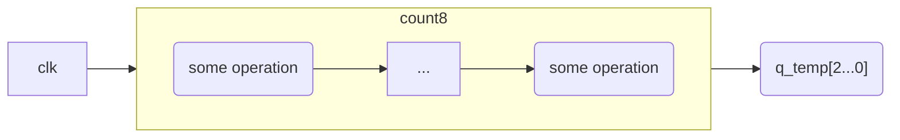
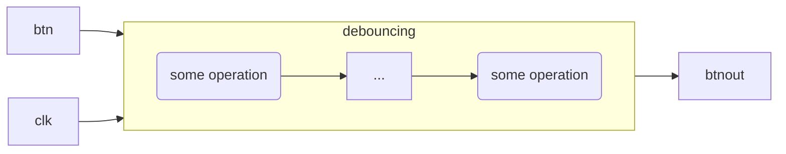
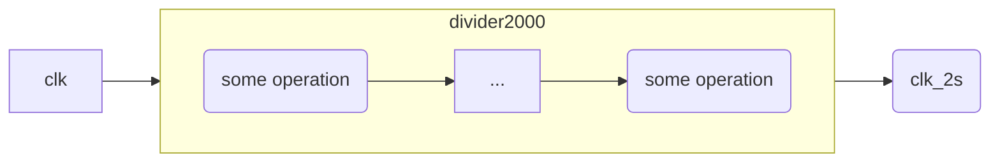
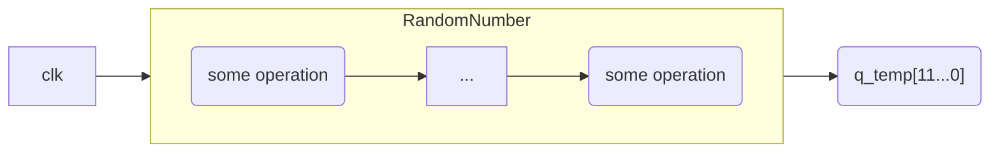
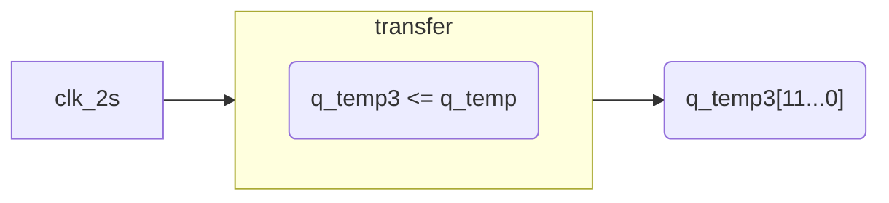
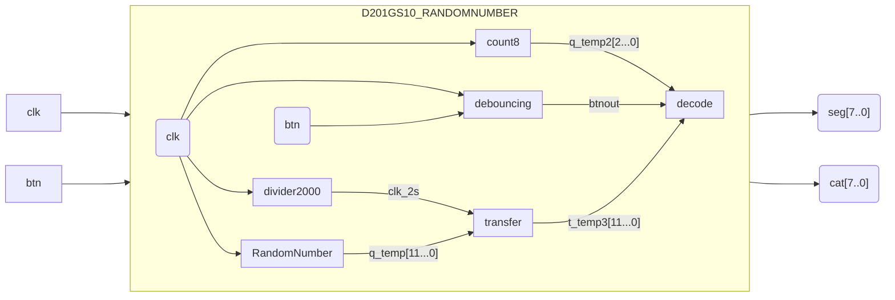

## 实验任务题目

用VHDL语言实现一个带复位功能的三位随机数产生和显示电路，具体功能如下：

* 在数码管 DISP7-DISP3 上稳定显示班级和班内序号，如： 201 班 1号同学显示“20101”；同时在数码管 DISP2-DISP0 上显示三位随机数，显示的随机数内容每2秒变换一次；

* 一个BTN用作复位键，按动复位键后，数码管 DISP2-DISP0显示为“000”，2秒后再次进入随机数显示和2秒切换的模式， 而DISP7-DISP3 上显示的内容不变。

* 输入时钟1MHz。

注意：每次清零后重新开始显示的随机数不能与上次清零后的随机数相同。

## 对实验任务的理解与思考

> **关于随机和伪随机**
>
> * 单纯的数学算法只能产生伪随机数
>   * 利用**M序列发生器**产生伪随机数
> * 要产生真随机数，必须要有**物理随机源**的参与
>   * 两次按键之间的时间间隔
>   * 按键被按下的宽度或抖动的宽度


### M序列产生伪随机数

M序列的长度M=2<sup>k</sup>-1,其中k是移存器的位数。  

反馈电路是某些触发器输出的**异或**加上校正项，校正项是先将k个触发器的输出“**或非**”，再将这个或非结果和原来的反馈输出再次进行“异或”运算:
$$
D_0=D_0	\oplus\overline{Q_{K-1} + Q_{K-2} + ... +Q_{2} + Q_{1} + Q_{0}}
$$
M序列发生器的设计已经定型化，一般只需查表即可。

|    k     | M=2<sup>k</sup>-1_1 |             反馈函数             |
| :------: | :-----------------: | :------------------------------: |
|    3     |          7          | $Q_0\oplus Q_2$或$Q_1\oplus Q_2$ |
|    4     |         15          | $Q_0\oplus Q_3$或$Q_2\oplus Q_3$ |
|    5     |         31          | $Q_1\oplus Q_4$或$Q_2\oplus Q_4$ |
| $\cdots$ |      $\cdots$       |             $\cdots$             |

### 产生随机数的关键vhdl代码：

```vhdl
architecture rtl of D201GS10_RandomNumber is    
	signal feedback : std_logic;
    signal q_temp : std_logic_vector(11 downto 0); -- is for M sequence
	randomNum1: process (q_temp) begin
        if(q_temp="000000000000") then feedback <= '1';
        else feedback <= q_temp(0) xor q_temp(3) xor q_temp(5) xor q_temp(11);
        end if;
    end process;
    
    randomNum2: process (clk,feedback,q_temp) begin
        -- clk's period should be 2s,freq=0.5Hz;it is from 1kHz divider 2000
        if clk'event and clk='1' then 
			q_temp <= q_temp(10 downto 0) & feedback;      
        end if;
    end process;
end
```

其中```q_temp <= q_temp(10 downto 0) & feedback;```表示将q_temp的0到10位与feedback连接，再赋值给q_temp。

## 电路的模块划分及作用

电路可划分为以下六个模块：

### 计数器(count8)




模值为8，其作用为动态扫描8个数码管。8个数码管的控制端口为

* 段码：seg(7 downto 0)
* 位码：cat(7 downto 0)

在某一确定的时刻，只有一个数码管亮，即任意时刻位码只含一个"0"；由于人眼的视觉暂留现象，人眼观察到8个数码管“同时显示”。  

扫描的频率，即计数器变化的频率，需满足
$$
f ≥ N × f_0
$$
其中$f_0$ 为 $50Hz$ ，在该实验板中，$N$= 8。$f_0$取 $1kHz$ 显然满足要求。

### 按键消抖(debouncing)



它的作用除了标题所言消抖，还有：按键一旦被按下（不管有没有弹开）后，2s内保持btnout输出高电平“1”，使显示译码的随机数部分复位保持2s再变化。  

消抖的原理如下：


此处使用计数法消抖，计数器在btn为“1”时，对毫秒信号计数，计数值保存在num中。检测num的值，只有它大于某一数值（如30）时，btnout才输出“1”，否则输出“0”。

>**注意**
>
>按键复位时应引入一计数值num，控制btnout输出高电平2s。

### 分频器(divider2000)



它的作用是根据输入的1kHz信号获得周期为2s的时钟信号，直接或间接地使显示的随机数以2s的周期切换。分频器的基本原理是对输入信号计数，当计数值达到设定值时让输出信号翻转。此处是2000分频，计数值num上限是999。

> **注意**
>
> 按键复位随机数时，该分频信号也应该清零！且计数值num不是赋初值0，而是赋初值-999！否则清零时的“000”显示时间不足2s，清零后的第一次随机数显示亦不足2s！

### M序列发生器(RandomNumber)



它的作用是产生一组二进制（伪）随机数，这里取其中的12位。

> **为什么取12位？**
>
> 数码管上显示的三位随机数，每一位都是十进制（0~9），每一位十进制数最少需四位二进制数来表示，如按8421BCD码，0001表示1,0111表示7。
>
> 在显示译码时再把这12位切割成3个4位，分别译码。
>
> 另外按键复位时，也不要清M序列，M序列应使用高频信号，保证随机数变化足够快，复位后的第一次随机数显示才不会与上一次重复。

### transfer



它的作用仅是将从之前的M序列发生器的得到的随机数再赋给另一信号（变量），关键是这一操作**每隔2s执行一次**，这样就能实现每隔2s更新一次数码管显示的随机数。

### 显示译码(decode)


## 总体逻辑结构图（详细准确标注端口及内部信号）




## VHDL代码截图及编译成功截图

### vhdl代码:

```vhdl
 library ieee;
use ieee.std_logic_1164.all;
use ieee.std_logic_unsigned.all;

entity D201GS10_RandomNumber is
    port (
        clk   : in std_logic;
        btn : in std_logic;
        seg: out std_logic_vector(7 downto 0) := (others => '0');
        cat: out std_logic_vector(7 downto 0)
        -- qotmp: out std_logic_vector(3 downto 0);
        -- qstmp: out std_logic_vector(3 downto 0);
        -- qttmp: out std_logic_vector(3 downto 0)
        -- numtmp: out integer range 0 to 1999; -- is for debouncing
        -- q: out std_logic_vector(11 downto 0);
        -- btnout_temp: out std_logic;
        -- clktmp: out std_logic
    );
end entity;

architecture rtl of D201GS10_RandomNumber is
    signal feedback : std_logic;
    signal q_temp : std_logic_vector(11 downto 0); -- is for M sequence
    signal q_temp4 : std_logic_vector(11 downto 0); -- is for M sequence
    signal q_temp2 : std_logic_vector(2 downto 0) := "000"; -- is for count8/seg
    signal qo : std_logic_vector(3 downto 0) := "0000"; -- is for count8/seg M sequence
    signal qs : std_logic_vector(3 downto 0) := "0000"; -- is for count8/seg M sequence
    signal qt : std_logic_vector(3 downto 0) := "0000"; -- is for count8/seg M sequence
    -- signal q_temp3 : std_logic_vector(2 downto 0) := "000"; -- is for debouncing
    signal clk_2s : std_logic := '0';
    
    signal btnout : std_logic;
    signal num: integer range 0 to 99; -- is for debouncing
    signal num4: integer range 0 to 1999; -- is for debouncing
    signal num2: integer range -999 to 999; -- is for divider2000
    signal num3: integer range 0 to 999; -- is for divider2000
    signal seg_temp: std_logic_vector(7 downto 0);
	signal cat_temp: std_logic_vector(7 downto 0);
	signal flag: std_logic;
begin
	divider: process(clk,clk_2s,num2,num3,btnout) begin
		if clk'event and clk='1' then
            if(btnout = '1') then num2 <= -999;clk_2s <= '0';
			elsif num2 = 999 then --*2=divider num
				num2 <= 0;clk_2s <= not clk_2s;
			else
				num2 <= num2 + 1;
			end if;
		end if;
	end process;

    debouncing1: process (clk,btn) begin
        if rising_edge(clk) then
            if btn='1' then
                if num = 99 then num <= 99;
                else num <= num+1;
                end if;
            else 
                num <= 0;
            end if;
        end if;
      end process;
      
    debouncing2: process(clk,num,btnout,num4) begin
        if rising_edge(clk) then
            if num > 30 then btnout <= '1';num4 <= num4 + 1;
            elsif(num4 < 1999 and num4 > 0) then num4 <= num4 + 1;btnout <= '1';
            elsif(num4 = 1999) then btnout <= '0';num4 <= 0;
            else btnout <= '0';num4 <= 0;
            end if;
        end if;
    end process;

    randomNum1: process (q_temp) begin
        if(q_temp="000000000000") then feedback <= '1';
        else feedback <= q_temp(0) xor q_temp(3) xor q_temp(5) xor q_temp(11);
        end if;
    end process;
    
    randomNum2: process (clk,feedback,q_temp) begin
        -- clk's period should be 2s,freq=0.5Hz;it is from 1kHz divider 2000
        if clk'event and clk='1' then 
			q_temp <= q_temp(10 downto 0) & feedback;      
        end if;
    end process;

    count8:process(clk) begin
        if(clk'event and clk='1') then
            if q_temp2 = "111" then q_temp2 <= "000";
            else 
                q_temp2 <= q_temp2 + 1;
            end if;
        end if;
    end process;

    transfer: process(clk_2s,q_temp4,q_temp) begin
        if(rising_edge(clk_2s)) then q_temp4 <= q_temp;
        end if;
    end process;

    decode:process(qo,qs,qt,q_temp4,q_temp2,btnout) begin
        qo <= q_temp4(3) & q_temp4(2) & q_temp4(1) & q_temp4(0);
        qs <= q_temp4(7) & q_temp4(6) & q_temp4(5) & q_temp4(4);
        qt <= q_temp4(11) & q_temp4(10) & q_temp4(9) & q_temp4(8);
        case q_temp2 is
            when "000" => cat_temp <= "01111111";seg_temp <= "11011010"; --2
            when "001" => cat_temp <= "10111111";seg_temp <= "11111100"; --0
            when "010" => cat_temp <= "11011111";seg_temp <= "01100000"; --1
            when "011" => cat_temp <= "11101111";seg_temp <= "01100000"; --1
            when "100" => cat_temp <= "11110111";seg_temp <= "11111100"; --0
            when "101" => cat_temp <= "11111011";
                if(btnout='1') then seg_temp <= "11111100"; --0
                else
                    case qo is 
                        when "0000" => seg_temp <= "11111100"; --0
                        when "0001" => seg_temp <= "01100000"; --1
                        when "0010"=> seg_temp <= "11011010";  --2
                        when "0011"=> seg_temp <= "11110010";  --3
                        when "0100"=> seg_temp <= "01100110";  --4
                        when "0101"=> seg_temp <= "10110110";  --5
                        when "0110"=> seg_temp <= "10111110";  --6
                        when "0111"=> seg_temp <= "11100000";  --7
                        when "1000"=> seg_temp <= "11111110";  --8
                        when "1001"=> seg_temp <= "11110110";  --9
                        when "1010" => seg_temp <= "11111100"; --0
                        when "1011" => seg_temp <= "01100000"; --1
                        when "1100"=> seg_temp <= "11011010";  --2
                        when "1101"=> seg_temp <= "11110010";  --3
                        when "1110"=> seg_temp <= "01100110";  --4
                        when "1111"=> seg_temp <= "10110110";  --5
                        when others => seg_temp <= "00000000";
                    end case; 
                end if;
            when "110" => cat_temp <= "11111101";
                if(btnout='1') then seg_temp <= "11111100"; --0
                else
                    case qs is 
                        when "0000" => seg_temp <= "11111100"; --0
                        when "0001" => seg_temp <= "01100000"; --1
                        when "0010" => seg_temp <= "11011010"; --2
                        when "0011" => seg_temp <= "11110010"; --3
                        when "0100" => seg_temp <= "01100110"; --4
                        when "0101" => seg_temp <= "10110110"; --5
                        when "0110" => seg_temp <= "10111110"; --6
                        when "0111" => seg_temp <= "11100000"; --7
                        when "1000" => seg_temp <= "11111110"; --8
                        when "1001" => seg_temp <= "11110110"; --9
                        when "1010" => seg_temp <= "11111100"; --0
                        when "1011" => seg_temp <= "01100000"; --1
                        when "1100"=> seg_temp <= "11011010";  --2
                        when "1101"=> seg_temp <= "11110010";  --3
                        when "1110"=> seg_temp <= "01100110";  --4
                        when "1111"=> seg_temp <= "10110110";  --5
                        when others => seg_temp <= "00000000";
                    end case; 
                end if;
            when "111" => cat_temp <= "11111110";
                if(btnout='1') then seg_temp <= "11111100"; --0
                else
                    case qt is 
                        when "0000" => seg_temp <= "11111100"; --0
                        when "0001" => seg_temp <= "01100000"; --1
                        when "0010" => seg_temp <="11011010";  --2
                        when "0011" => seg_temp <= "11110010"; --3
                        when "0100" => seg_temp <= "01100110"; --4
                        when "0101" => seg_temp <= "10110110"; --5
                        when "0110" => seg_temp <= "10111110"; --6
                        when "0111" => seg_temp <= "11100000"; --7
                        when "1000" => seg_temp <= "11111110"; --8
                        when "1001" => seg_temp <= "11110110"; --9
                        when "1010" => seg_temp <= "11111100"; --0
                        when "1011" => seg_temp <= "01100000"; --1
                        when "1100"=> seg_temp <= "11011010";  --2
                        when "1101"=> seg_temp <= "11110010";  --3
                        when "1110"=> seg_temp <= "01100110";  --4
                        when "1111"=> seg_temp <= "10110110";  --5
                        when others => seg_temp <= "00000000";
                    end case; 
                end if;
        end case;
    end process decode;
    seg <= seg_temp;
    cat <= cat_temp;
    -- btnout_temp <= btnout;
    -- q <= q_temp4;
    -- clktmp <= clk_2s;
    -- numtmp <= num4;
end architecture;
```

### 工程文件截图：


## 仿真波形图及分析、结论


从上图可以看出，位码大概每1ms切换一次，正确实现了动态扫描数码管。再看位码，初始显示"20110000"，也能正确译码。


将时间轴移动到2s处，得到上图，可以看出2s后后三位随机数已经变化。

如果在1s左右处按键按下，如下图：


仿真后：


可以看到此时即使时间来到3s左右，随机数仍保持“000”，说明按键可以实现复位，且复位保持2s。

## 实验中遇到的问题及解决方法

### 1.vhdl编译报错

**can't infer register for temp_temp[0] at D201GS10_RandomNumber.vhd(87) because it does not hold its value outside the clock edge**

无法推断寄存器，因为它的值不在时钟边缘之外.

需要注意几个点：

* 判断时钟上升沿的if语句，不能携带else；
* 同一个信号的赋值不能出现在多个进程里，一个进程里“写”，其他进程只能“读”；
* 按键清零（复位）应该是电平触发，而不是边沿触发。

### 2.下载到开发板上时数码管乱码

在检查自己的程序、仿真分析确定无误后，最后发现段码的引脚配置错误。

根据实验板说明书：


如要想01100000表示“1”，则seg: abcdefgp，只有bc亮，

seg[7] -> a -> PIN_62

seg[6] -> b -> PIN_59

...

注意左边起是高位，如“01100000”中，seg[7]=0,seg[6]=1,seg[5]=1.

最后的配置应该如下：


### 3.随机数显示译码是二进制数

注意应译码成十进制数。

### 4.每次清零后的显示都一样

清零不要清M序列，只清显示。M序列的时钟用高频，每2s读取M序列的结果取显示

### 5.清零后显示的第一组随机数持续时间不是2秒

按键复位时，分频器中的分频信号也应该清零。

## 总结及感想


* 这次的随机数实验不仅巩固了之前学习的数码管（动态扫描）、计数器、分频器，又结合与应用了新的知识点：M序列发生器。经过这次实验，我对之前学习的特别是数码管的动态扫描有了更深的理解。
* 这次实验做得较为坎坷，主要在三个地方：一是vhdl编译报错，纠错花费了大量时间；二是数码管段码引脚配置顺序相反，导致实验板上显示译码乱码，花费了不少时间定位到这个错误；三是优化细节，如清零时间要保持2s、清零后第一组随机数不能跟上次相同、清零后第一组随机数也要保持2s。
* 初学阶段，老师、同学的帮助很重要，我们要对每一个给我们debug的人心存感激；当然我认为必须在自己尝试、摸索之后才有资格想他人寻求帮助。

